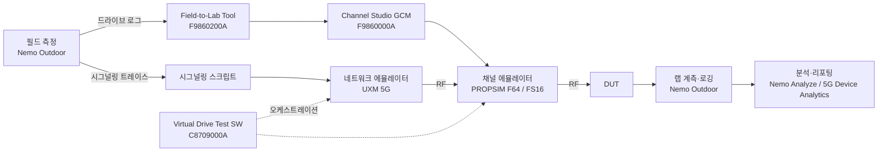

# Keysight Virtual Drive Test (VDT) & Nemo 리서치

> **문서 상태**: 재작성본 (rev. 2026-08-30)
> 이전 세션의 작업본이 커밋되지 않은 채 컨테이너가 회수되어 유실되었습니다. 본 문서는 처음부터 다시 조사하여
> 재구성한 것이며, 이전 문서에서 §11에 "미확인"으로 남아 있던 세 항목(공식 PDF / Nemo 매뉴얼 스크린샷 /
> 시각 디자인 언어)을 해소하는 것을 최우선 목표로 삼았습니다.

**신뢰도 표기 규약** — 본 문서 전체에서 다음 표기를 사용합니다.

| 표기 | 의미 |
|---|---|
| 【확인됨】 | 조사자가 직접 fetch 한 1차 출처(Keysight 소유 도메인·공식 PDF·실제 CSS/이미지 바이트)로 뒷받침됨 |
| 【추정】 | 정황상 합리적 추론이나 1차 출처로 직접 확인되지 않음 |
| 【미확인】 | 공개 정보로 확인하지 못함. 확인 방법을 함께 기재 |

---

## 1. 문서 개요

### 1.1 요약 (bottom line)

VDT(Virtual Drive Test, 가상 드라이브 테스트)는 **차량으로 실제 도로를 주행하며 수행하던 무선 품질 측정을,
현장에서 수집한 데이터를 근거로 실험실에서 재현(replay)하는 방식**입니다. Keysight의 상용 제품명은
**S8709A Virtual Drive Test Toolset**이며, 채널 에뮬레이션 + 네트워크 에뮬레이션 + **Nemo Outdoor** +
5G Device Analytics를 하나로 묶은 구성입니다 【확인됨】. 이 구조에서 **Nemo Outdoor는 "현장 데이터 수집" 쪽에
위치**하며, 수집된 데이터가 테스트 시나리오로 임포트되어 실험실에서 반복 재생됩니다 【확인됨】. 핵심 가치는
현장 주행으로는 불가능한 **반복 재현성과 통제 가능성**이고, 고속철도·터널·고속도로 같이 현장 재현이 어렵거나
비싼 시나리오에서 특히 유효합니다 【확인됨】. POC 관점에서 하드웨어 없이 모사 가능한 부분은 VDT 장비 자체가
아니라 **드라이브 테스트 데이터의 시각화·분석 UI 계층**입니다(§9).

### 1.2 범위

- **다루는 것**: VDT의 정의와 제품 구성, Nemo 제품군의 역할, 시스템 아키텍처, 측정 지표, 경쟁 지형,
  그리고 POC 구현에 직접 필요한 공식 문서·UI 구조·시각 디자인 언어.
- **다루지 않는 것**: 실제 S8709A 구매·라이선스 협상, RF 하드웨어 캘리브레이션 절차, Keysight와의 계약 사항.

### 1.3 조사 환경상의 제약 (결과 해석에 영향)

- `www.keysight.com`의 HTML 페이지는 일반 HTTP 클라이언트에 **403(봇 차단)** 을 반환합니다. 단
  `/etc/designs/...` 경로의 CSS와 `/content/dam/.../ungate/*.pdf` 경로의 PDF 원본은 정상 응답합니다 【확인됨】.
- 이 우회 경로 덕분에 **공식 PDF 원본 바이트를 직접 내려받아 내부 이미지(스크린샷)를 추출**할 수 있었고,
  §11.2/§11.3의 결론은 대부분 여기에 근거합니다.

---

## 2. VDT(Virtual Drive Test)란 무엇인가

### 2.1 정의

VDT는 실제 필드에서 측정한 **무선 채널 환경과 네트워크 시그널링 이벤트**를, 실험실의 채널 에뮬레이터와
네트워크 에뮬레이터 위에서 **반복 재생**하여 단말·칩셋·네트워크의 성능을 검증하는 기법입니다.
Keysight는 이를 "a real-world lab test environment for validating 5G devices under a wide range of network
signaling and radio channel conditions"로 기술합니다 【확인됨】.

### 2.2 무엇을 대체하는가

전통적 드라이브 테스트는 측정 장비를 실은 차량이 정해진 경로를 주행하며 로그를 수집합니다. 이 방식의 구조적
한계는 다음과 같습니다.

- **재현 불가능성** — 같은 경로를 다시 달려도 트래픽·기상·네트워크 부하가 달라 동일 조건이 재현되지 않습니다.
  펌웨어 A와 B를 공정하게 비교할 수 없습니다.
- **비용과 시간** — 차량·인력·장비가 실제로 이동해야 합니다.
- **희귀 시나리오 접근성** — 고속철도, 터널, 특정 핸드오버 실패 지점은 원할 때 재현할 수 없습니다.
- **관측 가능성의 한계** — 문제가 발생해도 그 순간의 채널 상태를 되돌려 재현할 수 없습니다.

### 2.3 비교

| 축 | 물리적 드라이브 테스트 | VDT (랩 재현) | MDT / 크라우드소싱 |
|---|---|---|---|
| 재현성 | 낮음 (1회성) | **매우 높음** (동일 조건 반복) 【확인됨】 | 낮음 |
| 통제 가능성 | 없음 | **높음** (채널·시그널링 파라미터화) 【확인됨】 | 없음 |
| 실제 네트워크 반영도 | **가장 높음** (실측 그 자체) | 높음 (실측 기반 재현) | 높음 (실사용자 분포) |
| 지리적 커버리지 | 주행 경로에 한정 | 수집된 시나리오에 한정 | **매우 넓음** |
| 단위 비용 | 높음 | 초기 장비비 높음, 반복 비용 낮음 | 낮음 |
| 희귀·위험 시나리오 | 어려움 | **가능** (고속철도/터널) 【확인됨】 | 우연에 의존 |
| 주 사용자 | 운영사 최적화 팀 | 칩셋·단말 제조사, 운영사 검증 팀 【확인됨】 | 운영사 기획, 시장 분석 |

### 2.4 제품 계보

Nemo와 VDT는 **핀란드 Oulu**에서 출발해 두 번의 인수를 거쳐 Keysight에 도달했습니다.

| 시점 | 사건 | 확인 |
|---|---|---|
| 1996 | **Nemo Technologies Ltd** 설립 (핀란드 Oulu). Nokia Networks와 Elektrobit의 합작으로 기술됨 | 【추정】 2차 출처 |
| 1997 | 미국 자회사 Nemo Inc. 설립 (Texas, Irving) | 【추정】 |
| 2006-12 이전 | **Anite plc**가 Elektrobit Group Plc로부터 Nemo Technologies 인수. 완료 보도일 2006-12-12 | 【확인됨】 |
| 2011-01 | Anite가 CommScope(Andrew Solutions)로부터 **Invex** 제품군 인수 → 이후 "Nemo Invex"로 편입 | 【추정】 원 보도자료 URL이 현재 404 |
| 2015-06-16 | Keysight의 Anite 인수 제안 발표 (약 £388M) | 【확인됨】 |
| **2015-08-13** | **Keysight, Anite 인수 완료.** Keysight 자사 보도자료 표현은 *"paid approximately $600 million in cash for Anite"* | 【확인됨】 |

참고로 Anite plc 자체는 1973년 **Cray Electronics**로 설립되어 1996년 10월 Anite Group plc,
2007년 10월 Anite plc로 개칭한 영국 상장사였습니다 【확인됨】.

> 널리 인용되는 "약 $606M"이라는 금액은 3rd-party 트레이드 헤드라인에서 나온 수치입니다. Keysight 자신은
> **약 $600M**이라고 적었습니다 — 인용 시 후자를 쓰십시오 【확인됨】.

Nemo의 핀란드 정체성은 지금도 남아 있습니다. Keysight는 여전히 **`nemo.fi` 도메인에서 Nemo 업데이트
인프라를 운영**하며, §11에서 확보한 정식 매뉴얼도 이 서버에서 나왔습니다 【확인됨】.

---

## 3. S8709A Virtual Drive Test Toolset 구성

### 3.1 구성 요소

공식 Technical Overview(리터러처 3120-1513)에 따르면 툴셋은 다음을 결합합니다 【확인됨】.

| 구성 요소 | 역할 |
|---|---|
| 5G 채널 에뮬레이션 | 실측 기반 지리적 채널 모델의 재현 |
| 네트워크 에뮬레이션 | 운영사 네트워크의 시그널링 동작 재현 |
| **Nemo Outdoor** | **현장 데이터 수집** 및 랩 측정/로깅 |
| 5G Device Analytics | 결과 분석 |

### 3.2 제품 페이지가 명시하는 기능 【확인됨】

- 테스트 캠페인 관리 (상세 KPI 및 상태 모니터링)
- 결과 분석 및 리포팅
- End-to-end 파라미터화 가능한 테스트 솔루션
- 고급 로깅·시각화·디버깅 도구
- 이동성 성능: **핸드오버 성공률, 호 절단률, 데이터 성능**

### 3.3 지원 범위 【확인됨】

| 항목 | 내용 |
|---|---|
| 무선 기술 | 5G NR (SA/NSA), LTE |
| 테스트 유형 | Virtual Drive Test, **High Speed Train**, **Urban City** |
| 시나리오 | 고속철도, 고속도로, 터널 |
| MIMO | Sub-6 GHz Massive MIMO. 전체 어레이 샘플링 **16x16bi ~ 64x16bi**, 부분 어레이 샘플링 옵션. 지원 포트 **16TR/32TR/64TR/128TR**, 레이어 2/4/8/16/32 |
| 연계 장비 | **PROPSIM F64**(`F8800A`) 5G Massive MIMO Channel Emulation Solution |
| 채널 모델 | **3GPP TR 38.901** 준수 — Urban Micro / Urban Macro / Indoor Office |
| 기타 | Multi-user massive MIMO, multi-RAT 단말 검증 |

### 3.4 대상 사용자 【확인됨】

- **이동통신사** — 상용화 이전 단말 검증
- **칩셋·단말 제조사** — 스트레스 테스트 및 상호운용성 검증

---

## 4. Nemo 제품군과 VDT의 관계

### 4.1 VDT 워크플로우에서 Nemo Outdoor의 위치 (핵심 질문)

**답: 주로 "현장 수집" 쪽이며, 랩에서의 측정·로깅에도 쓰입니다.** Technical Overview는 다음과 같이 기술합니다
— Nemo Outdoor로 수집한 필드 데이터가 테스트 시나리오로 **임포트**되어, 시그널링 이벤트와 무선 채널 환경을
통제된 실험실 환경에서 **신뢰성 있고 반복 가능하게 재생**할 수 있게 한다 【확인됨】. 즉 Nemo Outdoor는
VDT의 입력을 만드는 도구이며, 동시에 랩에서 단말을 계측하는 도구이기도 합니다 【추정】.

### 4.2 제품군

아래 표의 "확인" 열은 조사자가 해당 제품의 공식 Keysight 자료를 직접 확인했는지를 나타냅니다.

| 제품 | 모델번호 | 형태 | 역할 | 확인 |
|---|---|---|---|---|
| **Nemo Outdoor** | `NTA50000B` | Windows 랩탑 SW | 드라이브 테스트 측정·모니터링. 300종 이상 시험 단말 지원, NBM 결합 시 최대 60대 확장 | 【확인됨】 |
| **Nemo Analyze** | `NTN50046C` | Windows 데스크톱 SW | 사후 분석·리포팅 | 【확인됨】 |
| **Nemo Handy** | `NTH50047B` | Android 앱 | 휴대형 측정, QoS/QoE. 상용 스마트폰 및 ATEX 인증 단말에서 구동 | 【확인됨】 |
| Nemo Network Benchmarking (NBM) | `NTG10095A` | 벤치마킹 시스템 | 다중 단말 벤치마킹. **Nemo Invex II의 후속** | 【확인됨】 |
| Nemo Invex II | `NTB00000B` | 차량 탑재 섀시 | 다중 사업자 벤치마킹. 최대 50대 단말 + 스캐너 4대 | 【확인됨】 **단종** |
| Nemo WindCatcher | `NTW00002B` | 분석 SW | 다중 데이터 분석 | 【확인됨】 **단종**, Nemo Analyze로 대체 |
| Nemo Cloud | `NTC10011A` | 클라우드 서비스 | 측정 장비 원격 제어·관리 | 【추정】 |
| Nemo Walker Air | `NTD50000B` | 휴대형 | 실내 측정 | 【추정】 |
| Nemo Backpack Pro | `NTG10090A` | 백팩형 | 실내 벤치마킹. 최대 18 UE + 스캐너 1~2대 | 【추정】 |
| Nemo Backpack Air Pro | `NTD20000A` | 백팩형 | 실내 벤치마킹. 12대 수용 | 【추정】 |
| Nemo Active Probe | `NTP10010A` | 무인 프로브 | 24/7 자율 측정 | 【추정】 |
| Nemo Diagnostic Module (NDM) | — | 하드웨어 모듈 | **루팅하지 않은 상용 스마트폰에서 Nemo Handy 구동**을 가능하게 함 | 【확인됨】 |
| Nemo Global License Server | — | 라이선스 서버 | Nemo Outdoor/Analyze/WindCatcher용 플로팅·좌석 라이선스 | 【확인됨】 |
| Nemo Server | — | 서버 SW | end-to-end 데이터 시험 지원 백엔드 | 【추정】 |
| Nemo FSR1 | — | 스캐닝 수신기 | 네트워크 스캔 | 【확인됨】 자료 존재, 모델번호 【미확인】 |
| **Nemo Firmware Manager** | — | Windows 유틸리티 | 시험 단말 펌웨어 갱신 | 【확인됨】 매뉴얼 직접 입수 (§11.2) |

> **반증된 항목** — 인터넷에 도는 다음 정보는 1차 출처로 뒷받침되지 않습니다: NIDI를 "Nemo Intelligent
> Device Interface"로 풀어쓰는 것(공식 문서는 약어만 사용), Nemo FSR1의 모델번호 `NTS00000E`,
> Nemo IoT Meter `NTH50044B`, Nemo Autonomous Probe `NTP00000C`. 사용하지 마십시오 【미확인】.

### 4.3 Nemo Outdoor 상세 【확인됨】 (flyer 5992-2057)

- **지원 모뎀**: Qualcomm X35/X50/X55/X60/X65/X70/X75/X85, Samsung Exynos 5100/5123/5123A/5123B/5133/5153/5300/5400,
  MediaTek M60/M70/M80/M90, 서드파티 스캐닝 수신기
- **5G 기능**: NR SA/NSA, NR 캐리어 애그리게이션, **빔 단위 KPI**, Massive MIMO, DSS
- **KPI**: RACH 정보, TX power, MIMO rank, modulation, MAC throughput, BLER, 신호세기, SSB 빔 품질,
  계층별 throughput, latency
- **UI**: "fully customizable user interface" — 사용자가 화면 구성을 자유롭게 바꾸는 것이 제품의 명시적 특징

### 4.4 Nemo Analyze 상세 【확인됨】 (flyer 5992-2047)

- 플랫폼: **Windows 10/11 64-bit**
- **다중 페이지 workbook** 구조, 시간 동기화된 데이터 시각화
- **KPI Workbench** — 사용자 정의 지표 및 분석 스크립팅
- **5G NR 빔포밍의 3D 시각화**
- 웹 기반 라이브 매핑: **Google Maps, OpenStreetMap**
- **PostgreSQL** 데이터베이스 엔진
- Network Performance Score(NPS) 리포팅, CDR 기반 음성/데이터 리포트
- **임포트 포맷**: Nemo 자체 포맷, **InfoVista TEMS 포맷, R&S SwissQual 포맷**

---

## 5. 시스템 아키텍처와 워크플로우

### 5.1 구성 장비와 모델번호 【확인됨】

S8709A는 단일 장비가 아니라 **Keysight 자사 스택을 묶는 통합 계층**입니다. 아래 모델번호는 모두
Keysight 제품 페이지를 직접 fetch 하여 확인했습니다.

| 계층 | 모델번호 | 제품명 | 역할 |
|---|---|---|---|
| 오케스트레이션 | `C8709000A` | Virtual Drive Test Software | 시나리오 실행·테스트 케이스 관리. **실제 주행 경로에서 만든 사전 제작 테스트 케이스 동봉** |
| 네트워크 에뮬레이션 제어 | `S8711A` | UXM 5G Test Application | UXM 5G 네트워크 에뮬레이터를 제어하는 SW 인터페이스 |
| 네트워크 에뮬레이터 | `E7515B` | UXM 5G Wireless Test Platform | gNB/eNB 역할. 시그널링 테스트 플랫폼 |
| 채널 에뮬레이터 | `F8800A` | **PROPSIM F64** Channel Emulator | 대용량 페이딩·Massive MIMO |
| 채널 에뮬레이터(소형) | `F8820A` | **PROPSIM FS16** Channel Emulator | 컴팩트·비용 최적화 대안 |
| 채널 모델링 | `F9860000A` | Channel Studio **GCM Tool** | 기하학적 채널 모델 생성 |
| 필드→랩 변환 | `F9860200A` | Channel Studio **RF Field-to-Lab Tool** | 실측 로그를 랩 시나리오로 변환 |
| 측정 | Nemo Outdoor (`NTA50000B`) | — | 필드 수집 및 랩 계측 |

> **중요한 명명 정리** 【확인됨】: `F8800A`와 "PROPSIM F64"는 **같은 장비**이고, `F8820A`와 "PROPSIM FS16"도
> **같은 장비**입니다. `F88xxA`가 주문 모델번호, `F64`/`FS16`이 제품명입니다. 네 개의 별도 장비로 적으면 오류입니다.

> **혼동 주의** 【확인됨】: `E7515W`는 "UXM 5G RF"가 **아니라** **UXM Wireless Connectivity Test
> Platform**(Wi-Fi 7 / 셀룰러 공존 / FWA)입니다. E7515B와 같은 하드웨어 아키텍처를 쓰지만 VDT나 채널
> 에뮬레이션과는 무관합니다. `E7515R`은 RedCap·CIoT·NB-NTN용(3GPP Rel-17)으로 이 역시 별개입니다.

> **정직한 한계** 【미확인】: E7515B가 **S8709A 구성 안에서** 네트워크 에뮬레이터로 쓰인다는 사실은
> 어떤 Keysight 문서에서도 명시적으로 확인하지 못했습니다. S8709A 기술개요에는 `E7515B`, `UXM`,
> `PROPSIM` 어느 문자열도 등장하지 않습니다. 위 표의 결합은 각 제품의 역할로부터의 **재구성**입니다 【추정】.

### 5.2 채널 에뮬레이터 사양 【확인됨】

| 항목 | F8800A (PROPSIM F64) | F8820A (PROPSIM FS16) |
|---|---|---|
| 페이딩 채널 수 | 최대 **64** | 단일 유닛 **2~256**, 다중 유닛 최대 **1024** |
| MIMO 토폴로지 | 16x8, 16x16, 32x8, 32x16, 64x8, 64x16 | — |
| 최대 RF 대역폭 | **1,200 MHz** | — |
| 주파수 범위 옵션 | 3–450 MHz, 450 MHz–3 GHz, 450 MHz–6 GHz, 6–12 GHz, 7–15 GHz, 24.25–29.5 GHz, 37–43.5 GHz | FR1 / FR2 |
| 위치 | 대규모 Massive MIMO | 컴팩트·비용 효율, MIMO OTA |

E7515B UXM 5G의 RF 자원 【확인됨】: RF 포트 8개(DL+UL 4 / DL 전용 4), 최대 집성 대역폭 **800 MHz**,
DL 컴포넌트 캐리어 8 / UL 4(2x2 MIMO), LTE CC 2, **내장 페이딩** 보유, mmWave는 외부 RRH로 확장.
단 S8709A급 Massive MIMO VDT에서는 페이딩을 외부 PROPSIM으로 넘기는 구성이 자연스럽습니다 【추정】.

### 5.3 두 갈래로 재생되는 것 (핵심 개념) 【확인됨】

S8709A 제품 페이지의 다음 문장이 아키텍처의 핵심입니다 —
**"Field measured geometrical channel models with high-capacity fading options"** 와
**"Signaling scripts replicating operator-specific network capabilities"**.

즉 재생되는 산출물은 **두 종류가 병렬로** 존재합니다.

1. **무선 채널 측** — 실측에서 유도한 **기하학적 채널 모델**, PROPSIM에서 재생
2. **프로토콜 측** — 특정 운영사 네트워크 구성을 재현하는 **시그널링 스크립트**, 네트워크 에뮬레이터에서 재생

두 축은 **시간 정렬**되어, 스크립트상의 핸드오버가 그 지점에서 실측된 채널 조건과 일치하게 됩니다 【추정】.

기술개요는 이를 이렇게 요약합니다 【확인됨】 — *"import field data and replay signaling events and radio
channel environment in a controlled laboratory environment."*

### 5.4 "기하학적 채널 모델(GCM)"이란 무엇인가 【확인됨】

Keysight Channel Studio 문서의 정의: 모든 송수신기에 **실제 물리적 위치와 RF 특성이 부여된 가상 RF
환경**을 만드는 것입니다. 구체적으로는 —

- 무선기를 특정 좌표에 배치하고 속도·방향을 지정
- 단말을 정의된 궤적을 따라 설정된 속도로 이동시킴
- 도구가 그 **기하 구조로부터** 다중경로·지연·도플러·안테나 효과를 계산
- 선택적으로 안테나 어레이 모델링을 더해 다중 소자 MIMO 거동을 재현

**TDL(tapped-delay-line) 모델과의 대비가 핵심입니다.** TDL은 기하 구조가 없는 **정적 통계 탭 프로파일**이며,
Keysight는 이를 별도 제품(`F9860400A` TDL Modeling Tool)으로 판매합니다. GCM은 표에서 값을 고르는 게 아니라
**기하에서 계산**합니다.

**"실측 기반(field-measured)"의 의미** 【확인됨】: 기하와 파라미터를 사람이 손으로 쓰는 게 아니라
`F9860200A` RF Field-to-Lab Tool이 **실제 드라이브 테스트 로그로부터 채워 넣습니다.** 문서화된 입력은
**RSRP, SNR, MIMO correlation, Cell ID**이며, 출력은 "수작업 개입 없이" 생성된 에뮬레이션용 채널 모델입니다.

### 5.5 안테나 어레이 연결 토폴로지 【확인됨】

| 방식 | 내용 |
|---|---|
| **Full array sampling** | 모든 어레이 포트를 동시 샘플링. **16x16bi ~ 64x16bi** 지원. 다중 사용자 MIMO와 3D 빔포밍의 공간 분리 모델링 가능 |
| **Partial array sampling** | 비용 절감형. **외부 RF 아날로그 컴바이너 또는 위상 천이기 매트릭스** 사용. 열/행 안테나 조합과 가상 프로브 구성 |

지원 안테나 포트: **16TR, 32TR, 64TR, 128TR**, 레이어 2/4/8/16/32 — 모든 포트가 코히런트하게 샘플링됩니다.
에뮬레이트된 gNB의 안테나 포트 수가 채널 에뮬레이터의 RF 포트 수를 넘을 때 **외부 수동 컴바이너/위상
천이기 매트릭스**가 그 사이에 들어갑니다.

채널 모델은 **3GPP TR 38.901** 준수이며 **Urban Micro / Urban Macro / Indoor Office**를 지원합니다 【확인됨】.

### 5.6 신호 체인



### 5.7 워크플로우 단계별 산출물

| 단계 | 입력 | 산출물 | 도구 |
|---|---|---|---|
| 1. 필드 수집 | 실제 주행 | 측정 로그(RSRP·SNR·MIMO correlation·Cell ID), 시그널링 트레이스 | Nemo Outdoor |
| 2. 채널 모델 생성 | 측정 로그 | 기하학적 채널 모델 | `F9860200A` → `F9860000A` |
| 3. 시그널링 스크립트화 | 시그널링 트레이스 | 운영사별 네트워크 동작 스크립트 | — |
| 4. 랩 재생 | 채널 모델 + 스크립트 | 통제된 재현 환경 | PROPSIM + UXM, `C8709000A` 오케스트레이션 |
| 5. 측정·로깅 | DUT 거동 | KPI 로그 | Nemo Outdoor |
| 6. 분석 | KPI 로그 | 리포트·합불 판정 | Nemo Analyze / 5G Device Analytics |

> **진입점이 두 개입니다** 【확인됨】: `C8709000A`에는 **전 세계 실제 주행 경로 기반의 사전 제작 테스트
> 케이스**가 동봉되어 있고, Field-to-Lab 도구는 **선택 옵션**입니다. 즉 사용자는 (a) Keysight가 이미 수집해
> 둔 경로 라이브러리를 쓰거나, (b) 자기 경로를 Nemo Outdoor로 수집해 변환하거나 둘 중 하나를 택합니다.

### 5.8 인접 제품과의 구분 【확인됨】

| 제품 | 무엇을 하는가 | S8709A와의 차이 |
|---|---|---|
| **S8709A** | 캡처한 필드 로그를 랩에서 재생 | 기준점 |
| `S8809A` RF Field-to-Lab Toolset | 더 넓은 필드→랩 툴셋. 5G NR·LTE·WLAN, 단말뿐 아니라 **기지국·AP**까지 | 범위가 넓고 단말 중심이 아님 |
| `S8811A` Device Real Networks Performance Toolset | **실제 기지국·상용망**에 단말을 물려 시험 | 재생이 아니라 실장비 대상 |

Keysight는 "캡처 재생(S8709A) ↔ 실인프라(S8811A)"의 **2단 사다리**를 갖추고 있습니다.

---

## 6. 측정 지표(KPI)와 데이터 모델

### 6.1 3GPP 근거 규격 【확인됨】

아래 규격 번호와 제목은 실제 문서를 fetch 하여 표지·본문에서 확인했습니다.

| 규격 | 제목 | 이 문서에서의 쓸모 |
|---|---|---|
| **TS 38.215** | NR; Physical layer measurements | NR UE 측정량의 규범적 정의 |
| **TS 38.331** | NR; Radio Resource Control (RRC); Protocol specification | L3 메시지·측정 리포트 구조 |
| **TR 38.901** | Study on channel model for frequencies from 0.5 to 100 GHz | CDL/TDL 채널 모델 (7.7절) |
| **TS 37.320** | Radio measurement collection for Minimization of Drive Tests (MDT); Overall description; Stage 2 | MDT |
| TS 36.214 | E-UTRA; Physical Layer; Measurements | LTE RSRP/RSRQ/RS-SINR 정의 |
| TS 25.215 / TS 25.225 | Physical Layer; Measurements (FDD) / (TDD) | UMTS RSCP / Ec-No |

**TS 38.215가 정의하는 측정량** 【확인됨】 — 5.1절: SS-RSRP(5.1.1), CSI-RSRP(5.1.2), SS-RSRQ(5.1.3),
CSI-RSRQ(5.1.4), SS-SINR(5.1.5), CSI-SINR(5.1.6), E-UTRA RSRP/RSRQ/RS-SINR(5.1.15~5.1.17),
SS-RSRPB(5.1.18) 등. 5.1.7·5.1.8은 Void.

- **SS-RSRP** = SS/PBCH 블록 참조신호 전력의 **선형 평균**. 측정 시점은 **SMTC 윈도우** 안으로 한정.
  FR1은 UE 안테나 커넥터가 기준점, FR2는 안테나 소자 결합 신호 기준. 단위 dBm.
- **SS-RSRQ** = **N × SS-RSRP / (NR carrier RSSI)**, N은 RSSI 측정 대역폭의 RB 수. 단위 dB.
- **CSI-RSRQ** = N × CSI-RSRP / CSI-RSSI. SS-SINR·CSI-SINR 단위 dB.

**TR 38.901의 채널 모델** 【확인됨】: CDL-A/B/C는 **NLOS**, CDL-D/E는 **LOS** 프로파일.
TDL-A/B/C는 NLOS, TDL-D/E는 LOS이며 **TDL-D·TDL-E의 첫 탭은 Rician 페이딩**을 따릅니다.
TDL 모델은 CDL 모델에 공간 필터(7.7.4절)를 적용해 유도합니다.

**MDT** 【확인됨】: TS 37.320은 두 가지 모드만 정의합니다 —
**Immediate MDT**(CONNECTED 상태에서 측정·즉시 보고)와 **Logged MDT**(IDLE/CELL_PCH/URA_PCH에서 기록 후
나중에 보고). 측정에는 **위치 정보와 타임스탬프 연계가 필수**이며, 수집처는 **TCE(Trace Collection Entity)** 입니다.

### 6.2 Nemo Outdoor가 실제로 수집하는 것 【확인됨】

제품 페이지(`NTA50000B`) 인용 — 수집 항목은 **cell measurements, physical channel information, current cell
information(5G 서브캐리어별), 광범위한 RACH 파라미터, MAC 계층 KPI, RLC/PDCP KPI, link adaptation(서브캐리어별)**
이며, 여기에 **계층별 throughput과 latency를 포함한 5G QoS 측정**이 더해집니다.
사후 처리에서는 **L1–L3 무선 KPI에 대한 4,000가지 이상의 통계 계산**이 가능하다고 명시합니다.

**빔 단위 KPI** 【확인됨】: **SS-RSRP, SS-RSRQ, SS-CINR, RSSI가 셀의 SSB 참조 빔마다** 보고됩니다.
> 용어 주의: Keysight는 3GPP TS 38.215의 `SS-SINR`을 **`SS-CINR`** 로 표기합니다. 같은 양의 벤더 명칭입니다 【확인됨】.

### 6.3 실제 UI에서 관측된 5G NR 지표 【확인됨】

Nemo Outdoor 공식 스크린샷(§11.2)에서 직접 읽은 실제 파라미터입니다.

| 그룹 | 관측된 지표 |
|---|---|
| 셀 식별 | Cell type(SCG PSCell), SSB band(NR n78), SSB NR-ARFCN(633984), PCI(8), SSB GSCN(7853) |
| 무선 품질 | RSRP (NR SpCell), BI |
| 링크 적응 | MAC downlink BLER (NR / 1st / 2nd / 3rd+), MAC downlink block rate, new blocks |
| 처리량 | MAC downlink scheduled throughput, MAC downlink throughput |
| 물리계층 | PDSCH MCS CW0/CW1, PDSCH TBS CW0/CW1, PDSCH modulation(64QAM), PDSCH rank |
| 전력 | TX power (NR), TX power PUCCH, TX power PUSCH |
| 접속 | RACH type(Contention based), RACH reason, RACH result, RACH access delay, RACH config, contention resolution, logical root sequence, pathloss, preamble count/format(Format A2)/index/initial power/response/step, PUSCH power, RA-RNTI, response window, SSB ID, timing advance |

### 6.4 접속성·유지율·이동성 KPI의 지위 (중요) 【확인됨】

**CSSR(호 설정 성공률), DCR(호 절단률), HOSR(핸드오버 성공률), ping-pong 비율, RLF 비율은 3GPP가 정의한
양이 아닙니다.** 이들은 **업계·운영사 관행**으로 정의되는 파생 지표입니다. 3GPP가 제공하는 것은 그 재료가
되는 **절차와 메시지**입니다 — TS 38.331의 `MeasurementReport`, `MobilityFromNRCommand`, `RLF-Report-r16`,
`LogMeasReport-r16` 등. 핸드오버 성공률은 "measurement report → reconfiguration with sync →
reconfiguration complete" 절차에서 세어 만듭니다.

> **POC 시사점**: 따라서 이 지표들은 **계산식을 설정 가능하게** 만들어야 합니다. 하드코딩하면 고객사 기준과
> 어긋납니다 【추정】.

### 6.5 파일 포맷 — 확인된 것과 확인되지 않은 것

| 확장자 | 상태 | 근거 |
|---|---|---|
| **`.nemofw`** | 【확인됨】 Nemo 펌웨어 파일 | Keysight 발행 Firmware Manager User Guide 본문에 명시 |
| `.dcf`, `.nmp`, `.nbl` | **【반증됨】 Nemo 확장자라는 근거 없음** | Nemo Analyze 기술개요 전문(21p), `NTA50000B` 제품 페이지 어디에도 **0회** 등장 |
| `.nmf` | 【미확인】 | 2차 출처(포럼)에만 등장. 1차 출처 확인 실패 |

> 인터넷에 널리 퍼진 "Nemo 로그 확장자" 목록의 상당수가 **1차 출처로 뒷받침되지 않습니다.**
> POC에서 임의의 확장자를 지원한다고 표기하지 마십시오.

### 6.6 Nemo Analyze의 데이터 입출력 【확인됨】

| 구분 | 내용 |
|---|---|
| 임포트 | Nemo 측정 도구 포맷, **EADS REMS TETRAPOL**, **CSV**, ASCII Import to Database(옵션, 임의 구분자 데이터용 커스텀 템플릿) |
| 임포트 (신판 flyer 5992-2047) | **InfoVista TEMS 포맷, R&S SwissQual 포맷** |
| 익스포트 | **MapInfo, Microsoft Excel, txt, Google Earth** |
| 리포트 | Microsoft **Excel / PowerPoint / Word** 템플릿 |
| 쿼리 | **Custom SQL queries** 지원 |
| 스크립팅 | **KPI Workbench** — 플로차트 기반 스크립팅 엔진 |
| DB | 구판 기술개요는 "저유지보수 로컬 DB 엔진"으로만 기술. **PostgreSQL 명시는 신판 flyer 5992-2047** |
| 기타 기능 | 개별 로그 재생(playback), 기지국 맵 오버레이용 셀 참조 데이터, 기술/시간/사업자별 DB 필터, **area binning**, 파라미터 통계·벤치마킹 |

> **공개 스키마·API는 찾지 못했습니다** 【미확인】. 사용자 수준 SQL 접근은 문서화되어 있으나 테이블·컬럼
> 정의나 SDK/API는 공개 문서에 없습니다. "없다"가 아니라 **"공개된 것을 찾지 못했다"** 로 읽으십시오.

**QoE 범위** 【확인됨】: POLQA/PESQ 음성 품질과 함께 YouTube, Facebook, LinkedIn, Twitter, Netflix,
WhatsApp, Viber, mScore, BiP, Instagram, FTP, HTTP를 지원. 기술은 5G NR, NB-IoT, LTE-M, LTE-A CA,
VoLTE/ViLTE, VoWiFi, mMIMO. NPS(Network Performance Score) 리포트·대시보드 지원.
음성 품질 규격은 **POLQA = ITU-T P.863**, **PESQ = ITU-T P.862** 입니다 【확인됨】.

---

## 7. 경쟁 및 인접 솔루션

### 7.1 먼저 바로잡을 것 — TEMS Paragon은 랩 재현 제품이 아닙니다 【확인됨】

조사 착수 시 "TEMS Paragon이 S8709A의 가장 가까운 경쟁 제품(랩 재현형)"이라는 전제를 세웠으나,
**공식 데이터시트 원문 확인 결과 틀린 전제였습니다.**

Paragon은 *"a multi-device benchmarking solution that enables you to compare the service quality of your
network to the competition"* 이며, **차량 탑재 필드 벤치마킹 시스템**입니다. 데이터시트 어디에도
채널 에뮬레이션·RF 재생·랩 재생에 대한 언급이 없습니다. 비기술 인력인 운전자가 조작할 수 있는 UI,
*"multiple use cases across all your competitors in a single drive test"*, iOS/Android 다중 단말,
TEMS Cloud 기반 캠페인 관리가 그 정체입니다.

**따라서 Paragon의 경쟁 상대는 S8709A가 아니라 Nemo Outdoor / Nemo Backpack 계열입니다.**

경제 논리도 다릅니다 — Infovista는 *"minimizing field effort"*, 즉 **필드 캠페인의 건당 비용**을 줄인다고
주장합니다. Keysight VDT는 단말 검증에 한해 **필드 캠페인의 존재 자체**를 없애려 합니다. 서로 다른 싸움입니다.

### 7.2 지형도

| 분류 | 제품·벤더 | S8709A와의 관계 |
|---|---|---|
| **랩 재현(진짜 경쟁)** | Keysight S8709A | 기준점. *"only solution bringing real world logs to the testing workflow"* 라고 주장 【확인됨】 |
| 랩(실인프라) | Keysight `S8811A` | 자사 인접 제품 |
| 채널 에뮬레이터 | Keysight PROPSIM, **Spirent Vertex** | 합성 3GPP 모델 재생. 캡처 로그 재생은 별개 |
| **필드 드라이브 테스트** | Infovista **TEMS**(Investigation/Pocket/Paragon), R&S(**ROMES, QualiPoc, Freerider 4**), Viavi, Anritsu, Accuver **XCAL/XCAP** | Nemo **Outdoor/Handy/Backpack**의 경쟁자. VDT의 경쟁자가 아니라 **입력 공급원**의 경쟁자 |
| 크라우드소싱·분석 | Ookla, Opensignal, Tutela, umlaut | 커버리지는 넓으나 재현성 없음. 보완재 |

> R&S Freerider 4는 스캐너 **TSMA6 / TSME6 / TSME30DC**를 사용하며 GSM, WCDMA, CDMA2000, 1xEV-DO,
> WiMAX, LTE, 5G NR 등을 커버합니다 【확인됨】. 참고로 **Nemo Outdoor 자체가 R&S TSME6 스캐너를 지원**합니다
> (데이터시트 5992-3356) — 경쟁과 상호운용이 공존합니다.

### 7.3 소유권 이동 (이 시장은 최근 크게 재편되었습니다) 【확인됨】

| 시점 | 사건 |
|---|---|
| 1996 | **Nemo Technologies Ltd** 설립 (핀란드 Oulu) |
| 1999 | TEMS: LCC International → **Ericsson** |
| 2006-12 이전 | **Anite**가 Elektrobit Group Plc로부터 Nemo Technologies 인수 |
| 2009-06-02 | TEMS: Ericsson → **Ascom** |
| 2015-08-13 | **Keysight, Anite 인수 완료** (2015-06-16 발표, 약 **US$600M**) |
| 2016-10-03 | TEMS: Ascom → **Infovista** |
| 2021-12-14 | **Ookla, RootMetrics 인수** |
| **2025-10-15** | **Keysight, Spirent 인수 완료** (약 £1.16bn / 약 US$1.46bn) |
| 2025-10-16 | VIAVI, Spirent 매각 자산 인수 완료 ($425M) |

> **전략적 함의**: 2025년 Spirent 인수로 Keysight는 **Vertex 채널 에뮬레이터까지 보유**하게 되었습니다.
> 채널 에뮬레이션 계층의 경쟁 구도가 근본적으로 바뀌었으므로, 경쟁 분석 시 2025년 이전 자료를 그대로
> 쓰면 안 됩니다 【확인됨】.

### 7.4 왜 S8709A를 복제하기 어려운가 【추정】

S8709A는 **채널 에뮬레이터 + 네트워크 에뮬레이터 + 필드 측정 도구 + 분석 도구**의 4개 계층을 모두
자사가 보유해야 성립합니다. 경쟁사가 동등한 제품을 내려면 네 계층을 전부 갖춰야 하므로, 이는 기능 경쟁이
아니라 **포트폴리오 경쟁**입니다.

---

## 8. 활용 시나리오

### 8.1 Keysight가 직접 명시한 구매자와 과업 【확인됨】

| 사용자 | 수행 과업 (원문 근거) |
|---|---|
| **이동통신사** | *"verify new devices prior to market launch"*, *"assure device and software interoperability with local network configuration"* |
| **칩셋·단말 제조사** | *"stress test software stack"*, *"validate compliance with typical mobile operator device acceptance test conditions"* |

### 8.2 과업 유형별 정리

| 과업 | 내용 |
|---|---|
| 출시 전 수용 시험 | 운영사가 상용 출시 전 단말 검증 |
| 펌웨어 회귀 시험 | 빌드 간 성능 비교 — **동일 조건 반복이 필수**이므로 VDT가 결정적 |
| 필드 이슈 재현 | 현장에서 잡은 로그를 랩으로 가져와 재현 |
| 벤치마킹 | 고속철도·고속도로·터널 등 실환경 조건 대비 성능 비교 |

측정 대상 성능: **핸드오버 성공률, 셀 재선택, 호 절단률, 데이터 성능** 【확인됨】.

### 8.3 물리적 드라이브 테스트의 실제 비용 — 사례 【확인됨】

2024년 1월 Keysight 뉴스룸이 소개한 독일 전국 벤치마킹 캠페인은 VDT가 공격하는 비용 구조를 잘 보여줍니다.

| 항목 | 값 |
|---|---|
| 주관 | IMTEST(독일 최대 소비자 테스트 매체) + zafaco GmbH, Keysight 지원 |
| 사용 장비 | **Nemo Backpack Pro**, **Nemo Outdoor**, Keysight **ATA**(Application Testing Automation) |
| 기간 | **5주** |
| 주행 거리 | **10,000 km** |
| 대상 | 30개 대도시, 인구 1,500만 지역 |
| 시험 연결 수 | 약 **160,000회** |
| 결과 | Telekom 1.4 / Telefónica O2 1.8 / Vodafone 2.1 |

**한 나라의 스냅샷 하나에 5주와 10,000 km가 듭니다.** 그리고 이 캠페인은 **재현 불가능**합니다 —
같은 조건으로 다시 달릴 수 없습니다. 이것이 VDT의 존재 이유입니다.

---

## 9. POC 설계 시사점

> **전제**: 유실된 원본 문서에 POC의 정확한 목표가 기록되어 있지 않았습니다. 아래는 조사 결과에 근거한
> **제안**이며 확정 사항이 아닙니다 【추정】.

### 9.1 무엇을 만들 수 있고, 무엇은 만들 수 없는가

| 영역 | 하드웨어 없이 가능? | 비고 |
|---|---|---|
| 드라이브 테스트 데이터 **시각화 UI** | **가능** | 본 문서 §11.2/§11.3이 그대로 사양이 됨 |
| KPI 대시보드·리포팅 | **가능** | §6.2~§6.3의 실제 지표 목록 사용 |
| 지도 기반 경로 렌더링 + KPI 색상 비닝 | **가능** | §11.3의 색상 규약 사용 |
| 로그 파싱 | 부분적 | 실제 Nemo 로그 포맷 미확인 (§6.3) — 자체 스키마 정의 권장 |
| 채널/네트워크 에뮬레이션 | **불가능** | PROPSIM/UXM 실장비 필요 |
| 실단말 계측 | **불가능** | 진단 모뎀 접근 권한 필요 |

**결론**: POC는 "VDT 장비"가 아니라 **VDT/드라이브 테스트 결과를 보여주는 분석 UI**를 목표로 하는 것이
현실적입니다 【추정】.

### 9.2 제안 화면 목록

| 화면 | 목적 | 핵심 요소 | 우선순위 |
|---|---|---|---|
| 지도 뷰 | 경로별 KPI 공간 분포 | 색상 비닝된 폴리라인, 셀 사이트 섹터 마커, 색상 범례 | **P0** |
| 라인 그래프 | 시간축 KPI 추이 | 시간 X축, 공유 커서, 다중 패널 동기화 | **P0** |
| 파라미터 그리드 | 현재 시점 값 스냅샷 | Parameter/Value 2열, 임계 초과 셀 강조 | **P0** |
| 워크북 탭 바 | 화면 세트 전환 | 하단 탭, 사용자 정의 페이지 | P1 |
| L3 시그널링 뷰어 | 메시지 시퀀스 추적 | 타임스탬프 + 메시지명 목록, 상세 디코드 | P1 |
| 세션 상태 바 | 측정 구간 탐색 | START/END/CURRENT 시각, 진행 바 | P1 |
| 다중 단말 패널 | 단말 간 비교 | 단말별 열 비교 | P2 |

### 9.3 데이터 모델 최소 골격 【추정】

```
Measurement(id, name, device, location, start_ts, end_ts)
  └─ Sample(ts, lat, lon, cell_ref, kpi_name, value, unit)
  └─ Event(ts, type, detail)          # handover, RACH, drop, RLF
  └─ CellRef(pci, arfcn, band, gscn, cell_type)
```
§6.3의 실제 관측 지표가 `kpi_name` 어휘의 출발점이 됩니다.

### 9.4 단계별 범위

1. **Phase 1** — 정적 샘플 데이터로 지도 뷰 + 라인 그래프 + 파라미터 그리드, 커서 시간 동기화.
2. **Phase 2** — 워크북 탭, 임계값 기반 셀 강조, 색상 범례 편집.
3. **Phase 3** — 로그 임포트(자체 스키마), 이벤트 타임라인, 리포트 내보내기.

---

## 10. 리스크와 열린 질문

### 10.1 리스크

| 리스크 | 내용 | 완화 |
|---|---|---|
| **IP/저작권** | Keysight 스크린샷·로고·아이콘을 그대로 복제하면 저작권·상표 문제 발생 | 레이아웃 관용구와 도메인 색상 규약만 참고하고, 로고·아이콘·정확한 색상 조합의 복제는 피할 것 |
| 자료 접근 장벽 | Nemo 정식 매뉴얼은 제품 동봉/라이선스 게이트 뒤에 있음 (§11.2) | 공개 flyer·기술개요와 관측된 UI로 대체 |
| 포맷 미확인 | 실제 Nemo 로그 포맷 스펙 비공개 | POC는 자체 스키마로 시작, 임포트 어댑터를 나중에 추가 |
| 정보 최신성 | 제품 라인업·모델번호는 개정이 잦음 | 리터러처 번호와 확인 일자를 함께 기록 (§11.1) |
| **시장 재편** | **2025-10 Keysight의 Spirent 인수**로 채널 에뮬레이터 경쟁 구도가 바뀜. 2025년 이전 경쟁 분석은 이미 낡음 | §7.3 연표 기준으로 재검토 |
| 단종 제품 참조 | Nemo Invex II·WindCatcher는 단종되고 후속 제품으로 대체됨 | 제품 표(§4.2)의 단종 표기 확인 |

### 10.2 열린 질문

2차 조사에서 해소된 항목은 취소선으로 남겨 이력을 보존합니다.

**여전히 열려 있음**

1. **이 POC의 실제 목표는 무엇인가?** (UI 모사인가, 데이터 분석 도구인가, 영업용 데모인가) — 유실된
   원본에 기록이 없었고, §9는 이에 대한 제안일 뿐입니다. **가장 먼저 정해야 할 것.**
2. POC가 특정 운영사·고객을 대상으로 하는가? 그렇다면 그쪽 KPI 기준·임계값이 따로 존재하는가?
3. **Nemo 공식 KPI 색상 범례의 정확한 임계값과 hex 값** — 스크린샷 해상도 한계로 판독 실패 (§11.3.3).
   확보 방법: Nemo Analyze 실물 또는 고해상도 공식 자료.
4. **Nemo Outdoor/Analyze의 실제 로그 파일 확장자와 스키마** — 인터넷에 도는 `.dcf`/`.nmp`/`.nbl`은
   **반증**했고 `.nmf`는 2차 출처에만 존재합니다 (§6.5). 확보 방법: 정식 User Guide 또는 실물 라이선스.
5. **E7515B가 S8709A 구성 안에서 네트워크 에뮬레이터로 쓰이는지** — 두 제품 모두 실재하나 이를 잇는
   Keysight 문서를 찾지 못했습니다 (§5.1). 확보 방법: Keysight 영업·기술 문의.
6. Nemo Analyze의 공개 DB 스키마 또는 API 존재 여부 — 공개 문서에서 찾지 못했습니다 (§6.6).

**해소됨**

7. ~~Anite 인수 연도와 Nemo 브랜드의 정확한 계보~~ → §2.4에서 확정 (Anite 인수 2006, Keysight의 Anite
   인수 완료 2015-08-13, 약 $600M).
8. ~~VDT 랙의 장비 모델명~~ → §5.1에서 대부분 확정. 다만 5번 항목의 단서가 남습니다.
9. ~~TEMS Paragon이 S8709A의 랩 재현 경쟁 제품인가~~ → **아니오.** 필드 벤치마킹 제품임을 §7.1에서 확인.

## 11. 미확인 항목 해소

이전 문서에서 미확인으로 남아 있던 세 항목에 대한 조사 결과입니다.

### 11.1 공식 문서 및 PDF

#### 11.1.1 조사자가 직접 내려받아 내용을 확인한 문서 【확인됨】

| 문서명 | 종류 | 리터러처 번호 | 링크 | 내용 요약 |
|---|---|---|---|---|
| S8709A Virtual Drive Test Toolset | Technical Overview | `3120-1513` | [PDF](https://www.keysight.com/us/en/assets/3120-1513/technical-overviews/S8709A-Virtual-Drive-Test-Toolset.pdf) | VDT 툴셋의 구성(채널·네트워크 에뮬레이션 + Nemo Outdoor + 5G Device Analytics), 5G NR SA/NSA, multi-user massive MIMO, 고속철도·고속도로·터널 시나리오, Nemo Outdoor 필드 데이터의 랩 임포트/재생 구조 |
| Virtual Drive Testing Toolset | Solution Brief | `5992-3870` | [PDF](https://www.keysight.com/us/en/assets/7018-06582/solution-briefs/5992-3870.pdf) | 필드-투-랩 자동화 가상 드라이브 테스트의 사업적 배경. 5G NR SA/NSA와 massive MIMO가 만드는 검증 복잡도, 출시 기간 단축 논지 |
| Nemo Outdoor | Flyer / Brochure | `5992-2057` | [PDF](https://www.keysight.com/us/en/assets/7018-05580/flyers/5992-2057.pdf) | 드라이브 테스트 측정 솔루션. 지원 모뎀 목록(Qualcomm X35~X85, Exynos, MediaTek), 5G NR SA/NSA·CA·빔 KPI·DSS, KPI 목록, "fully customizable UI". **Nemo Outdoor 실제 화면 스크린샷 포함** |
| Nemo Analyze | Flyer / Brochure | `5992-2047` | [PDF](https://www.keysight.com/us/en/assets/7018-05573/flyers/5992-2047.pdf) | 사후 분석 도구. 다중 페이지 workbook, KPI Workbench, 5G NR 빔포밍 3D 시각화, Google Maps/OSM 매핑, PostgreSQL, NPS 리포팅, TEMS/SwissQual 임포트. **Nemo Analyze 실제 화면 스크린샷 포함** |
| Nemo Handy | Flyer / Brochure | `5992-2050` | [PDF](https://www.keysight.com/us/en/assets/7018-05575/flyers/5992-2050.pdf) | Android 기반 측정 앱. 공중 인터페이스 진단 정보, QoS/QoE 측정 |
| **Keysight Nemo Firmware Manager User Guide** | **User Guide (정식 매뉴얼)** | 매뉴얼 부품번호 `NTC00000A-900005` | [PDF](https://update.nemo.fi/updates/Nemo_Firmware_Manager_User_Guide_2.51.pdf) | **공개적으로 접근 가능한 유일한 정식 Nemo 매뉴얼.** Edition 3.00, 2022년 1월, SW 2.51 문서화. 35페이지, 스크린샷 42장. §11.2의 근거 |

#### 11.1.2 검색으로 확인된 추가 공식 자료 (URL 존재 확인, 본문 미정독)

| 문서명 | 종류 | 리터러처 번호 |
|---|---|---|
| Nemo Outdoor – Qualcomm-Based Terminals | Data Sheet | `5992-2035` |
| Nemo Outdoor – Qualcomm-Based NB-IoT and LTE-M Terminals | Data Sheet | `5992-2650` |
| Nemo Outdoor and R&S TSME6 | Data Sheet | `5992-3356` |
| Nemo Outdoor and PCTEL HBflex | Data Sheet | `5992-3517` |
| Nemo Server | Data Sheet | `5992-2064` |
| Nemo FSR1 Scanning Receiver | Data Sheet (archived) | `5992-2032` |
| Nemo Handy IoT | Brochure | `5992-2774` |
| Nemo Global License Server | Brochure | `5992-2268` |
| Nemo Diagnostic Module | Data Sheet | `3125-1130` |
| Nemo Active Probe | Flyer | `3122-2162` |
| Nemo Handy & Nemo Walker Air | Data Sheet | `3123-1442` |
| FieldFox and Nemo Handy | Flyer | `3120-1471` |
| Nemo Analyze | Technical Overview | `5992-2005` |

#### 11.1.3 URL 규칙과 원본 내려받기 방법 【확인됨】

Keysight 자료는 **두 가지 URL 형태**를 가집니다.

```
# (A) 사람이 보는 asset 페이지 (HTML 래퍼)
https://www.keysight.com/us/en/assets/<assetId>/<type>/<litNumber>.pdf

# (B) PDF 원본 바이트 (스크래퍼로도 접근 가능)
https://www.keysight.com/content/dam/keysight/en/doc/ungate/<type>/<litNumber>.pdf
```

`<type>`은 `flyers`, `data-sheets`, `brochures`, `solution-briefs`, `technical-overviews` 등입니다.
**(A)는 일반 HTTP 클라이언트에 403(봇 차단)을 반환**합니다. **(B)는 일부 문서에 한해 200과 함께 실제 PDF
바이트를 반환**합니다 【확인됨】. 경로의 `ungate`는 로그인이 필요 없는 자료를 뜻합니다 【추정】.

**(B) 경로의 실제 성공률** — 18건을 시험한 결과 5건만 성공했습니다 【확인됨】.

| 결과 | 문서 |
|---|---|
| **200 (PDF 획득)** | `flyers/5992-2057`, `flyers/5992-2047`, `flyers/5992-2050`, `brochures/5992-2774`, `brochures/5992-2268` |
| **404** | 시험한 모든 `data-sheets/*`, `technical-overviews/5992-2005`, `solution-briefs/5992-3870`, `flyers/3122-2162`, `flyers/3120-1471`, `technical-overviews/3120-1513` |

즉 **(B)는 일반 규칙이 아니라 부분적 미러**입니다. 특히 `3xxx-xxxx` 형식 번호와 `data-sheets` 계열은
대체로 실패하며, 검색 결과에서 `/assets/ndx/...` 형태로 나타나는 문서들도 (B)에서 받을 수 없었습니다.
404 시에는 PDF가 아니라 "Page Not Found" **HTML**이 반환되므로, 스크립트로 수집할 때는 반드시
`Content-Type` 또는 매직 바이트로 PDF 여부를 검증해야 합니다 【확인됨】.
실패한 문서는 (A) 경로를 브라우저 또는 WebFetch로 접근하십시오.

#### 11.1.4 2차 조사에서 추가 검증된 온라인 출처 【확인됨】

아래는 모두 실제로 fetch 하여 내용을 확인한 URL입니다.

**Keysight 제품 페이지 — Nemo 제품군**

`NTA50000B` Nemo Outdoor · `NTN50046C` Nemo Analyze · `NTH50047B` Nemo Handy ·
`NTG10095A` Nemo Network Benchmarking · `NTB00000B` Nemo Invex II · `NTW00002B` Nemo WindCatcher ·
`NTC10011A` Nemo Cloud · `NTD50000B` Nemo Walker Air · `NTG10090A` Nemo Backpack Pro ·
`NTD20000A` Nemo Backpack Air Pro · `NTP10010A` Nemo Active Probe
— 형식: `https://www.keysight.com/us/en/product/<모델번호>/...html`
포트폴리오 목록: <https://www.keysight.com/us/en/products/nemo-wireless-network-solutions>

**Keysight 제품 페이지 — VDT 스택**

| 모델 | URL |
|---|---|
| S8709A | <https://www.keysight.com/us/en/product/S8709A/s8709a-5g-virtual-drive-test-toolset.html> |
| C8709000A | <https://www.keysight.com/us/en/product/C8709000A/virtual-drive-test-software.html> |
| S8711A | <https://www.keysight.com/us/en/product/S8711A/s8711a-uxm-5g-test-application.html> |
| S8809A | <https://www.keysight.com/us/en/product/S8809A/rf-field-to-lab-toolset.html> |
| S8811A | <https://www.keysight.com/us/en/product/S8811A/device-real-networks-performance-toolset.html> |
| E7515B | <https://www.keysight.com/us/en/product/E7515B/uxm-5g-wireless-test-platform.html> |
| E7515W | <https://www.keysight.com/us/en/product/E7515W/uxm-wireless-connectivity-test-platform.html> |
| E7515R | <https://www.keysight.com/us/en/product/E7515R/uxm-r-5g-wireless-test-platform.html> |
| F8800A | <https://www.keysight.com/us/en/product/F8800A/f8800a-propsim-f64-channel-emulator.html> |
| Channel Studio | <https://www.keysight.com/us/en/products/channel-emulators/channel-studio-modeling-software.html> |
| VDT 카테고리 | <https://www.keysight.com/us/en/products/ue-ran-and-core-emulators/cellular-virtual-drive-test-emulation.html> |

**추가 Keysight PDF**

- PROPSIM FS16 `F8820A` 데이터시트 — `3119-1108`
- Nemo Diagnostic Module 데이터시트 — `3125-1130`
- Nemo Global License Server 브로슈어 — `5992-2268`
- Nemo Server 데이터시트 — `5992-2064` (`/assets/ndx/...` 경로)
- Nemo Analyze **Technical Overview** `5992-2005EN` — keysight.com에서는 받지 못했고, 제3자 미러
  (`avantec2.cl`)에서 전문(21p)을 확보했습니다. 내용은 Keysight 원문이나 **구판**이며, 최신 flyer
  `5992-2047`과 일부 항목이 다릅니다 【확인됨】.

**3GPP / ITU 규격 원문**

| 규격 | 확보 경로 |
|---|---|
| TS 38.215 V15.7.0 | ARIB 미러 |
| TS 38.331 V17.0.0 | ETSI (`ts_138331v170000p.pdf`, 1197p) |
| TR 38.901 V18.0.0 | ETSI (`tr_138901v180000p.pdf`) |
| TS 37.320 V10.4.0 | ARIB 미러 |
| ITU-T P.862 (PESQ) / P.863 (POLQA) | <https://www.itu.int/rec/T-REC-P.862/en> · <https://www.itu.int/rec/T-REC-P.863/en> |

**기업 활동·경쟁 관련**

- Keysight, Anite 인수 완료 보도자료 (2015-08-13) — investor.keysight.com
- Keysight, Spirent 인수 완료 보도자료 (2025-10-15) — keysight.com 뉴스룸
- VIAVI, Spirent 매각 자산 인수 완료 (2025-10-16) — viavisolutions.com
- Ookla, RootMetrics 인수 (2021-12-14) — businesswire.com
- Keysight Nemo 독일 벤치마킹 캠페인 (2024-01-23) — keysight.com 뉴스룸
- Anite 완료 보도 (2006-12-12) — lightreading.com
- TEMS 소유권 연혁 — en.wikipedia.org/wiki/Test_Mobile_System
- Infovista **TEMS Paragon 데이터시트** — media.trustradius.com 호스팅 PDF
- R&S Freerider 4 — rohde-schwarz.com

#### 11.1.5 무엇이 공개이고 무엇이 벽 뒤에 있는가

- **공개(ungated)**: flyer, brochure, data sheet, solution brief, technical overview — 위 표의 자료 전부.
- **벽 뒤**: **정식 User Guide/매뉴얼**. Keysight는 제품 문서를 `keysight.com/find/nemo`,
  소프트웨어는 `keysight.com/find/softwaremanager`(Keysight Software Manager)로 안내하며, 매뉴얼은
  일반적으로 **제품에 동봉되거나 라이선스 보유자에게 제공**됩니다 【추정】.
- **예외**: `update.nemo.fi`(Keysight가 운영하는 Nemo 업데이트 서버)는 봇 차단이 없고
  Firmware Manager 매뉴얼을 공개 제공합니다. 디렉터리에서 `Nemo_Firmware_Manager_User_Guide_3.60.pdf`
  (신버전)도 확인됩니다 【확인됨】.
- **비공식 미러**: PDFCoffee/Scribd 등에 Nemo Outdoor 8.01, Nemo Analyze 7.90, Nemo Handy 3.30 User Guide가
  올라와 있으나 **저작권자 허락 없는 복제본**입니다. 존재만 기록하며 인용·이용을 권하지 않습니다.

---

### 11.2 Nemo 매뉴얼 및 화면 구성

#### 11.2.1 결론 요약

정식 매뉴얼 스크린샷 자체는 **일부 확보에 성공**했습니다. 두 경로로 접근했습니다.

1. **정식 매뉴얼** — `update.nemo.fi`에서 Nemo Firmware Manager User Guide(35p, 스크린샷 42장) 원본 확보 【확인됨】
2. **공식 flyer 내장 스크린샷** — PDF 원본에서 이미지를 추출해 **Nemo Outdoor 5G NR 화면을 2560×1440
   네이티브 해상도로** 확보 【확인됨】. 아래 재구성은 이 실제 이미지를 직접 판독한 결과입니다.

> Nemo **Outdoor/Analyze의 정식 User Guide**는 공개 경로에서 확보하지 못했습니다 【미확인】.
> 확보 방법: Keysight Software Manager 계정 또는 제품 라이선스 보유자를 통한 정식 입수.

#### 11.2.2 Nemo Outdoor 화면 재구성 (실제 스크린샷 직접 판독) 【확인됨】

출처: `5992-2057.pdf` 3페이지 내장 이미지 (2560×1440 PNG). 창 제목 `Nemo Outdoor - 5G NR`.
측정 세션명은 `OnePlus 7 5G Oulu center 19Nov08 091517.1` — 2019-11-08 핀란드 Oulu 시내 측정.

| 화면 요소 | 위치 | 역할 | 확인 수준 |
|---|---|---|---|
| 타이틀 바 | 최상단 | 앱 아이콘(안테나 심볼) + 퀵 액세스 아이콘(핀·문서·**● 녹화 / ▶ 재생 / ⏸ 일시정지 / ⏹ 정지**) + 창 제목 + 최소/최대/닫기 | 【확인됨】 |
| 리본 탭 | 타이틀 바 아래 | `Home` \| **`Data Windows`**(활성) \| `Settings` \| `View`, 우측 끝 `?` 도움말 | 【확인됨】 |
| 리본 그룹 | 리본 본문 | 큰 아이콘 + 라벨, 하단에 회색 그룹명. `Custom Windows`(Open/Save/Properties), `Graph`(New/Open), `Grid`(New/Open), `Indoor`(New/Open), `Map`(New/Open), `Edit`(Copy/Find), `Images`(Save As Image/Export) | 【확인됨】 |
| 도킹 패널 | 본문 전체 | 각 패널은 자체 타이틀 바와 `×` 닫기 버튼, 일부는 최대화 버튼 보유. 자유 배치 | 【확인됨】 |
| 테이블 패널 | 상단 | `Table - 1. Qualcomm` — 열: Cell type / SSB band / SSB NR-ARFCN / PCI / SSB GSCN | 【확인됨】 |
| 라인 그래프 패널 | 좌측 대부분 | `Line Graph - RSRP (NR SpCell)` — Y축 `RSRP (NR SpCell) (dBm)` 0~-160(16 간격), X축 시각(09:33:20~09:34:40). 자체 미니 툴바(차트 아이콘, 확대 슬라이더, `53 %` 배율, `ABC` 토글) | 【확인됨】 |
| 값 그리드(그래프 종속) | 그래프 우측 | `1. RSRP (NR SpCell)` — 열 RSRP/NR-ARFCN/PCI/BI. 하단 탭 `Layers` \| `Values` \| `1. RSRP (NR SpCell)` | 【확인됨】 |
| 파라미터 그리드 | 우측 | `5G NR key parameters` — 2열(`Parameter` / `1. Qualcomm`). BLER·처리량·PDSCH·TX power 등 | 【확인됨】 |
| 파라미터 그리드 2 | 최우측 | `5G NR RACH metrics` — RACH 20여 개 항목 | 【확인됨】 |
| 임계 강조 | 그리드 셀 | **임계 초과 = 적색 배경 + 흰 글자**(TX power 3행), **경고 = 황색 배경**(BLER 2행) | 【확인됨】 |
| 처리량 그래프 | 하단 | `Line Graph - 5G NR MAC throughput` — Y축 0~603.98M(67.11M 간격 = 2^26 배수), 적색 계단 라인 + 적색 면적 채움 + 녹색 상단 라인 | 【확인됨】 |
| 워크북 탭 바 | 최하단 | 이동 버튼(맨앞/이전/다음/맨뒤) + 탭: **5G NR key measurements**(활성) \| LTE L1 \| LTE Link Adaptation \| LTE Data Throughputs \| Map \| 5G NR MAC \| 5G RACH and Signalling \| 5G NR Beams \| 5G and LTE Data Throughpu… \| 5G Physical Layer \| LTE and 5G NR Serv \| Default 12 \| `+` | 【확인됨】 |
| 상태 바 | 최하단 | `START: 9:15:18.543, END: 9:41:46.052, CURRENT: 9:33:57.852` + 녹색 진행 바 + `Device Config:` + `Measurement:` 세션명 | 【확인됨】 |
| 시간 커서 | 그래프 위 | 모든 그래프를 관통하는 **적색 수직선**, 그리드 값과 연동 | 【확인됨】 |

**설계상 핵심 관찰**: Nemo Outdoor는 *하나의 시간축 커서*를 중심으로 그래프·그리드·지도가 **동기화**되는
구조입니다. 화면 세트는 하단 **workbook 탭**으로 전환하며 사용자가 직접 구성합니다. POC가 모사해야 할
본질은 개별 위젯이 아니라 **"시간 커서 동기화 + 사용자 정의 패널 세트"** 라는 상호작용 모델입니다 【추정】.

#### 11.2.3 Nemo Analyze 화면 재구성 【확인됨】

출처: `5992-2047.pdf` 1페이지 내장 이미지(894×948). 해상도가 낮아 텍스트 판독은 제한적입니다.

| 화면 요소 | 위치 | 역할 | 확인 수준 |
|---|---|---|---|
| 리본 | 상단 | Outdoor와 동일 계열의 리본 UI | 【확인됨】 |
| 좌측 트리 (상) | 좌측 | `Analyze Local Database` → `All Measurements` / 즐겨찾기 / 배포 항목 | 【확인됨】(구조), 【추정】(정확한 라벨) |
| 좌측 트리 (하) | 좌측 | `Parameters` — KPI 파라미터 트리(스캐너/5G NR/RSRP·SINR 항목 등) | 【확인됨】(존재), 【추정】(항목명) |
| **지도 뷰** | 중앙 상단 | **위성 영상 위에 주행 경로를 굵은 폴리라인으로 렌더링, KPI 값에 따라 구간별 색상 비닝** | 【확인됨】 |
| 셀 사이트 마커 | 지도 위 | 방위각을 나타내는 **삼각형/콘 형태 섹터 마커**(마젠타·적·청·녹) | 【확인됨】 |
| 레이어 패널 | 지도 우측 | `Tools` 아이콘 행 + `Layers` 목록(레이어별 색상 아이콘·접기) | 【확인됨】 |
| **색상 범례 패널** | 지도 우측 하단 | `Color Legends` — 값 구간별 색상 스와치 + 구간값 + **구성비(%)** | 【확인됨】(존재), 【미확인】(정확한 값·hex) |
| 차트 그리드 | 중앙 하단 | 소형 라인 차트 다수를 **3열 × 3행** 배치, 다색 트레이스(적/녹/청) | 【확인됨】 |
| 워크북 탭 바 | 하단 | Outdoor와 동일한 다중 페이지 탭 구조 | 【확인됨】 |
| 리포트 산출물 | 별도 | **CDF 곡선 + 히스토그램 막대** 조합 차트(예: `RSCP best active set`), 범례 포함 | 【확인됨】 |

#### 11.2.4 Nemo Firmware Manager 화면 (정식 매뉴얼 내 스크린샷) 【확인됨】

정식 매뉴얼에서 직접 판독한 유일한 화면으로, **Nemo 유틸리티 계열의 디자인 관용구**를 보여줍니다.

- Windows 네이티브 흰색 타이틀 바 + 클래식 메뉴 바(`File`, `Help`)
- **다크 테마 본문** — 배경 `#0C0D11`에 **육각형(hexagon) 패턴** 모티프
- 2분할 레이아웃: 좌측 작업 영역 / 우측 디바이스 정보 패널(배경 `#1E2542` 남색)
- 우측 정보 필드: `IMEI`, `Serial number`, `Android version`, `Build number`, `Baseband version`,
  `CSC version`, `Country`, `Nemo ID/version`, 헤더는 `<Device not found>` 형식의 꺾쇠 표기
- 안내 배너: 채도 높은 파랑 `#3399FE` 바탕 + 굵은 검정 글자
- 상태 표시: 좌하단 **녹색 텍스트** 3줄(`Device driver ready` / `Connected to the firmware server` / `Ready to update devices`)
- 하단 흰색 푸터 밴드에 **Keysight 로고(적색 파형 마크)** 와 **NEMO 워드마크(남색)** 배치

> 관찰: Nemo 계열의 테마 선택은 **제품 성격이 아니라 플랫폼**을 따릅니다 — **Windows 데스크톱
> 측정 도구(Outdoor/Analyze)는 라이트 테마 + 리본**, **Android 앱(Handy)과 Windows 유틸리티(Firmware
> Manager)는 다크 테마**입니다 【확인됨】. (§11.2.5 참조)

#### 11.2.5 Nemo Handy 화면 재구성 (모바일) 【확인됨】

출처: `5992-2774.pdf`(Nemo Handy IoT 브로슈어) 1페이지 내장 이미지(2000×1520). 두 개의 화면이 실려 있습니다.

| 화면 요소 | 위치 | 역할 | 확인 수준 |
|---|---|---|---|
| 앱 바 | 최상단 | 햄버거 메뉴 `☰` + 화면 제목(`IoT Parameters` / `IoT Measurements`), 우측 끝에 삼각형 리사이즈 어포던스 | 【확인됨】 |
| 파라미터 목록 | 상단 | 좌측 라벨 + 우측 값의 2열 정렬. 관측 항목: `Test Round`(14/100), `Last Ping RTT`, `Last UDP Echo RTT`, `Operation Mode`, `Power Save Mode`(I-DRX), `DCI Repetitions/Count/Format`, `RACH Preamble Repetitions`, `RACH CE Level` | 【확인됨】 |
| 차트 패널 | 중단 (세로 적층) | 각 패널 상단에 **범례 헤더 행** — 색상 스와치 + KPI명 + **현재값**. 예: `■ RSRP -109.70`, `■ Serving SNR 7.20 dB`, `■ Ping RTT 280 ms` | 【확인됨】 |
| 차트 본문 | 각 패널 | 검정 배경, 점선 그리드, **좌·우 이중 Y축**(두 계열 동시 표시), X축은 경과 시간(`m:ss`) | 【확인됨】 |
| 하단 상태 바 | 최하단 | **파란 배경**. 좌측 `Measurement State` / `Measuring ICMP Ping`, 우측 `Test system state` / `Ready` | 【확인됨】 |

**설계상 핵심 관찰**: 데스크톱 Nemo가 "커서 동기화된 다중 패널"이라면, 모바일 Nemo는
**"KPI명 + 현재값 + 미니 시계열"을 한 카드로 묶어 세로로 쌓는" 구조**입니다. 좁은 화면에서 현재값을
즉시 읽히게 하는 것이 우선이며, 이 카드 구성은 POC의 반응형 레이아웃에 그대로 차용할 만합니다 【추정】.

---

### 11.3 시각 디자인 언어

세 계층으로 정리합니다. **1차 출처(Keysight 소유 도메인의 실제 CSS·이미지 바이트)** 에서 추출한 값만
【확인됨】으로 표기했습니다.

#### 11.3.1 Layer 1 — Keysight 코퍼레이트 브랜드

**타이포그래피** 【확인됨】
출처: `https://www.keysight.com/etc/designs/keysight/clientlibs/fonts.min.<hash>.css`

| 항목 | 값 |
|---|---|
| 본문 서체 | **Inter** (`InterVariable`, `InterDisplay` 포함) |
| 폴백 스택 | `'Inter', 'Helvetica Neue', Arial, sans-serif` |
| 배포 | 자체 호스팅 woff2 (`InterVariable.woff2` 외 Thin~ 각 weight 및 italic) |
| 레거시 사이트 | `update.nemo.fi`는 `Roboto, Helvetica, sans-serif` 사용 |

> Inter는 오픈 라이선스(SIL OFL) 서체이므로 POC에서 그대로 사용해도 무방합니다 【추정】.

**색상 팔레트** 【확인됨】
출처: `https://www.keysight.com/etc/designs/keysight/clientlibs/tailwind.min.<hash>.css` 및
`https://update.nemo.fi/updates/styles.css`

| Hex | 역할 (셀렉터 근거) |
|---|---|
| **`#E90029`** | **Keysight 시그니처 레드.** `.fill-red-500 { fill:#E90029 }`; nemo.fi `border-top:#e90029 solid 4px`, `#orgtitle{color:#e90029}` |
| `#262626` | 본문 텍스트 (`p { color:#262626 }`) |
| `#30578D` | 인터랙션 액센트 — 슬라이더 썸, 토글 ON 배경/테두리, `--tw-ring-color` |
| `#4175BE` | 슬라이더 진행 구간(밝은 블루) |
| `#97999B` | placeholder 텍스트 |
| `#808080` | placeholder (다른 룰셋) |
| `#666666`, `#4D4D4D`, `#B1B3B4`, `#D9D9D9`, `#D9D9D6`, `#F1F2F4`, `#E2E6E9` | 그레이 램프 |
| `#373A36`, `#1F2528`, `#031327` | 다크 뉴트럴 |
| `#D32F2F` | 에러 레드 |
| `#E8E8E8` | 레거시 사이트 타이틀바/푸터 배경 |
| `#9C9C9C` | 레거시 저작권 텍스트 |

**브랜드 레드 검증 경위 (중요)**

`#E90029`는 **서로 독립적인 1차 출처 3곳**에서 일치했습니다 【확인됨】.
1. keysight.com Tailwind 빌드의 `.fill-red-500`
2. `update.nemo.fi/updates/styles.css`의 브랜드 테두리·제목 색
3. Nemo 앱 스크린샷 안에 렌더된 Keysight 로고에서 샘플링한 `#EB0028` (JPEG 압축 오차 범위)

한편 공식 로고 PNG(`https://update.nemo.fi/updates/keysight-logo.png`, 201×50)의 실제 픽셀은
**`#ED1A37`(적) + `#58585A`(회)** 였습니다 【확인됨】 — 웹 CSS 값과 로고 아트워크 값이 다른 리비전입니다.
두 값을 임의로 합치지 말고 용도에 따라 구분해 쓰십시오.

> **주의 — 제3자 출처의 오정보**: 색상 참조 사이트들은 Keysight 브랜드색을 `#EE4B25`("Keysight Orange",
> Pantone 1665 C) 또는 `#FF0000`으로 서로 다르게 표기합니다. 어느 쪽도 1차 출처로 뒷받침되지 않습니다
> 【미확인】. 특히 `#FF0000`은 명백한 근사치이며, 검색 요약이 `#EE4B25`를 엉뚱한 출처에 귀속시키는 사례도
> 확인했습니다. **제3자 색상 사이트를 브랜드 근거로 쓰지 마십시오.** (제3자가 제시한 회색 `#54565A`는
> 실제 로고의 `#58585A`와 근접하여, 오래된 인쇄용 아이덴티티일 가능성이 있습니다 【추정】.)

#### 11.3.2 Layer 2 — Nemo 소프트웨어 UI 관용구 【확인됨】

**측정 도구 계열(Nemo Outdoor / Analyze)** — 실제 스크린샷에서 샘플링한 값입니다.

| 요소 | 값 | 비고 |
|---|---|---|
| 디자인 이디엄 | **Windows 네이티브 + Office 스타일 리본 + 도킹 패널** | WPF/WinForms 계열로 보임 【추정】 |
| 테마 | **라이트** | |
| 타이틀 바 배경 | `#EFEFF2` | |
| 리본 배경 | `#FAFAFA` | |
| 비활성 탭 | `#EEEEF2` | |
| 패널 타이틀 바 | `#EFEFF2` | |
| 상태 바 | `#F0F0F0` | |
| 데이터 영역(플롯·그리드) | `#FFFFFF` | |
| **임계 초과 셀** | 배경 **`#FF0000`** + 흰 글자 | 순색 적색 — 경고용 |
| **경고 셀** | 배경 **`#FFFF00`** 계열 | 순색 황색 |
| 시간 커서 | `#DA0000` 수직선 | 전 패널 공유 |
| RSRP 트레이스 | `#825AC8` (보라) | |
| 처리량 면적 채움 | `#FF7F7F` (연한 적색) | 외곽선 `#D02D2D` |
| 처리량 보조 라인 | `#008000` (녹색) | |
| 진행 바 | `#5BDC77` 계열 (녹색) | |
| 정보 밀도 | **매우 높음** — 한 화면에 6~8개 패널, 그리드는 20행 이상 | |

**유틸리티 계열(Nemo Firmware Manager)**

| 요소 | 값 |
|---|---|
| 테마 | **다크** |
| 본문 배경 | `#0C0D11` + 육각형 패턴 모티프 |
| 보조 패널 배경 | `#1E2542` (남색) |
| 강조 배너 | `#3399FE` |
| 상태 텍스트 | 녹색 (≈`#2E9440`) |
| NEMO 워드마크 | 남색 (≈`#004578`) |

**모바일 계열(Nemo Handy)** — 브로슈어 스크린샷에서 샘플링 【확인됨】

| 요소 | 값 |
|---|---|
| 테마 | **다크** |
| 본문 배경 | `#18171C` |
| 앱 바 배경 | `#28272D` |
| 차트 배경 | `#1B1A1F` |
| 하단 상태 바 | **`#2C5FC8`** (파랑) |
| 데이터 트레이스 | **순색 `#0000FF`(청), `#00FF00`(녹), 황색 점선** |

> **관통하는 규칙**: Nemo는 데스크톱·모바일 모두 **데이터 계열에 순색 프라이머리(순적·순황·순청·순녹)** 를
> 씁니다. 조화롭게 설계된 팔레트가 아니라 **최대 판별성**을 노린 계측기 관행입니다 【확인됨】.
> POC에서 이를 그대로 쓰면 촌스러워 보일 수 있으나, 다수 계열이 겹치는 밀집 차트에서는 실제로 유리합니다.
> 색상 접근성이 필요하면 순색 대신 동등한 명도 대비를 갖는 팔레트로 치환하되 **계열 간 구분 강도**는 유지하십시오 【추정】.

> **핵심 시사점**: Nemo 측정 도구의 시각 언어는 "브랜드 표현"이 아니라 **엔지니어링 계기판**입니다.
> 중립 회색 크롬 + 흰 데이터 영역 + **순색(적/황) 임계 강조**가 전부이며, 브랜드 레드는 UI 크롬에
> 거의 쓰이지 않습니다. 데이터가 유일한 색의 주인입니다.

#### 11.3.3 Layer 3 — 드라이브 테스트 도메인 시각 규약

POC에 가장 직접적으로 재사용 가능한 계층입니다.

**지도 경로 색상 비닝** 【확인됨】(구조) / 【미확인】(정확한 값)

Nemo Analyze 지도에서 주행 경로는 **굵은 폴리라인**으로 그려지고 KPI 값에 따라 구간별 색이 바뀝니다.
관측된 램프는 **적색 → 황색 → 녹색**의 이산(discrete) 스케일이며, 우측 `Color Legends` 패널이 구간별
색상·값범위·구성비(%)를 표시합니다. 다만 스크린샷 해상도와 JPEG 압축 때문에 **범례의 정확한 임계값과
hex를 판독하지 못했습니다** 【미확인】.

관측된 대표 색상(압축 오차 포함): 적색 ≈ `#CC0000`~`#D70D0B`, 황색 ≈ `#FFD731`, 녹색(구간 존재 확인).

**업계 관용 임계값 (Nemo 공식 아님 — 참고용)** 【추정】

아래는 드라이브 테스트 업계에서 널리 쓰이는 통상적 구간입니다. **Keysight/Nemo의 공식 기본 범례가
아니며**, POC 초기값으로만 사용하고 실제 프로젝트에서는 운영사 기준을 따라야 합니다.

| RSRP (dBm) | 통상 평가 | 색상 |
|---|---|---|
| ≥ -80 | 매우 좋음 | 진녹 |
| -90 ~ -80 | 좋음 | 녹 |
| -100 ~ -90 | 보통 | 황 |
| -110 ~ -100 | 나쁨 | 주황 |
| < -110 | 매우 나쁨 / 불통 | 적 |

> 근거 수준: `-90 dBm` 이상을 양호, `-100 dBm` 부근에서 성능 급락, `-110 dBm` 이하를 사실상 불통으로 보는
> 서술은 복수의 업계 자료에서 일관되게 확인되나, 특정 벤더의 공식 범례로 확정할 수는 없습니다 【추정】.
> RSRQ/SINR/처리량 구간은 별도 확인이 필요합니다 【미확인】.

**차트 관용구** 【확인됨】

- 시계열은 **계단(step) 라인**이 기본 (이산 스케줄링 값의 성격 반영)
- 처리량은 **면적 채움 + 상단 라인** 이중 표현
- 통계 리포트는 **CDF 곡선 + 히스토그램 막대**를 한 축에 겹쳐 표시
- 모든 시계열 패널은 **단일 시간 커서**를 공유

#### 11.3.4 POC 적용 권고

**채택할 것**
- 서체 **Inter** (오픈 라이선스, Keysight 실사용 서체와 동일)
- 중립 회색 크롬(`#EFEFF2`/`#FAFAFA`/`#F0F0F0`) + 흰 데이터 영역이라는 **저채도 껍데기** 원칙
- **순색 임계 강조**(적=초과, 황=경고)와 **전 패널 공유 시간 커서** — Nemo의 실질적 UX 정체성
- 지도 경로의 **이산 색상 비닝 + 구성비를 포함한 범례 패널**
- 워크북 탭 기반의 **사용자 정의 화면 세트**

**채택하지 말 것**
- Keysight 로고·워드마크·NEMO 워드마크, 육각형 브랜드 그래픽 (상표·저작권)
- 브랜드 레드 `#E90029`를 제품 아이덴티티 색으로 사용하는 것 (혼동 유발 소지)
- 공식 PDF에서 추출한 스크린샷 이미지의 재배포
- Nemo의 아이콘 세트 복제

> 요약: **상호작용 모델과 도메인 색상 규약은 참고하되, 브랜드 표식은 가져오지 마십시오.**

---

## 부록 A. 재현 방법 (조사 절차)

향후 이 조사를 갱신하려는 사람을 위한 절차입니다.

```bash
# 1) 공식 PDF 원본 내려받기 (asset 페이지는 403, dam 경로는 200)
curl -sSL -o nemo-outdoor.pdf \
  "https://www.keysight.com/content/dam/keysight/en/doc/ungate/flyers/5992-2057.pdf"

# 2) PDF 메타데이터와 내장 스크린샷 추출
pip install pymupdf pillow
python3 -c "
import pymupdf
d = pymupdf.open('nemo-outdoor.pdf')
print(d.metadata)
for i in range(d.page_count):
    for im in d[i].get_images(full=True):
        xref, w, h = im[0], im[2], im[3]
        if w*h > 150000:
            info = d.extract_image(xref)
            open(f'p{i+1}_{xref}.{info[\"ext\"]}','wb').write(info['image'])
            print(i+1, xref, w, h)
"

# 3) 브랜드 토큰 추출 (CSS 경로는 봇 차단 없음)
curl -sS "https://www.keysight.com/etc/designs/keysight/clientlibs/fonts.min.<hash>.css" | grep -o 'font-family:[^;}]*'

# 4) 공개된 정식 Nemo 매뉴얼
curl -sSL -O "https://update.nemo.fi/updates/Nemo_Firmware_Manager_User_Guide_2.51.pdf"
```

`<hash>` 값은 asset 페이지 HTML의 `<link href=...>`에서 얻습니다(캐시 버스팅으로 변동).

## 부록 B. 확인 일자

본 문서의 모든 【확인됨】 항목은 **2026-08-30** 기준으로 접근 확인되었습니다.
Keysight는 리터러처 번호와 asset ID를 개정하므로, 링크가 깨지면 리터러처 번호로 재검색하십시오.
