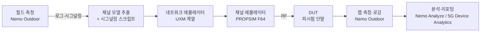

# Keysight Virtual Drive Test (VDT) & Nemo 리서치

> **문서 상태**: 재작성본 (rev. 2026-08-30)
> 이전 세션의 작업본이 커밋되지 않은 채 컨테이너가 회수되어 유실되었습니다. 본 문서는 처음부터 다시 조사하여
> 재구성한 것이며, 이전 문서에서 §11에 "미확인"으로 남아 있던 세 항목(공식 PDF / Nemo 매뉴얼 스크린샷 /
> 시각 디자인 언어)을 해소하는 것을 최우선 목표로 삼았습니다.

**신뢰도 표기 규약** — 본 문서 전체에서 다음 표기를 사용합니다.

| 표기 | 의미 |
|---|---|
| 【확인됨】 | 조사자가 직접 fetch 한 1차 출처(Keysight 소유 도메인·공식 PDF·실제 CSS/이미지 바이트)로 뒷받침됨 |
| 【추정】 | 정황상 합리적 추론이나 1차 출처로 직접 확인되지 않음 |
| 【미확인】 | 공개 정보로 확인하지 못함. 확인 방법을 함께 기재 |

---

## 1. 문서 개요

### 1.1 요약 (bottom line)

VDT(Virtual Drive Test, 가상 드라이브 테스트)는 **차량으로 실제 도로를 주행하며 수행하던 무선 품질 측정을,
현장에서 수집한 데이터를 근거로 실험실에서 재현(replay)하는 방식**입니다. Keysight의 상용 제품명은
**S8709A Virtual Drive Test Toolset**이며, 채널 에뮬레이션 + 네트워크 에뮬레이션 + **Nemo Outdoor** +
5G Device Analytics를 하나로 묶은 구성입니다 【확인됨】. 이 구조에서 **Nemo Outdoor는 "현장 데이터 수집" 쪽에
위치**하며, 수집된 데이터가 테스트 시나리오로 임포트되어 실험실에서 반복 재생됩니다 【확인됨】. 핵심 가치는
현장 주행으로는 불가능한 **반복 재현성과 통제 가능성**이고, 고속철도·터널·고속도로 같이 현장 재현이 어렵거나
비싼 시나리오에서 특히 유효합니다 【확인됨】. POC 관점에서 하드웨어 없이 모사 가능한 부분은 VDT 장비 자체가
아니라 **드라이브 테스트 데이터의 시각화·분석 UI 계층**입니다(§9).

### 1.2 범위

- **다루는 것**: VDT의 정의와 제품 구성, Nemo 제품군의 역할, 시스템 아키텍처, 측정 지표, 경쟁 지형,
  그리고 POC 구현에 직접 필요한 공식 문서·UI 구조·시각 디자인 언어.
- **다루지 않는 것**: 실제 S8709A 구매·라이선스 협상, RF 하드웨어 캘리브레이션 절차, Keysight와의 계약 사항.

### 1.3 조사 환경상의 제약 (결과 해석에 영향)

- `www.keysight.com`의 HTML 페이지는 일반 HTTP 클라이언트에 **403(봇 차단)** 을 반환합니다. 단
  `/etc/designs/...` 경로의 CSS와 `/content/dam/.../ungate/*.pdf` 경로의 PDF 원본은 정상 응답합니다 【확인됨】.
- 이 우회 경로 덕분에 **공식 PDF 원본 바이트를 직접 내려받아 내부 이미지(스크린샷)를 추출**할 수 있었고,
  §11.2/§11.3의 결론은 대부분 여기에 근거합니다.

---

## 2. VDT(Virtual Drive Test)란 무엇인가

### 2.1 정의

VDT는 실제 필드에서 측정한 **무선 채널 환경과 네트워크 시그널링 이벤트**를, 실험실의 채널 에뮬레이터와
네트워크 에뮬레이터 위에서 **반복 재생**하여 단말·칩셋·네트워크의 성능을 검증하는 기법입니다.
Keysight는 이를 "a real-world lab test environment for validating 5G devices under a wide range of network
signaling and radio channel conditions"로 기술합니다 【확인됨】.

### 2.2 무엇을 대체하는가

전통적 드라이브 테스트는 측정 장비를 실은 차량이 정해진 경로를 주행하며 로그를 수집합니다. 이 방식의 구조적
한계는 다음과 같습니다.

- **재현 불가능성** — 같은 경로를 다시 달려도 트래픽·기상·네트워크 부하가 달라 동일 조건이 재현되지 않습니다.
  펌웨어 A와 B를 공정하게 비교할 수 없습니다.
- **비용과 시간** — 차량·인력·장비가 실제로 이동해야 합니다.
- **희귀 시나리오 접근성** — 고속철도, 터널, 특정 핸드오버 실패 지점은 원할 때 재현할 수 없습니다.
- **관측 가능성의 한계** — 문제가 발생해도 그 순간의 채널 상태를 되돌려 재현할 수 없습니다.

### 2.3 비교

| 축 | 물리적 드라이브 테스트 | VDT (랩 재현) | MDT / 크라우드소싱 |
|---|---|---|---|
| 재현성 | 낮음 (1회성) | **매우 높음** (동일 조건 반복) 【확인됨】 | 낮음 |
| 통제 가능성 | 없음 | **높음** (채널·시그널링 파라미터화) 【확인됨】 | 없음 |
| 실제 네트워크 반영도 | **가장 높음** (실측 그 자체) | 높음 (실측 기반 재현) | 높음 (실사용자 분포) |
| 지리적 커버리지 | 주행 경로에 한정 | 수집된 시나리오에 한정 | **매우 넓음** |
| 단위 비용 | 높음 | 초기 장비비 높음, 반복 비용 낮음 | 낮음 |
| 희귀·위험 시나리오 | 어려움 | **가능** (고속철도/터널) 【확인됨】 | 우연에 의존 |
| 주 사용자 | 운영사 최적화 팀 | 칩셋·단말 제조사, 운영사 검증 팀 【확인됨】 | 운영사 기획, 시장 분석 |

### 2.4 제품 계보

Keysight의 VDT 툴셋은 **Anite의 "Virtual Drive Testing Toolset"** 계보를 잇습니다. Anite 시절 자료가
제3자 사이트(GTI 등)에 "Anite Virtual Drive Testing Toolset — Keysight Technologies"로 남아 있습니다 【추정】.
2020년 10월 Keysight가 5G VDT 툴셋 출시를 발표한 것으로 보이며 【추정】, 정확한 인수 연도와 발표일은 §10에
열린 질문으로 남깁니다 【미확인】.

---

## 3. S8709A Virtual Drive Test Toolset 구성

### 3.1 구성 요소

공식 Technical Overview(리터러처 3120-1513)에 따르면 툴셋은 다음을 결합합니다 【확인됨】.

| 구성 요소 | 역할 |
|---|---|
| 5G 채널 에뮬레이션 | 실측 기반 지리적 채널 모델의 재현 |
| 네트워크 에뮬레이션 | 운영사 네트워크의 시그널링 동작 재현 |
| **Nemo Outdoor** | **현장 데이터 수집** 및 랩 측정/로깅 |
| 5G Device Analytics | 결과 분석 |

### 3.2 제품 페이지가 명시하는 기능 【확인됨】

- 테스트 캠페인 관리 (상세 KPI 및 상태 모니터링)
- 결과 분석 및 리포팅
- End-to-end 파라미터화 가능한 테스트 솔루션
- 고급 로깅·시각화·디버깅 도구
- 이동성 성능: **핸드오버 성공률, 호 절단률, 데이터 성능**

### 3.3 지원 범위 【확인됨】

| 항목 | 내용 |
|---|---|
| 무선 기술 | 5G NR (SA/NSA), LTE |
| 테스트 유형 | Virtual Drive Test, **High Speed Train**, **Urban City** |
| 시나리오 | 고속철도, 고속도로, 터널 |
| MIMO | Sub-6 GHz Massive MIMO, 전체 안테나 어레이 샘플링 **16x16 ~ 64x16**, 부분 어레이 샘플링 옵션 |
| 연계 장비 | **PROPSIM F64** 5G Massive MIMO Channel Emulation Solution |
| 기타 | Multi-user massive MIMO, multi-RAT 단말 검증 |

### 3.4 대상 사용자 【확인됨】

- **이동통신사** — 상용화 이전 단말 검증
- **칩셋·단말 제조사** — 스트레스 테스트 및 상호운용성 검증

---

## 4. Nemo 제품군과 VDT의 관계

### 4.1 VDT 워크플로우에서 Nemo Outdoor의 위치 (핵심 질문)

**답: 주로 "현장 수집" 쪽이며, 랩에서의 측정·로깅에도 쓰입니다.** Technical Overview는 다음과 같이 기술합니다
— Nemo Outdoor로 수집한 필드 데이터가 테스트 시나리오로 **임포트**되어, 시그널링 이벤트와 무선 채널 환경을
통제된 실험실 환경에서 **신뢰성 있고 반복 가능하게 재생**할 수 있게 한다 【확인됨】. 즉 Nemo Outdoor는
VDT의 입력을 만드는 도구이며, 동시에 랩에서 단말을 계측하는 도구이기도 합니다 【추정】.

### 4.2 제품군

아래 표의 "확인" 열은 조사자가 해당 제품의 공식 Keysight 자료를 직접 확인했는지를 나타냅니다.

| 제품 | 형태 | 역할 | 확인 |
|---|---|---|---|
| **Nemo Outdoor** | Windows 랩탑 SW | 드라이브 테스트 측정·모니터링 | 【확인됨】 flyer 5992-2057 |
| **Nemo Analyze** | Windows 데스크톱 SW | 사후 분석(post-processing), 리포팅 | 【확인됨】 flyer 5992-2047 |
| **Nemo Handy** | Android 앱 | 휴대형 측정, QoS/QoE | 【확인됨】 flyer 5992-2050 |
| Nemo Walker Air | 워크테스트 | 실내 측정 | 【확인됨】 자료 3123-1442 존재 |
| Nemo Server | 서버 SW | 측정 인프라 | 【확인됨】 자료 5992-2064 존재 |
| Nemo FSR1 | 스캐닝 수신기 | 네트워크 스캔 | 【확인됨】 자료 5992-2032 (archived) |
| Nemo Diagnostic Module (NDM) | 모듈 | 단말 진단 | 【확인됨】 자료 3125-1130 존재 |
| Nemo Active Probe | 프로브 | 능동 측정 | 【확인됨】 자료 3122-2162 존재 |
| Nemo Global License Server | 라이선스 서버 | 라이선스 관리 | 【확인됨】 자료 5992-2268 존재 |
| **Nemo Firmware Manager** | Windows 유틸리티 | 테스트 단말 펌웨어 갱신 | 【확인됨】 매뉴얼 직접 입수 (§11.2) |
| Nemo Backpack / Backpack Pro | 백팩형 | 휴대 측정 | 【추정】 flyer 본문 언급 |
| Nemo NBM (Network Benchmarking) | 벤치마킹 | 다중 단말 벤치마킹 | 【추정】 flyer 본문 언급 |
| Nemo Invex / Invex II | 섀시 | 다중 단말 벤치마킹 | 【미확인】 |
| Nemo Cloud | 클라우드 | 원격 운용·수집 | 【미확인】 |
| Nemo WindCatcher | 분석 | 네트워크측 분석 | 【미확인】 |

> Nemo Analyze 제품 페이지의 제품번호는 **NTN50046C**로 보입니다 【추정】 — 검증 진행 중.

### 4.3 Nemo Outdoor 상세 【확인됨】 (flyer 5992-2057)

- **지원 모뎀**: Qualcomm X35/X50/X55/X60/X65/X70/X75/X85, Samsung Exynos 5100/5123/5123A/5123B/5133/5153/5300/5400,
  MediaTek M60/M70/M80/M90, 서드파티 스캐닝 수신기
- **5G 기능**: NR SA/NSA, NR 캐리어 애그리게이션, **빔 단위 KPI**, Massive MIMO, DSS
- **KPI**: RACH 정보, TX power, MIMO rank, modulation, MAC throughput, BLER, 신호세기, SSB 빔 품질,
  계층별 throughput, latency
- **UI**: "fully customizable user interface" — 사용자가 화면 구성을 자유롭게 바꾸는 것이 제품의 명시적 특징

### 4.4 Nemo Analyze 상세 【확인됨】 (flyer 5992-2047)

- 플랫폼: **Windows 10/11 64-bit**
- **다중 페이지 workbook** 구조, 시간 동기화된 데이터 시각화
- **KPI Workbench** — 사용자 정의 지표 및 분석 스크립팅
- **5G NR 빔포밍의 3D 시각화**
- 웹 기반 라이브 매핑: **Google Maps, OpenStreetMap**
- **PostgreSQL** 데이터베이스 엔진
- Network Performance Score(NPS) 리포팅, CDR 기반 음성/데이터 리포트
- **임포트 포맷**: Nemo 자체 포맷, **InfoVista TEMS 포맷, R&S SwissQual 포맷**

---

## 5. 시스템 아키텍처와 워크플로우

> 이 절의 장비 모델명 상당수는 검증 진행 중입니다. 확정된 것만 【확인됨】으로 표기했습니다.

### 5.1 신호 체인



### 5.2 워크플로우 단계별 산출물

| 단계 | 입력 | 산출물 |
|---|---|---|
| 1. 필드 수집 | 실제 주행 | 측정 로그, 시그널링 트레이스 【확인됨】 |
| 2. 채널 모델 추출 | 측정 로그 | 실측 기반 지리적 채널 모델 【확인됨】 |
| 3. 시그널링 스크립트화 | 시그널링 트레이스 | 운영사 네트워크 동작을 재현하는 스크립트 【확인됨】 |
| 4. 랩 재생 | 채널 모델 + 스크립트 | 통제된 재현 환경 【확인됨】 |
| 5. 측정·로깅 | DUT 동작 | KPI 로그 【확인됨】 |
| 6. 분석 | KPI 로그 | 리포트, 합불 판정 【확인됨】 |

---

## 6. 측정 지표(KPI)와 데이터 모델

> 검증 진행 중인 절입니다. 아래는 Nemo Outdoor 공식 flyer가 **명시적으로 나열한** KPI와, 실제 UI
> 스크린샷에서 **직접 관측된** 지표만 담았습니다. 3GPP 규격 번호와 임계값은 확인 후 보강합니다 【미확인】.

### 6.1 공식 자료가 나열한 KPI 【확인됨】

RACH 정보 · TX power · MIMO rank · modulation · MAC throughput · BLER · 신호세기 · SSB 빔 품질 ·
계층별 throughput · latency

### 6.2 실제 UI에서 관측된 5G NR 지표 【확인됨】

Nemo Outdoor 공식 스크린샷(§11.2)에서 직접 읽은 실제 파라미터입니다.

| 그룹 | 관측된 지표 |
|---|---|
| 셀 식별 | Cell type(SCG PSCell), SSB band(NR n78), SSB NR-ARFCN(633984), PCI(8), SSB GSCN(7853) |
| 무선 품질 | RSRP (NR SpCell), BI |
| 링크 적응 | MAC downlink BLER (NR / 1st / 2nd / 3rd+), MAC downlink block rate, new blocks |
| 처리량 | MAC downlink scheduled throughput, MAC downlink throughput |
| 물리계층 | PDSCH MCS CW0/CW1, PDSCH TBS CW0/CW1, PDSCH modulation(64QAM), PDSCH rank |
| 전력 | TX power (NR), TX power PUCCH, TX power PUSCH |
| 접속 | RACH type(Contention based), RACH reason, RACH result, RACH access delay, RACH config, contention resolution, logical root sequence, pathloss, preamble count/format(Format A2)/index/initial power/response/step, PUSCH power, RA-RNTI, response window, SSB ID, timing advance |

### 6.3 파일 포맷

| 확장자 | 용도 | 상태 |
|---|---|---|
| `.nemofw` | Nemo 펌웨어 파일 | 【확인됨】 Firmware Manager 매뉴얼에 명시 |
| `.nmf` / `.dcf` 등 | 측정 로그 포맷 | 【미확인】 — 추측 금지, 검증 진행 중 |

Nemo Analyze는 PostgreSQL을 엔진으로 사용하며 TEMS / R&S SwissQual 포맷을 임포트합니다 【확인됨】.

---

## 7. 경쟁 및 인접 솔루션

> 검증 진행 중. 현재까지 1차 자료로 확인된 사실만 기재합니다.

- **InfoVista TEMS** 및 **R&S SwissQual** — Nemo Analyze가 이들의 파일 포맷을 임포트한다는 점이
  공식 자료로 확인됩니다 【확인됨】. 이는 두 제품군이 이 시장의 실질적 표준 경쟁자임을 방증합니다.
- TEMS Paragon(랩 재현형), R&S QualiPoc/ROMES, Viavi, Spirent, Anritsu, Accuver XCAL,
  크라우드소싱(Ookla/Opensignal 등)과의 상세 비교는 보강 예정 【미확인】.

---

## 8. 활용 시나리오

| 사용자 | 수행 작업 | 근거 |
|---|---|---|
| 이동통신사 | 상용 출시 전 단말 검증 | 【확인됨】 |
| 칩셋·단말 제조사 | 스트레스 테스트, 상호운용성 검증 | 【확인됨】 |
| 공통 | 핸드오버 성공률·호 절단률·데이터 성능 측정 | 【확인됨】 |
| 공통 | 고속철도/터널 등 재현 곤란 시나리오의 반복 검증 | 【확인됨】 |

---

## 9. POC 설계 시사점

> **전제**: 유실된 원본 문서에 POC의 정확한 목표가 기록되어 있지 않았습니다. 아래는 조사 결과에 근거한
> **제안**이며 확정 사항이 아닙니다 【추정】.

### 9.1 무엇을 만들 수 있고, 무엇은 만들 수 없는가

| 영역 | 하드웨어 없이 가능? | 비고 |
|---|---|---|
| 드라이브 테스트 데이터 **시각화 UI** | **가능** | 본 문서 §11.2/§11.3이 그대로 사양이 됨 |
| KPI 대시보드·리포팅 | **가능** | §6.2의 실제 지표 목록 사용 |
| 지도 기반 경로 렌더링 + KPI 색상 비닝 | **가능** | §11.3의 색상 규약 사용 |
| 로그 파싱 | 부분적 | 실제 Nemo 로그 포맷 미확인 (§6.3) — 자체 스키마 정의 권장 |
| 채널/네트워크 에뮬레이션 | **불가능** | PROPSIM/UXM 실장비 필요 |
| 실단말 계측 | **불가능** | 진단 모뎀 접근 권한 필요 |

**결론**: POC는 "VDT 장비"가 아니라 **VDT/드라이브 테스트 결과를 보여주는 분석 UI**를 목표로 하는 것이
현실적입니다 【추정】.

### 9.2 제안 화면 목록

| 화면 | 목적 | 핵심 요소 | 우선순위 |
|---|---|---|---|
| 지도 뷰 | 경로별 KPI 공간 분포 | 색상 비닝된 폴리라인, 셀 사이트 섹터 마커, 색상 범례 | **P0** |
| 라인 그래프 | 시간축 KPI 추이 | 시간 X축, 공유 커서, 다중 패널 동기화 | **P0** |
| 파라미터 그리드 | 현재 시점 값 스냅샷 | Parameter/Value 2열, 임계 초과 셀 강조 | **P0** |
| 워크북 탭 바 | 화면 세트 전환 | 하단 탭, 사용자 정의 페이지 | P1 |
| L3 시그널링 뷰어 | 메시지 시퀀스 추적 | 타임스탬프 + 메시지명 목록, 상세 디코드 | P1 |
| 세션 상태 바 | 측정 구간 탐색 | START/END/CURRENT 시각, 진행 바 | P1 |
| 다중 단말 패널 | 단말 간 비교 | 단말별 열 비교 | P2 |

### 9.3 데이터 모델 최소 골격 【추정】

```
Measurement(id, name, device, location, start_ts, end_ts)
  └─ Sample(ts, lat, lon, cell_ref, kpi_name, value, unit)
  └─ Event(ts, type, detail)          # handover, RACH, drop, RLF
  └─ CellRef(pci, arfcn, band, gscn, cell_type)
```
§6.2의 실제 관측 지표가 `kpi_name` 어휘의 출발점이 됩니다.

### 9.4 단계별 범위

1. **Phase 1** — 정적 샘플 데이터로 지도 뷰 + 라인 그래프 + 파라미터 그리드, 커서 시간 동기화.
2. **Phase 2** — 워크북 탭, 임계값 기반 셀 강조, 색상 범례 편집.
3. **Phase 3** — 로그 임포트(자체 스키마), 이벤트 타임라인, 리포트 내보내기.

---

## 10. 리스크와 열린 질문

### 10.1 리스크

| 리스크 | 내용 | 완화 |
|---|---|---|
| **IP/저작권** | Keysight 스크린샷·로고·아이콘을 그대로 복제하면 저작권·상표 문제 발생 | 레이아웃 관용구와 도메인 색상 규약만 참고하고, 로고·아이콘·정확한 색상 조합의 복제는 피할 것 |
| 자료 접근 장벽 | Nemo 정식 매뉴얼은 제품 동봉/라이선스 게이트 뒤에 있음 (§11.2) | 공개 flyer·기술개요와 관측된 UI로 대체 |
| 포맷 미확인 | 실제 Nemo 로그 포맷 스펙 비공개 | POC는 자체 스키마로 시작, 임포트 어댑터를 나중에 추가 |
| 정보 최신성 | 제품 라인업·모델번호는 개정이 잦음 | 리터러처 번호와 확인 일자를 함께 기록 (§11.1) |

### 10.2 열린 질문

1. 이 POC의 실제 목표는 무엇인가? (UI 모사인가, 데이터 분석 도구인가, 영업용 데모인가)
2. Anite 인수 연도와 Nemo 브랜드의 정확한 계보는? 【미확인】
3. Nemo Outdoor/Analyze의 실제 로그 파일 확장자와 스키마는? 【미확인】
4. VDT 랙의 정확한 네트워크 에뮬레이터 모델명(UXM E7515B/E7515W 여부)은? 【미확인】
5. Nemo 공식 KPI 색상 범례의 정확한 임계값과 hex 값은? (§11.3) 【미확인】
6. POC가 특정 운영사/고객 대상인가? 그렇다면 해당 사업자의 KPI 기준이 별도로 존재하는가?

---
## 11. 미확인 항목 해소

이전 문서에서 미확인으로 남아 있던 세 항목에 대한 조사 결과입니다.

### 11.1 공식 문서 및 PDF

#### 11.1.1 조사자가 직접 내려받아 내용을 확인한 문서 【확인됨】

| 문서명 | 종류 | 리터러처 번호 | 링크 | 내용 요약 |
|---|---|---|---|---|
| S8709A Virtual Drive Test Toolset | Technical Overview | `3120-1513` | [PDF](https://www.keysight.com/us/en/assets/3120-1513/technical-overviews/S8709A-Virtual-Drive-Test-Toolset.pdf) | VDT 툴셋의 구성(채널·네트워크 에뮬레이션 + Nemo Outdoor + 5G Device Analytics), 5G NR SA/NSA, multi-user massive MIMO, 고속철도·고속도로·터널 시나리오, Nemo Outdoor 필드 데이터의 랩 임포트/재생 구조 |
| Virtual Drive Testing Toolset | Solution Brief | `5992-3870` | [PDF](https://www.keysight.com/us/en/assets/7018-06582/solution-briefs/5992-3870.pdf) | 필드-투-랩 자동화 가상 드라이브 테스트의 사업적 배경. 5G NR SA/NSA와 massive MIMO가 만드는 검증 복잡도, 출시 기간 단축 논지 |
| Nemo Outdoor | Flyer / Brochure | `5992-2057` | [PDF](https://www.keysight.com/us/en/assets/7018-05580/flyers/5992-2057.pdf) | 드라이브 테스트 측정 솔루션. 지원 모뎀 목록(Qualcomm X35~X85, Exynos, MediaTek), 5G NR SA/NSA·CA·빔 KPI·DSS, KPI 목록, "fully customizable UI". **Nemo Outdoor 실제 화면 스크린샷 포함** |
| Nemo Analyze | Flyer / Brochure | `5992-2047` | [PDF](https://www.keysight.com/us/en/assets/7018-05573/flyers/5992-2047.pdf) | 사후 분석 도구. 다중 페이지 workbook, KPI Workbench, 5G NR 빔포밍 3D 시각화, Google Maps/OSM 매핑, PostgreSQL, NPS 리포팅, TEMS/SwissQual 임포트. **Nemo Analyze 실제 화면 스크린샷 포함** |
| Nemo Handy | Flyer / Brochure | `5992-2050` | [PDF](https://www.keysight.com/us/en/assets/7018-05575/flyers/5992-2050.pdf) | Android 기반 측정 앱. 공중 인터페이스 진단 정보, QoS/QoE 측정 |
| **Keysight Nemo Firmware Manager User Guide** | **User Guide (정식 매뉴얼)** | 매뉴얼 부품번호 `NTC00000A-900005` | [PDF](https://update.nemo.fi/updates/Nemo_Firmware_Manager_User_Guide_2.51.pdf) | **공개적으로 접근 가능한 유일한 정식 Nemo 매뉴얼.** Edition 3.00, 2022년 1월, SW 2.51 문서화. 35페이지, 스크린샷 42장. §11.2의 근거 |

#### 11.1.2 검색으로 확인된 추가 공식 자료 (URL 존재 확인, 본문 미정독)

| 문서명 | 종류 | 리터러처 번호 |
|---|---|---|
| Nemo Outdoor – Qualcomm-Based Terminals | Data Sheet | `5992-2035` |
| Nemo Outdoor – Qualcomm-Based NB-IoT and LTE-M Terminals | Data Sheet | `5992-2650` |
| Nemo Outdoor and R&S TSME6 | Data Sheet | `5992-3356` |
| Nemo Outdoor and PCTEL HBflex | Data Sheet | `5992-3517` |
| Nemo Server | Data Sheet | `5992-2064` |
| Nemo FSR1 Scanning Receiver | Data Sheet (archived) | `5992-2032` |
| Nemo Handy IoT | Brochure | `5992-2774` |
| Nemo Global License Server | Brochure | `5992-2268` |
| Nemo Diagnostic Module | Data Sheet | `3125-1130` |
| Nemo Active Probe | Flyer | `3122-2162` |
| Nemo Handy & Nemo Walker Air | Data Sheet | `3123-1442` |
| FieldFox and Nemo Handy | Flyer | `3120-1471` |
| Nemo Analyze | Technical Overview | `5992-2005` |

#### 11.1.3 URL 규칙과 원본 내려받기 방법 【확인됨】

Keysight 자료는 **두 가지 URL 형태**를 가집니다.

```
# (A) 사람이 보는 asset 페이지 (HTML 래퍼)
https://www.keysight.com/us/en/assets/<assetId>/<type>/<litNumber>.pdf

# (B) PDF 원본 바이트 (스크래퍼로도 접근 가능)
https://www.keysight.com/content/dam/keysight/en/doc/ungate/<type>/<litNumber>.pdf
```

`<type>`은 `flyers`, `data-sheets`, `brochures`, `solution-briefs`, `technical-overviews` 등입니다.
**(A)는 일반 HTTP 클라이언트에 403을 반환**하지만 **(B)는 200과 함께 실제 PDF를 반환**합니다 【확인됨】.
경로에 포함된 `ungate`는 게이팅되지 않은(로그인 불필요) 자료임을 뜻합니다 【추정】.

> 주의: `technical-overviews` 계열 일부는 (B) 경로에서 404가 납니다 (`5992-2005`, `3120-1513` 확인).
> 이 경우 (A) 경로를 브라우저 또는 WebFetch로 접근해야 합니다 【확인됨】.

#### 11.1.4 무엇이 공개이고 무엇이 벽 뒤에 있는가

- **공개(ungated)**: flyer, brochure, data sheet, solution brief, technical overview — 위 표의 자료 전부.
- **벽 뒤**: **정식 User Guide/매뉴얼**. Keysight는 제품 문서를 `keysight.com/find/nemo`,
  소프트웨어는 `keysight.com/find/softwaremanager`(Keysight Software Manager)로 안내하며, 매뉴얼은
  일반적으로 **제품에 동봉되거나 라이선스 보유자에게 제공**됩니다 【추정】.
- **예외**: `update.nemo.fi`(Keysight가 운영하는 Nemo 업데이트 서버)는 봇 차단이 없고
  Firmware Manager 매뉴얼을 공개 제공합니다. 디렉터리에서 `Nemo_Firmware_Manager_User_Guide_3.60.pdf`
  (신버전)도 확인됩니다 【확인됨】.
- **비공식 미러**: PDFCoffee/Scribd 등에 Nemo Outdoor 8.01, Nemo Analyze 7.90, Nemo Handy 3.30 User Guide가
  올라와 있으나 **저작권자 허락 없는 복제본**입니다. 존재만 기록하며 인용·이용을 권하지 않습니다.

---

### 11.2 Nemo 매뉴얼 및 화면 구성

#### 11.2.1 결론 요약

정식 매뉴얼 스크린샷 자체는 **일부 확보에 성공**했습니다. 두 경로로 접근했습니다.

1. **정식 매뉴얼** — `update.nemo.fi`에서 Nemo Firmware Manager User Guide(35p, 스크린샷 42장) 원본 확보 【확인됨】
2. **공식 flyer 내장 스크린샷** — PDF 원본에서 이미지를 추출해 **Nemo Outdoor 5G NR 화면을 2560×1440
   네이티브 해상도로** 확보 【확인됨】. 아래 재구성은 이 실제 이미지를 직접 판독한 결과입니다.

> Nemo **Outdoor/Analyze의 정식 User Guide**는 공개 경로에서 확보하지 못했습니다 【미확인】.
> 확보 방법: Keysight Software Manager 계정 또는 제품 라이선스 보유자를 통한 정식 입수.

#### 11.2.2 Nemo Outdoor 화면 재구성 (실제 스크린샷 직접 판독) 【확인됨】

출처: `5992-2057.pdf` 3페이지 내장 이미지 (2560×1440 PNG). 창 제목 `Nemo Outdoor - 5G NR`.
측정 세션명은 `OnePlus 7 5G Oulu center 19Nov08 091517.1` — 2019-11-08 핀란드 Oulu 시내 측정.

| 화면 요소 | 위치 | 역할 | 확인 수준 |
|---|---|---|---|
| 타이틀 바 | 최상단 | 앱 아이콘(안테나 심볼) + 퀵 액세스 아이콘(핀·문서·**● 녹화 / ▶ 재생 / ⏸ 일시정지 / ⏹ 정지**) + 창 제목 + 최소/최대/닫기 | 【확인됨】 |
| 리본 탭 | 타이틀 바 아래 | `Home` \| **`Data Windows`**(활성) \| `Settings` \| `View`, 우측 끝 `?` 도움말 | 【확인됨】 |
| 리본 그룹 | 리본 본문 | 큰 아이콘 + 라벨, 하단에 회색 그룹명. `Custom Windows`(Open/Save/Properties), `Graph`(New/Open), `Grid`(New/Open), `Indoor`(New/Open), `Map`(New/Open), `Edit`(Copy/Find), `Images`(Save As Image/Export) | 【확인됨】 |
| 도킹 패널 | 본문 전체 | 각 패널은 자체 타이틀 바와 `×` 닫기 버튼, 일부는 최대화 버튼 보유. 자유 배치 | 【확인됨】 |
| 테이블 패널 | 상단 | `Table - 1. Qualcomm` — 열: Cell type / SSB band / SSB NR-ARFCN / PCI / SSB GSCN | 【확인됨】 |
| 라인 그래프 패널 | 좌측 대부분 | `Line Graph - RSRP (NR SpCell)` — Y축 `RSRP (NR SpCell) (dBm)` 0~-160(16 간격), X축 시각(09:33:20~09:34:40). 자체 미니 툴바(차트 아이콘, 확대 슬라이더, `53 %` 배율, `ABC` 토글) | 【확인됨】 |
| 값 그리드(그래프 종속) | 그래프 우측 | `1. RSRP (NR SpCell)` — 열 RSRP/NR-ARFCN/PCI/BI. 하단 탭 `Layers` \| `Values` \| `1. RSRP (NR SpCell)` | 【확인됨】 |
| 파라미터 그리드 | 우측 | `5G NR key parameters` — 2열(`Parameter` / `1. Qualcomm`). BLER·처리량·PDSCH·TX power 등 | 【확인됨】 |
| 파라미터 그리드 2 | 최우측 | `5G NR RACH metrics` — RACH 20여 개 항목 | 【확인됨】 |
| 임계 강조 | 그리드 셀 | **임계 초과 = 적색 배경 + 흰 글자**(TX power 3행), **경고 = 황색 배경**(BLER 2행) | 【확인됨】 |
| 처리량 그래프 | 하단 | `Line Graph - 5G NR MAC throughput` — Y축 0~603.98M(67.11M 간격 = 2^26 배수), 적색 계단 라인 + 적색 면적 채움 + 녹색 상단 라인 | 【확인됨】 |
| 워크북 탭 바 | 최하단 | 이동 버튼(`|◀ ◀ ▶ ▶|`) + 탭: **5G NR key measurements**(활성) \| LTE L1 \| LTE Link Adaptation \| LTE Data Throughputs \| Map \| 5G NR MAC \| 5G RACH and Signalling \| 5G NR Beams \| 5G and LTE Data Throughpu… \| 5G Physical Layer \| LTE and 5G NR Serv \| Default 12 \| `+` | 【확인됨】 |
| 상태 바 | 최하단 | `START: 9:15:18.543, END: 9:41:46.052, CURRENT: 9:33:57.852` + 녹색 진행 바 + `Device Config:` + `Measurement:` 세션명 | 【확인됨】 |
| 시간 커서 | 그래프 위 | 모든 그래프를 관통하는 **적색 수직선**, 그리드 값과 연동 | 【확인됨】 |

**설계상 핵심 관찰**: Nemo Outdoor는 *하나의 시간축 커서*를 중심으로 그래프·그리드·지도가 **동기화**되는
구조입니다. 화면 세트는 하단 **workbook 탭**으로 전환하며 사용자가 직접 구성합니다. POC가 모사해야 할
본질은 개별 위젯이 아니라 **"시간 커서 동기화 + 사용자 정의 패널 세트"** 라는 상호작용 모델입니다 【추정】.

#### 11.2.3 Nemo Analyze 화면 재구성 【확인됨】

출처: `5992-2047.pdf` 1페이지 내장 이미지(894×948). 해상도가 낮아 텍스트 판독은 제한적입니다.

| 화면 요소 | 위치 | 역할 | 확인 수준 |
|---|---|---|---|
| 리본 | 상단 | Outdoor와 동일 계열의 리본 UI | 【확인됨】 |
| 좌측 트리 (상) | 좌측 | `Analyze Local Database` → `All Measurements` / 즐겨찾기 / 배포 항목 | 【확인됨】(구조), 【추정】(정확한 라벨) |
| 좌측 트리 (하) | 좌측 | `Parameters` — KPI 파라미터 트리(스캐너/5G NR/RSRP·SINR 항목 등) | 【확인됨】(존재), 【추정】(항목명) |
| **지도 뷰** | 중앙 상단 | **위성 영상 위에 주행 경로를 굵은 폴리라인으로 렌더링, KPI 값에 따라 구간별 색상 비닝** | 【확인됨】 |
| 셀 사이트 마커 | 지도 위 | 방위각을 나타내는 **삼각형/콘 형태 섹터 마커**(마젠타·적·청·녹) | 【확인됨】 |
| 레이어 패널 | 지도 우측 | `Tools` 아이콘 행 + `Layers` 목록(레이어별 색상 아이콘·접기) | 【확인됨】 |
| **색상 범례 패널** | 지도 우측 하단 | `Color Legends` — 값 구간별 색상 스와치 + 구간값 + **구성비(%)** | 【확인됨】(존재), 【미확인】(정확한 값·hex) |
| 차트 그리드 | 중앙 하단 | 소형 라인 차트 다수를 **3열 × 3행** 배치, 다색 트레이스(적/녹/청) | 【확인됨】 |
| 워크북 탭 바 | 하단 | Outdoor와 동일한 다중 페이지 탭 구조 | 【확인됨】 |
| 리포트 산출물 | 별도 | **CDF 곡선 + 히스토그램 막대** 조합 차트(예: `RSCP best active set`), 범례 포함 | 【확인됨】 |

#### 11.2.4 Nemo Firmware Manager 화면 (정식 매뉴얼 내 스크린샷) 【확인됨】

정식 매뉴얼에서 직접 판독한 유일한 화면으로, **Nemo 유틸리티 계열의 디자인 관용구**를 보여줍니다.

- Windows 네이티브 흰색 타이틀 바 + 클래식 메뉴 바(`File`, `Help`)
- **다크 테마 본문** — 배경 `#0C0D11`에 **육각형(hexagon) 패턴** 모티프
- 2분할 레이아웃: 좌측 작업 영역 / 우측 디바이스 정보 패널(배경 `#1E2542` 남색)
- 우측 정보 필드: `IMEI`, `Serial number`, `Android version`, `Build number`, `Baseband version`,
  `CSC version`, `Country`, `Nemo ID/version`, 헤더는 `<Device not found>` 형식의 꺾쇠 표기
- 안내 배너: 채도 높은 파랑 `#3399FE` 바탕 + 굵은 검정 글자
- 상태 표시: 좌하단 **녹색 텍스트** 3줄(`Device driver ready` / `Connected to the firmware server` / `Ready to update devices`)
- 하단 흰색 푸터 밴드에 **Keysight 로고(적색 파형 마크)** 와 **NEMO 워드마크(남색)** 배치

> 관찰: Nemo 계열은 **측정 도구(Outdoor/Analyze)는 라이트 테마 + 리본**, **유틸리티(Firmware Manager)는
> 다크 테마 + 브랜드 그래픽**이라는 이원적 디자인을 씁니다 【확인됨】.

---

### 11.3 시각 디자인 언어

세 계층으로 정리합니다. **1차 출처(Keysight 소유 도메인의 실제 CSS·이미지 바이트)** 에서 추출한 값만
【확인됨】으로 표기했습니다.

#### 11.3.1 Layer 1 — Keysight 코퍼레이트 브랜드

**타이포그래피** 【확인됨】
출처: `https://www.keysight.com/etc/designs/keysight/clientlibs/fonts.min.<hash>.css`

| 항목 | 값 |
|---|---|
| 본문 서체 | **Inter** (`InterVariable`, `InterDisplay` 포함) |
| 폴백 스택 | `'Inter', 'Helvetica Neue', Arial, sans-serif` |
| 배포 | 자체 호스팅 woff2 (`InterVariable.woff2` 외 Thin~ 각 weight 및 italic) |
| 레거시 사이트 | `update.nemo.fi`는 `Roboto, Helvetica, sans-serif` 사용 |

> Inter는 오픈 라이선스(SIL OFL) 서체이므로 POC에서 그대로 사용해도 무방합니다 【추정】.

**색상 팔레트** 【확인됨】
출처: `https://www.keysight.com/etc/designs/keysight/clientlibs/tailwind.min.<hash>.css` 및
`https://update.nemo.fi/updates/styles.css`

| Hex | 역할 (셀렉터 근거) |
|---|---|
| **`#E90029`** | **Keysight 시그니처 레드.** `.fill-red-500 { fill:#E90029 }`; nemo.fi `border-top:#e90029 solid 4px`, `#orgtitle{color:#e90029}` |
| `#262626` | 본문 텍스트 (`p { color:#262626 }`) |
| `#30578D` | 인터랙션 액센트 — 슬라이더 썸, 토글 ON 배경/테두리, `--tw-ring-color` |
| `#4175BE` | 슬라이더 진행 구간(밝은 블루) |
| `#97999B` | placeholder 텍스트 |
| `#808080` | placeholder (다른 룰셋) |
| `#666666`, `#4D4D4D`, `#B1B3B4`, `#D9D9D9`, `#D9D9D6`, `#F1F2F4`, `#E2E6E9` | 그레이 램프 |
| `#373A36`, `#1F2528`, `#031327` | 다크 뉴트럴 |
| `#D32F2F` | 에러 레드 |
| `#E8E8E8` | 레거시 사이트 타이틀바/푸터 배경 |
| `#9C9C9C` | 레거시 저작권 텍스트 |

**브랜드 레드 검증 경위 (중요)**

`#E90029`는 **서로 독립적인 1차 출처 3곳**에서 일치했습니다 【확인됨】.
1. keysight.com Tailwind 빌드의 `.fill-red-500`
2. `update.nemo.fi/updates/styles.css`의 브랜드 테두리·제목 색
3. Nemo 앱 스크린샷 안에 렌더된 Keysight 로고에서 샘플링한 `#EB0028` (JPEG 압축 오차 범위)

한편 공식 로고 PNG(`https://update.nemo.fi/updates/keysight-logo.png`, 201×50)의 실제 픽셀은
**`#ED1A37`(적) + `#58585A`(회)** 였습니다 【확인됨】 — 웹 CSS 값과 로고 아트워크 값이 다른 리비전입니다.
두 값을 임의로 합치지 말고 용도에 따라 구분해 쓰십시오.

> **주의 — 제3자 출처의 오정보**: 색상 참조 사이트들은 Keysight 브랜드색을 `#EE4B25`("Keysight Orange",
> Pantone 1665 C) 또는 `#FF0000`으로 서로 다르게 표기합니다. 어느 쪽도 1차 출처로 뒷받침되지 않습니다
> 【미확인】. 특히 `#FF0000`은 명백한 근사치이며, 검색 요약이 `#EE4B25`를 엉뚱한 출처에 귀속시키는 사례도
> 확인했습니다. **제3자 색상 사이트를 브랜드 근거로 쓰지 마십시오.** (제3자가 제시한 회색 `#54565A`는
> 실제 로고의 `#58585A`와 근접하여, 오래된 인쇄용 아이덴티티일 가능성이 있습니다 【추정】.)

#### 11.3.2 Layer 2 — Nemo 소프트웨어 UI 관용구 【확인됨】

**측정 도구 계열(Nemo Outdoor / Analyze)** — 실제 스크린샷에서 샘플링한 값입니다.

| 요소 | 값 | 비고 |
|---|---|---|
| 디자인 이디엄 | **Windows 네이티브 + Office 스타일 리본 + 도킹 패널** | WPF/WinForms 계열로 보임 【추정】 |
| 테마 | **라이트** | |
| 타이틀 바 배경 | `#EFEFF2` | |
| 리본 배경 | `#FAFAFA` | |
| 비활성 탭 | `#EEEEF2` | |
| 패널 타이틀 바 | `#EFEFF2` | |
| 상태 바 | `#F0F0F0` | |
| 데이터 영역(플롯·그리드) | `#FFFFFF` | |
| **임계 초과 셀** | 배경 **`#FF0000`** + 흰 글자 | 순색 적색 — 경고용 |
| **경고 셀** | 배경 **`#FFFF00`** 계열 | 순색 황색 |
| 시간 커서 | `#DA0000` 수직선 | 전 패널 공유 |
| RSRP 트레이스 | `#825AC8` (보라) | |
| 처리량 면적 채움 | `#FF7F7F` (연한 적색) | 외곽선 `#D02D2D` |
| 처리량 보조 라인 | `#008000` (녹색) | |
| 진행 바 | `#5BDC77` 계열 (녹색) | |
| 정보 밀도 | **매우 높음** — 한 화면에 6~8개 패널, 그리드는 20행 이상 | |

**유틸리티 계열(Nemo Firmware Manager)**

| 요소 | 값 |
|---|---|
| 테마 | **다크** |
| 본문 배경 | `#0C0D11` + 육각형 패턴 모티프 |
| 보조 패널 배경 | `#1E2542` (남색) |
| 강조 배너 | `#3399FE` |
| 상태 텍스트 | 녹색 (≈`#2E9440`) |
| NEMO 워드마크 | 남색 (≈`#004578`) |

> **핵심 시사점**: Nemo 측정 도구의 시각 언어는 "브랜드 표현"이 아니라 **엔지니어링 계기판**입니다.
> 중립 회색 크롬 + 흰 데이터 영역 + **순색(적/황) 임계 강조**가 전부이며, 브랜드 레드는 UI 크롬에
> 거의 쓰이지 않습니다. 데이터가 유일한 색의 주인입니다.

#### 11.3.3 Layer 3 — 드라이브 테스트 도메인 시각 규약

POC에 가장 직접적으로 재사용 가능한 계층입니다.

**지도 경로 색상 비닝** 【확인됨】(구조) / 【미확인】(정확한 값)

Nemo Analyze 지도에서 주행 경로는 **굵은 폴리라인**으로 그려지고 KPI 값에 따라 구간별 색이 바뀝니다.
관측된 램프는 **적색 → 황색 → 녹색**의 이산(discrete) 스케일이며, 우측 `Color Legends` 패널이 구간별
색상·값범위·구성비(%)를 표시합니다. 다만 스크린샷 해상도와 JPEG 압축 때문에 **범례의 정확한 임계값과
hex를 판독하지 못했습니다** 【미확인】.

관측된 대표 색상(압축 오차 포함): 적색 ≈ `#CC0000`~`#D70D0B`, 황색 ≈ `#FFD731`, 녹색(구간 존재 확인).

**업계 관용 임계값 (Nemo 공식 아님 — 참고용)** 【추정】

아래는 드라이브 테스트 업계에서 널리 쓰이는 통상적 구간입니다. **Keysight/Nemo의 공식 기본 범례가
아니며**, POC 초기값으로만 사용하고 실제 프로젝트에서는 운영사 기준을 따라야 합니다.

| RSRP (dBm) | 통상 평가 | 색상 |
|---|---|---|
| ≥ -80 | 매우 좋음 | 진녹 |
| -90 ~ -80 | 좋음 | 녹 |
| -100 ~ -90 | 보통 | 황 |
| -110 ~ -100 | 나쁨 | 주황 |
| < -110 | 매우 나쁨 / 불통 | 적 |

> 근거 수준: `-90 dBm` 이상을 양호, `-100 dBm` 부근에서 성능 급락, `-110 dBm` 이하를 사실상 불통으로 보는
> 서술은 복수의 업계 자료에서 일관되게 확인되나, 특정 벤더의 공식 범례로 확정할 수는 없습니다 【추정】.
> RSRQ/SINR/처리량 구간은 별도 확인이 필요합니다 【미확인】.

**차트 관용구** 【확인됨】

- 시계열은 **계단(step) 라인**이 기본 (이산 스케줄링 값의 성격 반영)
- 처리량은 **면적 채움 + 상단 라인** 이중 표현
- 통계 리포트는 **CDF 곡선 + 히스토그램 막대**를 한 축에 겹쳐 표시
- 모든 시계열 패널은 **단일 시간 커서**를 공유

#### 11.3.4 POC 적용 권고

**채택할 것**
- 서체 **Inter** (오픈 라이선스, Keysight 실사용 서체와 동일)
- 중립 회색 크롬(`#EFEFF2`/`#FAFAFA`/`#F0F0F0`) + 흰 데이터 영역이라는 **저채도 껍데기** 원칙
- **순색 임계 강조**(적=초과, 황=경고)와 **전 패널 공유 시간 커서** — Nemo의 실질적 UX 정체성
- 지도 경로의 **이산 색상 비닝 + 구성비를 포함한 범례 패널**
- 워크북 탭 기반의 **사용자 정의 화면 세트**

**채택하지 말 것**
- Keysight 로고·워드마크·NEMO 워드마크, 육각형 브랜드 그래픽 (상표·저작권)
- 브랜드 레드 `#E90029`를 제품 아이덴티티 색으로 사용하는 것 (혼동 유발 소지)
- 공식 PDF에서 추출한 스크린샷 이미지의 재배포
- Nemo의 아이콘 세트 복제

> 요약: **상호작용 모델과 도메인 색상 규약은 참고하되, 브랜드 표식은 가져오지 마십시오.**

---

## 부록 A. 재현 방법 (조사 절차)

향후 이 조사를 갱신하려는 사람을 위한 절차입니다.

```bash
# 1) 공식 PDF 원본 내려받기 (asset 페이지는 403, dam 경로는 200)
curl -sSL -o nemo-outdoor.pdf \
  "https://www.keysight.com/content/dam/keysight/en/doc/ungate/flyers/5992-2057.pdf"

# 2) PDF 메타데이터와 내장 스크린샷 추출
pip install pymupdf pillow
python3 -c "
import pymupdf
d = pymupdf.open('nemo-outdoor.pdf')
print(d.metadata)
for i in range(d.page_count):
    for im in d[i].get_images(full=True):
        xref, w, h = im[0], im[2], im[3]
        if w*h > 150000:
            info = d.extract_image(xref)
            open(f'p{i+1}_{xref}.{info[\"ext\"]}','wb').write(info['image'])
            print(i+1, xref, w, h)
"

# 3) 브랜드 토큰 추출 (CSS 경로는 봇 차단 없음)
curl -sS "https://www.keysight.com/etc/designs/keysight/clientlibs/fonts.min.<hash>.css" | grep -o 'font-family:[^;}]*'

# 4) 공개된 정식 Nemo 매뉴얼
curl -sSL -O "https://update.nemo.fi/updates/Nemo_Firmware_Manager_User_Guide_2.51.pdf"
```

`<hash>` 값은 asset 페이지 HTML의 `<link href=...>`에서 얻습니다(캐시 버스팅으로 변동).

## 부록 B. 확인 일자

본 문서의 모든 【확인됨】 항목은 **2026-08-30** 기준으로 접근 확인되었습니다.
Keysight는 리터러처 번호와 asset ID를 개정하므로, 링크가 깨지면 리터러처 번호로 재검색하십시오.
