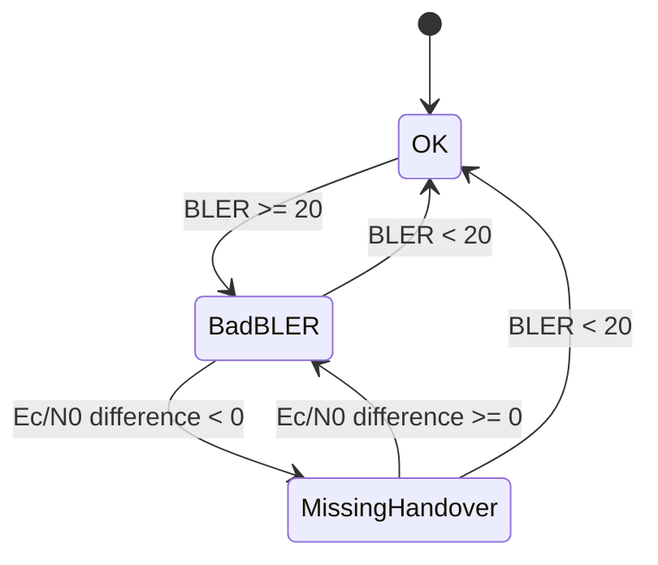

# Nemo Analyze 10.2 User Guide — Use Case 31개 상세 (원문 전사판)

매뉴얼이 "Use Case N:" 제목으로 실은 사용자 절차 **31개 전부**를, 장(chapter) 순서대로
**원문 PDF 없이도 같은 일을 할 수 있을 만큼** 자세히 옮긴 문서입니다. 각 항목은 매뉴얼이
말하는 것 — 목적 · 전제 · 단계별 절차 · 대화상자의 필드와 값 · 원문 인용 · 그림 — 을 먼저 적고,
끝에 **우리 구현과의 관계**를 짧게 붙였습니다.

| | |
|---|---|
| 출처 | Nemo Analyze User Guide · `NTN00000A-90013` · Edition 1, 2023-11-27 · 문서화 대상 SW 10.1.0 · 505p |
| 근거 | 이 문서의 절차·값·인용은 전부 원문 PDF(p1–504)에서 직접 옮겼습니다 |
| 기계 판독 인덱스 | [`use-cases.json`](use-cases.json) · [`toc.json`](toc.json) |
| 현재 구현 상태 | [`../../use-case-coverage.md`](../../use-case-coverage.md) — **상태는 그쪽에서 셉니다.** 이 문서는 *레퍼런스가 무엇을 하라고 하는가*의 기록입니다 |
| 그림 | `docs/assets/screenshots/manual10.2_*` — 파일명 끝 `_pNNN`이 원문 페이지. 재배포하지 않습니다([`NOTICE.md`](../../assets/NOTICE.md)) |

> **원본 PDF는 여전히 저장소에 두지 않습니다** ([`README.md`](README.md)). 대신 이 문서가
> 유즈케이스에 관한 한 원문을 대신하도록 썼습니다 — 단계, 메뉴 경로, 대화상자 필드, 예시 값,
> 경고문까지. 원문 표현이 판단에 중요한 곳은 영어 원문을 그대로 인용했습니다.

## 근거 등급

| 등급 | 뜻 | 해당 UC |
|---|---|---|
| **●** | 원문 페이지를 직접 읽고 절차 전체를 옮김 | **1–31 전부** |

UC27이 쓰는 워크벤치 요소의 대화상자(p367–396)는 [부록](#부록--워크벤치-요소의-대화상자-p367p396)에
있습니다.

## 페이지 번호

목차(`toc.json`) 기준이며 원문으로 전부 확인했습니다. UC20은 p172 하단에서 시작해 p174까지,
UC27은 p403–426입니다.

---

## 한눈에 — 31개 인덱스

| UC | p | 장·절 | 제목 | 근거 | 우리 ([대조표](../../use-case-coverage.md)) |
|---|---|---|---|---|---|
| 1 | 66–68 | 8 · 지도 | Viewing cell footprints, RSCP footprints, and LTE footprints | ● | ✅ |
| 2 | 68–69 | 8 · 지도 | Viewing uplink voice quality server data | ● | ✕ 범위 밖 |
| 3 | 69–72 | 8 · 지도 | Viewing IP/UDP packet trace data | ● | ✕ 범위 밖 |
| 4 | 72–74 | 8 · 지도 | Viewing Binary Log Data | ● | ✕ 범위 밖 |
| 5 | 77–82 | 8 · 필터 | Global parameter filtering based on a secondary parameter | ● | ◐ |
| 6 | 108–109 | 8 · 그래프 | Multiple graph layers | ● | ✅ |
| 7 | 110 | 8 · 그래프 | Notification icons in graphs | ● | ✅ |
| 8 | 110–112 | 8 · 그래프 | Correlating parameters using color grids and surface graphs | ● | ✕ 미룸 |
| 9 | 112 | 8 · 그래프 | Viewing 5G measurement results in 3D Visualizer (optional) | ● | ✕ 범위 밖 |
| 10 | 118–120 | 8 · 그리드 | Color sets in grids | ● | ◐ |
| 11 | 120–121 | 8 · 그리드 | Play audio sample | ● | ✕ 범위 밖 |
| 12 | 121–122 | 8 · 그리드 | Using L3 and RRC message search parameters | ● | ◐ |
| 13 | 147–148 | 8 · MapX/BTS | Adding map layers and saving layer combinations as geosets | ● | ◐ |
| 14 | 148–149 | 8 · MapX/BTS | Coloring routes based on BTS coverage | ● | ✅ |
| 15 | 150–157 | 8 · MapX/BTS | Performing area binning (+ Distance-based binning) | ● | ✅ |
| 16 | 158–162 | 8 · MapX/BTS | Comparing two groups of measurements from the same route on map | ● | ✅ |
| 17 | 162–168 | 8 · MapX/BTS | Displaying base station cell beam range on map | ● | ✕ 미구현 |
| 18 | 168–171 | 8 · MapX/BTS | Synchronizing base station map overlay with grid rows | ● | ✅ |
| 19 | 171–172 | 8 · MapX/BTS | Using BTS reference parameters | ● | ◐ |
| 20 | 172–174 | 8 · MapX/BTS | Displaying base station connections on map based on pilot pollution | ● | ✅ |
| 21 | 174–176 | 8 · MapX/BTS | Cell locator analysis | ● | ✕ 미구현 |
| 22 | 177 | 8 · MapX/BTS | 5G beam visualization | ● | ✕ 미구현 |
| 23 | 177–179 | 8 · MapX/BTS | Exporting Serving Cell Lines to Google Earth | ● | ◐ |
| 24 | 190–191 | 8 · 스프레드시트 | Retrieving data from minimized data sets | ● | ✕ 해당 없음 |
| 25 | 307–310 | 10 · 리포트 자동화 | Triggering events | ● | ◐ |
| 26 | 396–403 | 11 · KPI Workbench | Creating complex filters using multiple conditions | ● | ✅ |
| 27 | 403–426 | 11 · KPI Workbench | Creating a KPI for dropped calls resulting from a missing handover | ● | ◐ |
| 28 | 432–434 | 12 · 색상셋 | Automatic generation of color set for a value range | ● | ✅ |
| 29 | 434–436 | 12 · 색상셋 | Creating a color set | ● | ◐ |
| 30 | 436–439 | 12 · 색상셋 | Creating and applying a color set on map | ● | ✅ |
| 31 | 440–443 | 12 · 색상셋 | Creating and applying a color set in grid | ● | ◐ |

UC 번호는 장의 흐름을 그대로 따릅니다 — 1–24가 8장(Viewing Measurement Data), 25가
10장(Reports), 26–27이 11장(Customization, KPI Workbench), 28–31이 12장(Other tasks). 매뉴얼의
유즈케이스는 독립된 시나리오 모음이 아니라 **각 절의 끝에 붙은 실습**입니다.

---

## 8장 — Viewing Measurement Data (UC1–UC24)

### 8.1 지도에서 열기 (p61–p74) — UC1 · UC2 · UC3 · UC4

앞 절(p61–65)이 측정 파일을 지도에 여는 법, BTS 파일을 지도에 여는 법, 지도의 알림 아이콘을
설명합니다. p66 상단은 알림 아이콘의 마무리입니다 — 경로 우클릭 → `Properties` → `Notifications`
탭에서 관심 있는 알림(예: `Cell reselections`)을 고르면 지도에 작은 아이콘으로 찍히고, 뷰들이
동기화돼 있으면 아이콘 위로 현재 위치 마커를 옮길 때 모든 뷰가 그 시점으로 따라옵니다.

#### UC1 · p66–68 · 셀 푸트프린트 · RSCP 푸트프린트 · LTE 푸트프린트 보기 — ●

**입력.** 측정 파일(단말 또는 UMTS 스캐너)에 **Ec/N0 · RSCP · RSRP · RSRQ 중 하나**와 셀 식별(SC/PCI/채널) · **GPS 좌표** · 지도(배경, 선택) · 필터 값(SC 또는 채널 번호)

**우리 데이터.** ✅ `sample_kpi`(RSRP 등) + `sample`(좌표·서빙 PCI) + `sample_neighbour`(3강 판정용)


**목적.** 측정된 **모든 셀**에 대해 푸트프린트(서비스 범위) 지도를 자동 생성합니다.

> *"Nemo Analyze can automatically create a cell footprint, an RSCP footprint, or an LTE
> footprint map plot for every cell measured. Cell/RSCP/LTE footprint is displayed for every
> cell whose signal has been among the three strongest at some point during the measurement
> session. The footprint of each cell is displayed on map on a separate page, allowing you
> to browse from footprint to another and immediately see both the footprint and the cell."*

- 대상 데이터: **UMTS 스캐너와 단말 데이터 모두**.
- 경고: *"Analysis will not work properly if there will be hundreds of pages in the results.
  Therefore, it is advisable to use filters to limit the amount of results."*

**절차.**

1. `Workspace | Measurements | Measurements`에서 측정 파일 우클릭 → `Analyses` →
   다음 중 하나: `Ec/N0 Cell Footprints (mobile)` · `Ec/N0 Footprints (scanner)` ·
   `RSCP Cell Footprints (mobile)` · `RSCP Cell Footprints (scanner)` ·
   `RSRP Cell Footprints (mobile)` · `RSRP Cell Footprints (scanner)` ·
   `RSRQ Cell Footprints (mobile)` · `RSRQ Cell Footprints (scanner)`.
   `Analyses` 하위 메뉴에는 workbooks 폴더의 워크북도 전부 나열됩니다.
2. 필터 대화상자(예: `Ec/N0 Cell Footprints`)에서 고릅니다:
   - **Filters**: `Scrambling code filter` **또는** `Channel number filter`. 필터 값은
     숫자 하나 이상 또는 범위를 쉼표로 — 대화상자 도움말의 예: `3,10-30,42,100-`. 비워 둘 수 있음.
   - **Options**: `Show color legend` (No/Yes) · `Show entire route` (No/Yes).
3. `OK` → 푸트프린트 뷰가 열리고, **셀마다 별도 페이지**로 표시됩니다.
4. 지도 아래 페이지 탭으로 셀에서 셀로 이동합니다.

**그림.** `uc01-analyses-submenu_p67`(Analyses 하위 메뉴), `uc01-footprint-filter-dialog_p67`
(필터 대화상자), `uc01-footprint-pages_p68`(하단 탭이 있는 푸트프린트 페이지),
`cell-footprint_p66`(한 셀의 페이지 — 경로가 RSCP 구간색, Layers에 `RSCP 1. best`, 범례에
구간별 건수·비율).

**우리.** `GeoAnalysisService.cellFootprints` — 셀이 **서빙했던** 표본의 볼록 껍질. 다른 점:
(1) 포함 기준이 "서빙"이지 "3강 안"이 아님 — `sample_neighbour`에 순위별 이웃이 있어 바꿀 수
있습니다. (2) 셀당 한 페이지가 아니라 **전부 겹쳐** 그립니다 — 중첩이 곧 파일럿 오염이라 우리
방식이 낫다고 봤지만, 셀이 수십 개면 못 읽습니다. 레퍼런스의 SC/채널 필터가 그 문제의 답입니다.

#### UC2 · p68–69 · 업링크 음성 품질 서버 데이터 보기 — ●

**입력.** **서버 측 UL 음성 품질 로그** + 같은 세션의 단말(DL) 로그 · 두 로그의 **시각 동기**(GPS/NTP, ±3 s) · 서버 전화선 번호 설정

**우리 데이터.** ✕ 서버 로그도 음성 품질 측정도 없음


**목적.** 같은 측정 세션의 **서버 측 업링크(UL) MOS**와 단말 측 다운링크 데이터를 함께 봅니다.
Nemo Analyze가 서버 로그의 UL MOS를 단말 로그에 **자동으로 상관**시킵니다.

**전제.** (1) 두 파일 모두 DB에 로드돼 있을 것. (2) 서버와 단말 로그의 **시각이 동기화**돼 있을 것
— 측정 도구는 GPS 시간, 서버는 온라인 시간 동기화 서비스(Nemo Server · Nemo Outdoor · Nemo
Handy 매뉴얼 참조). 수동 동기화도 가능하며 **약 3초 정확도면 충분**합니다.

**Step 1 — 로드.** 리본 `File | Measurement | Open Measurement` → `Open` 대화상자에서
**서버 측정 파일과 단말 측정 파일을 Shift로 함께 선택** → `Open`. 진행은 `Activity`에서
확인합니다.

> *"In order for the uplink server data to be displayed correctly, the database must contain
> both the server (UL) measurement file and the mobile terminal (DL) measurement file. Nemo
> Analyze will correlate these files automatically."*

**Step 2 — 질의.** Workspace에서 **다운링크(단말) 파일을 선택**하고(업링크 서버 파일은 선택하지
않음), 음성 품질 파라미터를 우클릭 → `Open In | [Data view]`. 측정 파일 기준으로 워크북이 열립니다.

**관련 절.** `Processing uplink voice quality data`(p191): Nemo Outdoor에서 `User Interface
Measurements | Use time from GPS`, Nemo Server에서 NSM 메뉴의 `NTP`. 측정 전에 서버 전화선 번호를
서버에 수동 설정(로그 헤더에 기록됨). 두 로그를 모두 로드하면 Outdoor 파일에서 UL MOS를 볼 수
있습니다.

**그림.** `uc02-ul-voice-quality-workbook_p69`.

**우리.** 범위 밖 — 음성 품질 측정도, 그것을 받는 서버도 데이터 모델에 없습니다.

#### UC3 · p69–72 · IP/UDP 패킷 트레이스 데이터 보기 — ●

**입력.** 측정 파일 + **같은 세션·동일 타임스탬프의 `.pcap`** · Microsoft Network Monitor 3.4(Analyze보다 먼저 설치)

**우리 데이터.** ✕ 패킷 캡처 없음


**전제 — Microsoft Network Monitor 3.4.** Nemo Analyze **보다 먼저** 설치돼 있어야 전체 IP/UDP
상세가 표시됩니다. 나중에 설치했다면 `C:\Program Files\Microsoft Network Monitor 3\NMAPI.dll`을
`C:\Program Files\Keysight\Nemo Analyze`로 복사하면 활성화됩니다. 없으면 **제한된 상세만**
표시됩니다.

**데이터.** IP 패킷 캡처는 단말별 **`.pcap`** 파일에 저장되고 Ethereal 같은 제3자 도구로도
후처리할 수 있습니다. 측정 파일과 `.pcap`은 **같은 세션, 동일한 타임스탬프**여야 두 워크북이
동기화됩니다.

**절차.**

1. *(설치)* Microsoft 다운로드 센터에서 `NM34_x64.exe` → 실행 → `Typical` → `Install` → `Finish`.
2. 측정 파일 우클릭 → 관련 워크북(예: `HSDPA full details`) 선택 → 워크북이 열림.
3. Parameters 뷰 아래 패널의 **`IP Traces`** 아이콘 → Workspace의 IP Traces 페이지. 파일이 없으면
   배경 우클릭 → `Open` → `.pcap` 선택 → `Open`.
4. IP Traces 페이지에서 해당 측정에 대응하는 `.pcap`을 **더블클릭** → 별도의 IP trace information
   워크북이 열리고 측정 워크북과 **자동 동기화**됩니다.
5. 측정 워크북에서 관심 이벤트(예: Throughput이 급락하는 시점)를 선택 → IP trace 워크북으로
   전환해 그 전후의 IP 메시지(IP 계층의 원인 후보)를 봅니다.

**설정 쪽.** `Options – IP Trace`(p457): `Autoload pcap files`(측정 파일에 붙은 pcap을 자동 업로드,
DB가 아니라 로컬 저장), 서버 환경에서는 다른 사용자가 `Workspace | Measurement | Open trace file`로
직접 올려야 함, `Time offset`(시간대 차 보정).

**그림.** `uc03-ip-traces-page_p71`.

**우리.** 범위 밖 — 패킷 캡처를 수집하지 않습니다.

#### UC4 · p72–74 · 바이너리 로그 데이터 보기 — ●

**입력.** 측정 파일 + 같은 세션의 **바이너리 진단 로그 `.nmfb` / `.dfl`**

**우리 데이터.** ✕ CSV 입력, 바이너리 디코더 없음


**목적.** 평소에는 측정 파일만으로 충분하지만, 특정 파라미터의 해상도가 부족한 경우 칩셋
**바이너리 진단 로그**(`.nmfb` 또는 `.dfl`)를 측정과 동기화해 봅니다. 두 파일은 같은 세션,
동일 타임스탬프여야 합니다.

**절차.**

1. 측정 파일 우클릭 → 관련 워크북 선택 → 워크북이 열림.
2. Parameters 뷰 아래 패널의 **`Binary Logs`** 아이콘 → Binary Logs 페이지. 파일이 없으면 배경
   우클릭 → `Open` → 바이너리 로그 선택 → `Open`.
3. Binary Logs 페이지에서 해당 로그를 **더블클릭** → binary log information 워크북이 열리고 측정
   워크북과 자동 동기화.
4. 측정 워크북에서 이벤트 선택 → 바이너리 로그 워크북에서 전후 메시지를 봅니다.

**그림.** `uc04-binary-logs-page_p73`.

**우리.** 범위 밖 — 입력이 CSV이고 벤더 바이너리 디코더가 없습니다.

### 8.2 파라미터 필터링 (p74–p82) — UC5

**Parameter filtering (p74–75).** 측정 파일 선택 → 파라미터 우클릭 → `Open Filtered in |
[dataview]` → 빈 워크북과 **`Filters` 대화상자**. `Add`로 필터 줄을 더합니다. `Name` 목록에는
`<Secondary parameter>` · `Area` · `Base station identification code` · `Cell ID` ·
`Channel number` · `Description` · `Device label` · `Device name` · `Distance` · `Ec/N0` ·
`Equipment ID` · `Event ID` · `Exclude event` · `Extension` · `GPS status` · `Height` … 가 있습니다
(그림 `filters-dialog-name-list_p75`). 필터는 질의에 포함된 파라미터에 걸립니다.

**Filtering based on polygon area (p75–77).** 경로의 일부에만 값 기반 색상셋을 입히고 나머지는
기본색으로 두는 용도입니다.

1. 측정 파일 선택, Parameters 필터 칸에 `Ec/N0 best active set` 입력 → 우클릭 → `Open Filtered
   In | Map`.
2. `Analyze Wizard - Filters`에서 `Add` → `Name`에 **`Area`** → `…` 버튼 → `Select Area` 대화상자:
   - `Area | Name` — 저장해 둔 폴리곤 선택
   - `Area` — 지도를 클릭해 폴리곤을 그리고 **더블클릭으로 닫음** → `Add polygon`에서 이름 부여
   - `Pan`(드래그 이동) · `Reset`(선택 지움) · 줌 인/아웃
3. `Finish` → 폴리곤 구간만 Ec/N0 색상셋, 나머지는 기본색(예에서는 파랑).
   (그림 `polygon-filter-route_p77`)

#### UC5 · p77–82 · 2차 파라미터에 의한 전역 파라미터 필터링 — ●

**입력.** 측정 파일 · **2차 파라미터**(예 `RSCP best active set`)와 임계값 · (셀 단위 필터면) BTS 파일과 지도

**우리 데이터.** ◐ 파라미터·임계는 `sample_kpi`로 표현 가능. 셀 ID 필터는 `serving_pci`로 가능. 전역 적용 층이 없음


**목적.** 사업자는 커버리지 영역을 특정 파라미터의 임계로 정의합니다. 그 임계를 **전역 필터**로
걸면 이후 모든 Nemo Analyze 조작(단, **Crystal Reports 템플릿은 제외**)이 그 필터를 통과한
데이터만 씁니다.

> *"Filtering by secondary parameter enables the filtering of a primary parameter data set
> based on a selected secondary one. The resulting data set will contain only those values
> from the primary data set that coincide with the values in the secondary one."*

예제 조건: **`RSCP best active set >= -100`** 인 구간만 커버리지 영역으로 간주.

**절차.**

1. 리본 `Utilities | Global Filters` → `Global Filters` 대화상자(`Active global filters` ·
   `Saved global filter sets` 두 칸과 `Edit… / Clear / Save`, `Set Active / Modify / Delete`).
2. `Edit` → `Analyze Wizard – Filters` → `Add` → 빈 줄.
3. `Name`에서 **`<Secondary parameter>`** 선택 → `Value` 열의 `…` → `Analyze Wizard – Secondary
   Measurement Parameters`에서 **`RSCP best active set`** 선택 → `Next`.
4. 두 번째 `Analyze Wizard – Filters`(*Filters For Secondary Parameter*) → `Add` → `Name` = `RSCP`,
   연산자 = `>=`, `Value` = `-100` → `Finish`.
5. 첫 대화상자로 돌아와 `Finish` → `Active global filters`에 필터가 표시됩니다.
6. **세션 동안** 모든 조작이 필터를 통과합니다. 다음 세션에도 쓰려면 `Save` → `Save Filter`에
   이름 입력(기본값은 필터 문자열 자체, 그림에서 `… = 0 AND "order" = 1 AND ("rscp" >= -100)`) →
   `OK` → `Saved global filter sets`에 나타남.
7. 저장된 세트 활성화: 세트 선택 → `Set Active`. 제거: 선택 → `Delete`.

**셀 단위 전역 필터.** 지도에서 기지국 섹터 위를 우클릭 → **`Create Global Filter From Cell
ID`** → 이후 모든 워크북·질의가 **그 셀이 서빙하던 지점**의 결과만 돌려줍니다.

**이벤트 제외(p94).** 측정 우클릭 → `Exclude Events` → 대화상자에서 이벤트 지정 → `Utilities |
Edit`의 Global Filters에 `Exclude event <> 1`을 추가하면 결과에서 빠집니다(예: 측정 시스템 오류로
실패한 호 제거).

**메뉴 쪽 근거.** `Utilities | Global Filters`(p467): *"applied to all operations performed with
Nemo Analyze"*, 예시로 폴리곤 영역 선택.

**그림.** `uc05-secondary-parameter-dialog_p79`, `uc05-filter-rscp_p80`, `uc05-save-filter_p81`,
`uc05-global-filters-saved_p82`.

**우리.** 전역 필터라는 개념이 없습니다. 우리 필터는 화면 단위(Statistics의 범위 필터, 지도의
임계 색상). 2차 파라미터 게이팅은 워크벤치로 표현됩니다 — `SOURCE_KPI(RSRP) + SOURCE_KPI(대상) →
COMBINE → FILTER: rsrp >= -100 → OUTPUT` — 결과가 새 KPI가 되어 이후 모든 화면에서 쓸 수 있습니다.
남는 차이: 지금 보는 화면에 즉시 걸리지 않고, 폴리곤·셀 ID 같은 **공간 조건은 전역으로 걸 수
없습니다**.

### 8.3 그래프 (p94–p112) — UC6 · UC7 · UC8 · UC9

**그래프 절의 배경 (p94–107).** 그래프 종류는 `line` · `bar` · `scatter` · `pie` · `color grid` ·
`surface`(`Change Graph Type`). 팝업 메뉴: `Reset` · `Query`(Cut/Copy/Paste — 다른 뷰로 같은
질의를 옮김, Query Clipboard) · `Pick Parameter`(그래프에는 새 레이어, 그리드에는 열, 지도에는
경로) · `Add Function`(Average · Exponential moving average(`2 / (Period + 1)`) · High · Low ·
Median · Mode · Moving average · Trend, `Period` = 표본 수) · `Add Reference Line` · `Tool`(Scroll /
Zoom) · `Mode` · `Bin data`(산점도·컬러 그리드를 가로·세로 한계로 4구역으로 나눠 구역별 표본
비율 또는 개수 표시).

**Mode (p97–98).** `Single` — 레이어를 겹쳐 그리고 축은 **활성 레이어**(Layers 패널에서 연한
파랑)만. `Stacked` — 레이어를 위아래로 쌓고 레이어마다 축. 순서는 Layers 패널 우클릭 `Move Up /
Move Down`. `Automatic` — 같은 Y축을 가진 레이어는 한 그래프에, 다른 축은 쌓음.

**Layer properties (p104–107).** `Name` · `Show marks`(값 라벨) · `Title (on x-tab)` · `Scale
automatically to values` 또는 `Top / Bottom` 수동 · **`Parameter` 탭**(필터 — N 파라미터 예:
`Ec/N0 Nth best`는 `N = 1`이 자동 설정, 2번째로 바꾸려면 `N = 2`) · `Default color` · `Coloring
mode` · `Color set`. 라인 그래프: `Line width` · **`Hold value constant until next`**(값이 바뀔
때까지 수평 유지) · `Show value points`. 바: `Style`(사각·타원·다이아몬드 등) · `Sorting`(X/Y 값
기준 오름·내림). 산점도: `Mode` · `Style`.

#### UC6 · p108–109 · 다중 그래프 레이어 — ●

**입력.** 측정 파일 · 겹칠 **파라미터 2개 이상**(시간축 공유)

**우리 데이터.** ✅ `sample_kpi` 다중 KPI


- 한 그래프에 **레이어 수 제한 없음**. 예제는 3개 레이어를 stacked 모드로.
- 레이어가 많으면 페이지를 키웁니다: 그래프 우클릭 → `Page | Properties` → `Page` 탭 →
  - `Fit to window` — 모든 레이어를 보이는 영역 안에. 레이어를 더할수록 각 레이어가 작아짐.
  - **`Fixed size`** — 픽셀 단위로 정확한 크기(그림의 예 `Width 1483 · Height 640`; *"The size is
    at least the size of the actual window even if smaller size is specified"*). 레이어마다 공간이
    넓어지고 스크롤바로 오르내림. 옵션 `Copy page for each device` · `Copy page for each
    inbuilding floor`.
- **single 모드에서 두 레이어의 축을 모두 표시**: 그래프 우클릭 → `Properties` → `Graph` 탭 →
  `Axes`의 `Left` / `Right`에 두 레이어를 각각 지정(예: 왼쪽 `RSCP 1. best`, 오른쪽 `MIMO RSCP`).

**그림.** `uc06-three-layers-stacked_p108`, `uc06-page-properties_p108`,
`uc06-graph-properties-axes_p109`.

**우리.** ✅ — 구성 워크북의 페인에 KPI를 겹쳐 그립니다. 레이어 체크 해제는 숨기기이지 삭제가
아닙니다. 없는 것: 좌·우 이중 축, stacked/single 모드 전환, 고정 페이지 크기.

#### UC7 · p110 · 그래프의 알림 아이콘 — ●

**입력.** 측정 파일에 기록된 **알림/이벤트**(Notifications and markers — 셀 재선택, 호 이벤트 등)

**우리 데이터.** ✅ `network_event` + `event_type` 레지스트리


1. 그래프 우클릭 → `Pick Parameter`.
2. `Pick Parameter` 대화상자에서 **`Notifications and markers`** 선택 → `OK`.
3. `Notifications Properties`에서 표시할 알림을 선택 → `OK`. **픽셀 오프셋**도 정할 수 있음.
4. 알림 아이콘이 그래프에 표시됩니다.

**관련.** 지도의 알림(p65–66, 경로 `Properties → Notifications` 탭, `Pixel offset` Horizontal /
Vertical, `Apply to all routes`), 타임라인의 알림(p207), 설정 `Configuring notification
icons`(p451) · `Notification configuration`(p453).

**그림.** `uc07-notification-icons-graph_p110`.

**우리.** ✅ — 차트 이벤트 마크(시각 위치에 점선 + 타입 글리프). 이벤트의 이름과 색은
`event_type` 레지스트리 한 곳에서 나와 지도·차트·독·파이가 같은 것을 씁니다.

#### UC8 · p110–112 · 컬러 그리드·표면 그래프로 파라미터 상관 보기 — ●

**입력.** 측정 파일 · 상관시킬 **파라미터 2개**(X·Y) · 각 최소·최대·구간 수

**우리 데이터.** ✅ 데이터는 있음(`sample_kpi` 두 KPI의 `(session_id, seq)` 조인). 뷰가 없음


**목적.** color grid와 surface는 **두 파라미터를 상관시키기 위한** 그래프 종류입니다. 설명은
color grid 기준이며 surface에도 그대로 적용됩니다. 빈 color grid에서 `Pick parameter`를 하면
기본 파라미터 쌍(예: `Rx quality sub` vs `Rx level sub`)이 제안되고, 직접 쌍을 정의할 수도 있습니다.

**절차.**

1. `View | Add Workbook | Graph` → 빈 데이터 뷰 우클릭 → `Change Graph Type` → `Color grid`.
   (이미 그래프가 있으면 우클릭 → `Change Graph Type` → `Color grid`.)
2. 빈 color grid 우클릭 → **`Correlate Parameters`** → 대화상자:
   - `Scope` — 포함할 측정 데이터
   - `Color set` — 그리드 색상셋
   - `X Parameter` 페이지: `Parameter` · `Filters` · `Minimum` · `Maximum` · **`Steps`**(색상
     그리드 눈금 수)
   - `Y Parameter` 페이지: 동일
3. `OK` → color grid 생성.

**그림.** `uc08-change-graph-type-popup_p111`, `uc08-color-grid_p112`.

**우리.** ✕ 미룸 — 두 파라미터 상관을 보는 유일한 뷰. 가치는 인정하되 순위가 낮습니다
([백로그 §6](../../ui-ux-backlog.md)).

#### UC9 · p112 · 3D Visualizer로 5G 측정 결과 보기 (옵션) — ●

**입력.** **5G 측정 파일** + **BTS 파일**(활성화) · 3D Visualizer 별매 옵션

**우리 데이터.** ✕ 3D 뷰어 없음. 빔 데이터도 없음


1. 5G 측정 파일을 Workspace 창에 **드래그 앤 드롭**으로 추가.
2. Workspace 하단 아이콘으로 `Base Stations` 페이지 → BTS 파일을 드래그 앤 드롭 → BTS 파일 선택,
   측정 파일 우클릭 → `Active`.
3. `Workspace | Measurements`의 `All Measurements`에서 5G 파일 선택 → Parameters 뷰에서 5G
   파라미터 선택 → `Open In | 3D Visualizer` → 새 창.
4. 주의: 모든 파라미터가 BTS 기능을 지원하지는 않음 — 3D Visualizer에서는 열리지만 **셀에서
   경로로 빔을 그리지 못하는** 파라미터가 있음. 조작법은 Keysight의 3D Visualizer User Guide.

**우리.** 범위 밖 — 레퍼런스에서도 별매 옵션.

### 8.4 그리드 (p112–p122) — UC10 · UC11 · UC12

**그리드 절의 배경.** 팝업 처음 셋(`Reset` · `Query` · `Pick Parameter`)은 그래프와 같음.
**`Play Audio Sample`은 오디오 샘플 파일 열이 있는 그리드에만** 표시. Side panel의 `Search`
(불리언 지원, `Highlight matches` / `Filter in` / `Filter out`, `Search decoded messages` —
디코딩된 본문 값으로 행 검색), `Layers`, `Information`(선택 메시지를 디코딩해 표시). `Row
Details`(더블클릭 — Info View에 디코딩). `Export Data To` — MS Excel · text · **MapInfo Tab** ·
**Google KML**(Tab/KML은 지도에 경로로 다시 열 수 있음); 여러 파라미터를 열별로 내보내려면 먼저
상관시켜 그리드로 본 뒤 내보냄, **보이는 데이터만** 내보냄. `Grid Properties`: `Visible columns`,
열 순서, `Use coordinate projection`(기본 `EPSG:4326 WGS84`, 4000+ 투영 지원, 예 Lambert 2
`EPSG:27572`), `Add / Delete`, 열별 색상셋(열 이름 선택 → 나타나는 버튼 → 드롭다운),
`Show heading` · `Vertical text in heading` · `Show row numbers` · `Show time intervals` · `Font`.

#### UC10 · p118–120 · 그리드의 색상셋 — ●

**입력.** 그리드에 연 파라미터 데이터 · **색상셋**(numerical)

**우리 데이터.** ◐ KPI별 임계 사다리. 그리드는 심각도 클래스만


**목적.** 지도뿐 아니라 그리드의 열마다 다른 색상셋을 써서 시각화합니다. **그리드에서 색상셋은
막대그래프처럼 동작**합니다 — 셀 안 막대의 크기와 색이 값에 대응합니다.

1. 그리드 우클릭 → `Properties` → **`Color Sets`** 탭.
2. 색상셋을 입힐 열 선택 → 나타나는 버튼 클릭 → 드롭다운에서 색상셋 선택 → `OK`.
   예제: `Scr. code` 열에 `Scrambling code`, `Ec/No` 열에 `EcNo`.
3. 선택한 열이 색상셋을 표시합니다.
4. 대안: `Color Sets` 탭의 **`Color whole cell`** — 막대 대신 셀 전체를 칠하고 색만으로 값을
   나타냄.

**그림.** `uc10-grid-color-sets-tab_p119`, `uc10-grid-color-bars_p120`,
`uc10-grid-color-whole-cell_p120`.

**우리.** ◐ — KPI별 임계 사다리를 편집·저장합니다. 그리드 셀은 심각도 클래스(`sev-*`)로
칠합니다. 이름 붙은 재사용 색상셋과 셀 내 막대 표시는 미룸.

#### UC11 · p120–121 · 오디오 샘플 재생 — ●

**입력.** **음성 품질 측정 파일**의 `Audio Quality Sample File Name UL` + 오디오 샘플 파일

**우리 데이터.** ✕ 오디오 없음


**배경.** Nemo 음성 품질 측정 파일에는 **수신 오디오 샘플**이 들어 있어 원본 송신 샘플과 품질을
비교할 수 있습니다.

1. 음성 품질 측정 선택, Parameters 뷰에서 **`Audio Quality Sample File Name UL`** 선택 → 우클릭 →
   `Open In | Grid`.
2. 그리드에서 듣고 싶은 샘플의 행 우클릭 → **`Play Audio Sample`**.

**그림.** `uc11-play-audio-sample_p121`.

**우리.** 범위 밖 — 오디오를 수집하지 않습니다.

#### UC12 · p121–122 · L3·RRC 메시지 검색 파라미터 사용 — ●

**입력.** **디코딩된 L3/RRC 시그널링**이 있는 측정 파일 · 검색 텍스트(예 `Short MAC value`) · 대상 메시지(예 `SERVICE_REQUEST`)

**우리 데이터.** ◐ `signaling_message`는 있으나 본문이 구조화돼 있지 않음


**목적.** 디코딩된 L3·RRC 시그널링 메시지에서 **특정 종류의 값**을 검색해 결과 데이터셋의
**열로** 만듭니다.

1. `Workspace | Measurements | Measurements`에서 측정 파일 선택.
2. 필요에 맞는 검색 파라미터 선택(예: **`L3 signaling parameter search`**) → **더블클릭**.
3. `Analyze Wizard – Filters`에서 **search text**(예: `Short MAC value`)와 **search message**(예:
   `SERVICE_REQUEST`) 입력 → `Finish`.
4. **`Parameter name`** — 검색된 값을 표시할 결과 열의 이름을 사용자가 정합니다.

**그림.** `uc12-search-parameter-result_p122`.

**질의 API 쪽 대응.** Appendix 5 Decoder 스칼라 13개 · Appendix 6 `MSG_DECODER_*` 8개
([`query-api.md`](query-api.md)).

**우리.** ◐ — Signaling 화면은 목록·필터·커서 동기화·본문 펼치기까지. 본문 필드를 KPI 열로
만드는 경로가 없고, 본문이 구조화돼 있지 않아 데이터 모델에서 시작하는 격차입니다.

### 8.5 지도 · MapX · BTS 파일 (p122–p179) — UC13 ~ UC23

**BTS 파일 절 (p140–146) — 이 구간의 전제.**

- Workspace 하단 아이콘 → `Base Stations` 페이지: `Files`(DB의 BTS 파일) · `Sites`(사이트·안테나
  상세). 사이트 정보에 **사용자 정의 열**을 추가할 수 있음.
- 같은 BTS 파일의 **날짜별 버전**: 파일명을 `filename_YYYY-MM-DD.nbf` 규약으로 지으면 측정
  시각에 맞는 버전이 **자동 선택**됩니다. 규약을 안 따르면 관련 버전을 **활성화**해야 하고,
  아무것도 활성화하지 않으면 *"reliable results cannot be guaranteed"*.
- BTS 파일을 열면 `Set Active BTS Files` 대화상자 — 체크로 활성화. 이미 DB에 있는 파일은 BTS
  페이지에서 우클릭 → `Active`.
- 지도에 표시: `Workspace | Base Stations | Files`에서 지도로 드래그. **초록 섹터가 안테나
  방향**. 줌 아웃하면 빨간 점으로 바뀜. 아이콘 더블클릭으로 상세.
- 경로와 BTS 연결: 경로 우클릭 → `Properties` → `BTS` 탭 → `Draw line to active base station`
  (연결되지 않은 경로에는 선이 그려지지 않음). BTS 파일이 여럿이면 `BTS` 탭 → `Modify`로 연결할
  파일 선택.
- `BTS Properties`(측면 패널의 BTS 레이어 우클릭): `Draw line to active base station` · `Icon
  size`(Fixed / Dynamic, max size) · `Show site names` · `Draw frame` · `Site transparency` ·
  `Show cell information`(+`Add`) · `Hide cell texts on low zoom levels` · **`Use cell beam range
  from BTS file`** · **`use estimation from antenna height and tilt`** · `Beam transparency` ·
  `Default color` · `Mode (parameter/custom)` · `Technology` · `BTS parameter` · `Custom query` ·
  `Color set` · `Beam color`.

우리는 이 정보를 **`cell_ref` 테이블**로 DB 안에 갖고 있어 "BTS 파일을 드래그해 연결한다"는
단계 자체가 없습니다.

#### UC13 · p147–148 · 맵 레이어 추가와 레이어 조합을 지오셋으로 저장 — ●

**입력.** **MapInfo `.TAB` 지도 파일**(Workspace › Maps에 로드) · MapX 엔진

**우리 데이터.** ✕ MapInfo 자산 없음(범위 차이). 워크북 저장이 대응


1. `Workspace | Maps | Loaded MapX Maps`에서 **`.TAB`** 파일을 열린 지도 뷰로 드래그 앤 드롭 →
   레이어 추가. 레이어 정리는 "MapX"(p132).
2. 필요한 레이어를 다 올린 뒤, 조합 전체를 **Geoset**으로 저장: 지도 우클릭 → **`MapX | Save
   Geoset`**. *"Note that to have these options, a MapX must be used."*
3. `Save As`에 지오셋 **파일** 이름 → `Save` → `Geoset Name`에 지오셋 이름 → `OK`.
4. 이후 레이어 조합 전체를 DB에 로드해 **하나의 지도로** 엽니다.

**그림.** `uc13-drag-tab-layer_p147`, `uc13-mapx-save-geoset_p148`.

**우리.** ◐ — "조합을 저장한다"는 절반은 워크북이 합니다.
막히는 것은 **무엇을 조합하는가**입니다 — 레퍼런스의 레이어는 `.TAB` **지도 자산**(그리고 UC15가
말하듯 분석 결과도 새 레이어가 됩니다)이고, 우리 레이어는 `{kpiName, visible}`
(`types.ts:436`, `WorkbookService.java:31`)뿐입니다. MapX·`.TAB`·지오셋은 코드에 전무하고
(`grep -i "mapx|geoset|basemap"` → `RouteMap.tsx`의 타일 실패 플래그만), 지도에는 **레이어 목록
자체가 없습니다**(우측 도크 = Parameters·Color Legends·Numerical Data·Monitored Set·Events,
`App.tsx:962·997·1011·1029·1035`). 게다가 워크북 MAP 페인의 Layers 도크는 **캡션만 바꾸고 그림을
바꾸지 않습니다**(`ComposedWorkbook.tsx:202` — `visible[0]`이 라벨에만 쓰이고 오버레이 prop이
넘어가지 않음).

#### UC14 · p148–149 · BTS 커버리지로 경로 채색 — ●

**입력.** **좌표 있는 측정 파일** + **BTS 파일** + 지도 · 기지국의 scrambling code · Ec/N0 또는 RSCP

**우리 데이터.** ✅ `sample`(좌표·serving_pci) + `cell_ref`. BTS 파일 연결 단계 불필요


**목적.** **단일 기지국의 커버리지**를 지도에서 봅니다. 전제: 좌표가 있는 측정 파일, BTS 파일,
대응하는 지도가 DB에 있음.

- **Step 1.** 지도 파일을 열고 측정을 드래그 앤 드롭. **파라미터는 열지 않습니다.** BTS 파일을
  지도에 드래그해 경로와 연결.
- **Step 2.** 기지국 우클릭 → **`Color Layers Based On Scrambling Code [번호]`** → 경로가 **그
  기지국의 Ec/N0 또는 RSCP 값**으로 칠해집니다. 같은 팝업에 `Highlight Sectors With Same Channel
  Number And Scrambling Code` · `Highlight Neighboring Cells` · `Create Global Filter From Cell
  ID`가 있습니다.
- 경로의 일부에 대한 영역 비닝은 UC15로.

**그림.** `uc14-color-layers-popup_p149`, `uc14-route-colored-by-bts_p149`.

**우리.** ✅ — 서빙 셀(PCI) 채색(`view/paint.ts`). 레퍼런스가 "한 셀의 Ec/N0·RSCP"라면 우리는
"어느 셀이 서빙했나"라 목적이 조금 다릅니다 — 색이 바뀌는 지점이 핸드오버 경계입니다.

#### UC15 · p150–157 · 영역 비닝 수행 (+ Distance-based binning) — ●

**입력.** 좌표 있는 측정 파일 1개 이상 · 집계할 파라미터 · 지도 · (단일 BTS면 SC/채널 값) · 통계 기준(Time/Distance/Sample)

**우리 데이터.** ✅ `sample`(좌표) + `sample_kpi` + `RouteContinuity.travelledMetres`(거리 가중)


**Step 1 — 영역 선택.** Tools 패널의 **Area Binning 아이콘** 클릭 → 지도에서 영역 선택.

**Step 2 — 측정 선택.** `Analyze Wizard – Select Measurement`: `Folder`(측정 폴더) · `Filter`
(검색) · `Selected measurements`(선택 목록) · `>>` / `<<`. **지도 위 경로는 기본 포함.** → `Next`
→ `Analyze Wizard – Measurement parameters`(예: `RSCP best active set`) → `Next` → `Analyze
Wizard – Filters`. 단일 기지국에 대한 비닝이면 `Finish` 후 필터 대화상자가 한 번 더 열리고,
`Value` 드롭다운에서 **scrambling code 또는 channel number**를 고릅니다(그림
`uc15-filters-scrambling-code_p151` — `Area = 25.4632:64.9976 …`, `X steps = 10`, `Scrambling code`
목록).

**가중.** *"The area binning statistics are by default weighted by time. Although area binning
as an operation is location-based, each sample has its unique time and distance weights that
can be used in calculating time and distance averages per bin."* 거리 가중을 쓰려면
`View | Options | Environment | Statistics`의 `Calculate statistics based on`을 **`<Ask every
time>`**으로 두면, `Finish` 뒤 `Choose Statistics Type` 대화상자에서 `Distance`를 고를 수 있습니다.
결과는 지도에 **새 레이어**로.

**Step 3 — 빈 크기.** Layers 패널의 area binning 레이어 우클릭 → `Properties`:

| 필드 | 뜻 |
|---|---|
| `Name` | 기준 파라미터 이름 |
| **`X steps` / `Y steps`** | 빈 크기. **값이 클수록 빈이 작아짐** |
| `Scrambling code` | 기지국의 scrambling code |
| `Draw method` | `Fixed size`(줌과 무관한 고정 크기) / `Actual size` |
| `Print value` | 측정점의 숫자 값을 지도에 인쇄 |
| **`Statistic`** | `Average`(기본) · `Minimum` · `Maximum` · `Sample count` · `Std. deviation` · `Variance` · `Mode` |
| `Color set` · `Transparency` | |

**Step 4 — 내보내기.** 레이어 우클릭 → `Export Data To | Excel` 또는 `| File`(.txt · MapInfo
.tab). KML(Google Earth)은 "Export to KML file" 절.

**Distance-based binning (p153–157).** 워크플로는 같고, area binning이 **좌표**로 빈을 만드는
반면 distance binning은 **측정 파일의 거리 값**으로 빈을 만듭니다.

1. Tools 패널의 **Distance Binning 아이콘** → 지도에서 영역 선택.
2. `Select Measurement` → `Next` → `Measurement Parameters` → `Next` → `Filters` → `Finish`.
3. 결과가 새 레이어로. `Zoom in`으로 측정점까지 확대.
4. 레이어 `Properties`는 `Statistics` · `Color` 두 뷰: `Name` · `Info`(측정 정보) · `Draw frame` ·
   `Print value` · `Draw method`(Fixed size circle / Actual size) · `Size`(고정 원의 크기) ·
   `Filters`(`X steps = 100`, `Area = <area>` 식) · `Statistics`(위 목록) · `Color set` ·
   `Transparency`.

**설정 쪽.** `Options – Statistics`(p457): 통계 기준 기본값(Time / Distance / Sample, 매번
묻기), 색상 범례 통계 기준, **dB 파라미터를 선형 산술로 계산할지**, `Area binning`의 X/Y steps와
`Bins in meters`, `Distance binning`의 구간 길이(m) — *"the statistics collected in distance
binning are based on the measuring point GPS coordinates closest to the midpoint of the defined
segment, not necessarily the mean value."*

**그림.** `area-binning_p150`(선택 도구 + 사각형 영역), `uc15-area-binning-result_p152`,
`uc15-bin-layer-properties_p156`, `uc15-statistic-dropdown_p157`.

**우리.** ✅ — 격자 비닝(50/150/500 m) + 지도 위 임의 폴리곤(`AreaStatsService`). 폴리곤 안의
통계에 **통과 목록**이 함께 나옵니다. 통계 기준(`[Distance]` / `[Sample]`)과 dB 선형 평균은
브리프 ⑦에서 한 자리(`AggregationBasis`)로 들어갔습니다. 없는 것: 빈별 `Statistic` 전환(최소·
최대·표준편차·분산·최빈), 빈 값 인쇄, 레이어 내보내기.

#### UC16 · p158–162 · 같은 경로의 두 측정 그룹 비교 (Delta plotting) — ●

**입력.** **같은 경로의 측정 파일 2그룹**(그룹당 1개 이상) · 좌표 · **두 그룹에 같은 파라미터** · 지도 · 통계 기준

**우리 데이터.** ✅ 세션 2개 + `sample_kpi`. 그룹당 여러 측정의 평균은 없음


**목적.** 같은 경로에서 얻은 **두 측정 그룹**의 파라미터 값 차이를 지도에 그립니다. 전제:
좌표가 있는 측정 파일과 대응 지도.

**Step 1.** 지도 파일을 열고 측정을 드래그 앤 드롭.

**Step 2 — Delta Plotting.**

1. Tools 패널의 **Delta Plotting 아이콘** → 지도에서 영역 선택(가는 점선으로 표시).
2. `Delta Plotting` 대화상자: `Measurement Group 1` / `Measurement Group 2`, 각각 `Group` ·
   `Parameter` · `Measurements` · **`Configure`**.
3. Group 1의 `Configure` → `Analyze Wizard – Select Measurement`(폴더·필터·선택 목록). **그룹마다
   측정 1개 이상**. *"A measurement group average is calculated from all measurements within a
   Measurement Group. The difference value plotted on map represents the difference between the
   two measurement group averages."* → `Next`.
4. `Measurement parameters` — 비교 기준 파라미터. **두 그룹에 같은 파라미터**를 골라야 함
   (원문 규칙. 다만 원문 그림 p161은 Group 1 = `Ec/N0 best active set`, Group 2 = `Ec/N0 detected
   set`으로 다른 파라미터를 보여 줌 — 같은 측정 파일 하나의 두 파라미터 차이를 낸 예) → `Next`.
5. `Filters`(선택) → `Finish`.
6. Group 2에 대해 반복 → `Delta Plotting`에서 `OK`.
7. **`Choose Statistics Type`** — `Time` / `Distance` / `Sample`(가중 없음). *"Although delta
   plotting as an operation is by default distance-based, each sample has its unique time and
   distance weights … In delta plotting this average per bin is calculated for bins of both
   routes separately. To find out the difference between the bin values of one route and the
   bin values of the other, a subtraction is performed between the bin values of the routes."*
8. 결과가 지도에 새 레이어로.

**그림.** `uc16-tools-delta-plotting_p158`, `uc16-area-selection_p158`,
`uc16-delta-plotting-dialog_p159`, `uc16-delta-plotting-configured_p161`,
`uc16-delta-plotting-result_p162`(경로를 따라 비닝된 타일 — RSCP · Throughput `[Distance]` 범례).

**우리.** ✅ — 공간 차분 지도(`SpatialDiffService`): 두 주행을 하나의 격자에 담아 타일별 차이.
한쪽만 지나간 타일은 0이 아니라 null. 레퍼런스와 같은 "빈별 평균 → 빼기"이고, 가중 기준 선택도
같습니다. 없는 것: 그룹당 여러 측정의 그룹 평균(우리는 주행 1 대 1).

#### UC17 · p162–168 · 기지국 셀 빔 범위를 지도에 표시 — ●

**입력.** **BTS 파일**에 셀 빔 범위, 또는 `Options › BTS`의 기본 빔 길이·각도, 또는 **안테나 높이·틸트** · 지도

**우리 데이터.** ◐ `cell_ref`에 방위각은 있음. 빔 범위·높이·틸트 열 없음


1. 지도에서 셀을 **우클릭으로 선택** → 그 셀의 빔 범위가 **섹터**로 표시됩니다.
2. BTS 파일에 빔 범위 데이터가 없으면 옵션에서 설정: `View | Options` → **`BTS | General`**.

**`Options – BTS` (p163–164, p459 전문).**

| 항목 | 뜻 |
|---|---|
| `BTS texts options` | BTS 텍스트 크기·스타일 |
| `Display BTS overlay on top of other layers` | BTS 레이어를 최상위로 |
| `Do not zoom to BTS layers` (기본 켜짐) | BTS가 첫 레이어여도 경로에 줌 |
| `Default BTS filter` · `Carrier` | 기본 필터. UMTS/LTE는 `Carrier number`로 필터의 어느 부분을 쓸지 정함 |
| `Optimization` | 셀·사이트를 언제 그릴지 (`Do not draw cells when visible area width is more than N`) |
| `Turn off BTS workspace` | 사이트 트리를 숨겨 성능 향상 |
| `Cell size` — `Fixed` / `Dynamic, max size` | 셀 아이콘 픽셀 크기 |
| `Show site names` · `Draw frame` · `Organize by name` · `Site transparency` | `Organize by name`: 같은 이름의 사이트가 넓게 퍼져 있으면 긴 여분 선이 그려질 수 있음; 끄면 분산 사이트의 선이 일부 안 그려질 수 있음 |
| `Show cell information` (+`Add`) | 셀별 표시 항목. **기술·밴드별로** 메트릭 지정(그림: `Antenna beam width`, `GSM`, `900`) |
| `Hide cell texts on low zoom levels` | 슬라이더 |
| **`Use cell beam range from BTS file`** | BTS 파일의 빔 범위 데이터 사용 |
| **`use estimation from antenna height and tilt`** | 안테나 높이·틸트로 커버리지 추정 |
| **`Default beam`** (m) · **`Default beam angle`** (°) · `Beam transparency` | 기본 빔 길이·각도 |
| `Default color` · `Default beam color` · `Default settings for BTS parameter`(BTS 파라미터별 기본 색상셋) · `Gradient color` | |
| `BTS Technology Based Settings` — `Use technology based settings (overrides icon size settings)` → `Add` → `Set Technology Setting`(System · Band · Carrier · Cell size · Icon color) | 기술·캐리어별 색과 크기 |

**셀별 속성 (p165–168).** 기지국 아이콘 우클릭 → `Properties`: `Current` 탭(현재 셀), `BTS` 탭
(`Draw line to active base station`), `Site` 탭(`Cell size` Fixed/Dynamic · `Show site names` ·
`Draw frame` · `Site transparency`), `Cell` 탭(`Show cell information` +`Add` · `Hide cell texts on
low zoom levels` · `Use cell beam range from BTS file` · `use estimation from antenna height and
tilt` · `Beam transparency`), **`Beam range`(m)**. 빔 범위는 `Workspace | Base Stations | File
Contents`에서 셀을 좌클릭해도 표시됩니다.

**그림.** `uc17-cell-beam-range-sector_p162`(경로 위 연한 초록 섹터), `uc17-options-bts-general_p163`,
`uc17-cell-properties-beam-range_p166`, `uc17-bts-tab-beam-options_p167`.

**우리.** ✕ 미구현 — `cell_ref`에 방위각이 있어 부채꼴을 그릴 데이터는 있습니다. 레퍼런스의
빔 길이는 (a) BTS 파일 값, (b) 기본값(m), (c) 안테나 높이·틸트 추정 셋 중 하나이므로, (b)만으로도
시작할 수 있고 (c)는 nullable 두 열이면 열립니다.

#### UC18 · p168–171 · BTS 지도 오버레이와 그리드 행 동기화 — ●

**입력.** 측정 파일 + **BTS 파일 `.nbf`** + 지도

**우리 데이터.** ✅ `cell_ref`(사이트 좌표) — 그리드는 셀 목록으로 대체


1. 측정 파일(p61)과 BTS 파일(p63)을 지도에 엽니다.
2. 지도 우클릭 → **`Data View | Split | Vertically`** → 뷰가 둘로 나뉨.
3. 빈 쪽 우클릭 → **`Data View | Insert | Grid`**.
4. Workspace에서 **`.nbf`** 파일을 그리드로 드래그 앤 드롭.
5. BTS 데이터 그리드가 표시되고, **그리드에서 고른 셀로 지도가 자동 줌**합니다.

**그림.** `uc18-split-vertically-popup_p169`, `uc18-insert-grid_p170`,
`uc18-grid-synced-with-bts-map_p171`.

**우리.** ✅ — 공유 시간 커서가 지도·그리드·차트·L3를 함께 움직입니다. 레퍼런스의 이 유즈케이스는
시간이 아니라 **셀 행 → 지도 줌** 동기화라, 우리의 셀 목록(Monitored set 표)에서 행을 고르면
지도가 그 셀로 가는 동작이 정확한 대응물입니다.

#### UC19 · p171–172 · BTS 참조 파라미터 사용 — ●

**입력.** **BTS 파일**(활성화, 날짜 버전이면 `_YYYY-MM-DD.nbf` 규약) + 측정 파일

**우리 데이터.** ◐ `cell_ref`가 BTS 파일 역할. 이름 열 없음(PCI만)


**개념.** Parameters 뷰에 이름이 **`BTS reference`**로 시작하는 파라미터 묶음이 있습니다. BTS
참조 파일(=BTS 파일)에 근거해 **현재 서빙·이웃 셀의 정보**를 표시합니다. 용도: 워크북에 서빙 셀
**이름**을 측정값과 함께 표시, 또는 **KPI workbench의 입력 데이터셋**으로 써서 서빙 셀 등으로
집계를 그룹핑.

**절차.**

1. 관련 BTS 파일이 DB에 있어야 하고 **활성화**돼 있어야 합니다(열 때 `Set Active BTS Files`
   체크; 이미 있으면 BTS 페이지에서 우클릭 → `Activate`). 날짜별 버전이 여럿이면 맞는 버전을
   활성화.
2. Workspace `Measurements` 페이지 → 측정 또는 폴더 선택 → Parameters 필터에 **`reference`**
   입력 → BTS 참조 파라미터 목록(그림: `Other › All BTS reference cells`, 그리고 `Services ›
   Voice quality › Audio quality reference sample filename DL/UL`도 검색에 걸림).
3. 파라미터 더블클릭 → 기본 뷰, 우클릭 → 다른 뷰. 통계는 우클릭 → `Parameter Launchpad`(p57).

**질의 API 쪽.** Appendix 6 `BTS_QUEST`(p499) — 측정과 BTS 파일로 "언제 어느 사이트·셀에 붙어
있었나"(`type` 1 = serving, 0 = neighbor).

**그림.** `uc19-set-active-bts-files_p171`, `uc19-bts-reference-parameters-workspace_p172`.

**우리.** ◐ — `cell_ref`(PCI · ARFCN · 밴드 · GSCN · 방위각)를 DB가 갖고 있어 임포트·활성화
절차가 불필요합니다. "서빙 셀 이름을 열로 붙이기"는 `SOURCE_SAMPLE`의 `serving_pci`가 절반을
합니다(이름이 아니라 PCI).

#### UC20 · p172–174 · 파일럿 오염 기반 기지국 연결선 표시 — ●

**입력.** **UMTS 측정**의 `Pilot pollution` 파라미터(active set + monitored set Ec/N0·RSCP) · **carrier/channel number**(BTS 파일 값과 일치) · BTS 파일 · 지도

**우리 데이터.** ✅ `sample_neighbour`(서빙 + 이웃 RSRP) + `cell_ref`. active/monitored set 구분은 없음


1. `Measurements`에서 측정 파일 선택 → Parameters 뷰에서 **`Pilot pollution`** 우클릭 →
   `Open In | Map`.
2. **carrier number**를 묻습니다 — `Select query values`에서 값 입력. **BTS 파일의 값과 일치해야**
   합니다. 원문 그림의 필터 대화상자 값:

   | Name | Value |
   |---|---|
   | `Polluter level window from the best active set` | `-6` |
   | `Ec/N0 active set best below threshold (dB)` | `-12` |
   | `RSCP active set best above threshold (dBm)` | `-95` |
   | `Pilot count threshold` | `3` |
   | `Carrier number` | `1538` |

3. `Select columns` 대화상자(Type `Route`, Longitude → `gps_longitude`, Latitude → `gps_latitude`,
   Time → `time`, Distance) → `OK`. 질의가 끝나면 결과가 지도에 그려집니다.
4. `Base stations` 탭에서 BTS 파일을 지도로 드래그 → "경로를 BTS와 연결할까요?" → **`Yes`**.
5. 앞서 입력한 query value와 같은 **channel number** 입력 → **측정된 파일럿들이 선으로**
   그려집니다.
6. 그려진 BTS 선을 보려면 `Tools | Layers` → 우클릭 → **`Properties | BTS`** — "Select which lines
   to draw" 목록: `Mobile serving and neighboring cells` · `CDMA / EVDO / LTE / UMTS scanner
   measured pilots` · `GSM scanner top N measured BCCHs` · `LTE / UMTS scanner top N measured
   pilots` · `GSM neighbor list` · `UMTS neighbor list` · **`Missing CDMA / GSM / UMTS
   neighbors`** · `UMTS Mobile Detected Set Cells` · **`UMTS Mobile Pilot Pollution`**; `Apply
   to all routes`. 범례는 `Number of cells [Time]` — 1 · 2 · 3 · 4 · 5 · 6 · 7 · >7.

**판정 규칙(필터 값에서 읽히는 것).** 파일럿 오염 = best active set에서 **`-6` dB 창 안에** 드는
파일럿이 **3개 이상**이고, best active set의 Ec/N0가 `-12` dB보다 **나쁘며** RSCP가 `-95` dBm보다
**좋은** 구간. 즉 레퍼런스에도 RSCP 하한이 있습니다 — 커버리지 홀을 오염으로 오탐하지 않기 위한
조건입니다.

**그림.** `uc20-pilot-pollution-filters_p173`, `uc20-select-columns_p173`,
`uc20-pilots-drawn-on-map_p174`, `uc20-bts-lines-properties_p174`.

**우리.** ✅ — Mobility 탭의 모니터드 셋 점선 + `MonitoredSetService`의 오염 구간. 우리도
하한(`POLLUTION_MIN_BEST_DBM = -110`)을 답니다. **정정**: 2026-09-01 브리프 ⑤와 대조표는 "매뉴얼의
UC20에는 이 조건이 없다"고 적었는데, 원문 필터 대화상자에 `RSCP active set best above threshold
(dBm) = -95`가 있습니다. **레퍼런스에도 같은 종류의 하한이 있고, 값만 다릅니다**(−95 대 −110).
"우리가 더 낫다"는 판정은 철회하고 "같은 설계, 다른 기본값"으로 고칩니다. 레퍼런스의 창(−6 dB)·
개수(3)·Ec/N0 상한(−12)도 우리 상수와 대조할 기준값입니다.

#### UC21 · p174–176 · Cell locator 분석 — ●

**입력.** **WCDMA/LTE/5G 옥외 측정**(스캐너 또는 단말)의 **셀별 신호 강도**와 좌표 · carrier number · 전력 하한 · (검증용) 실제 사이트 위치

**우리 데이터.** ◐ 입력(`sample_neighbour` + 좌표)은 있음. 정답 `cell_ref`도 있음. 알고리즘 미구현


> *"Cell locator is an algorithm that estimates the site locations and antenna directions of
> individual cells based on measured signal strength per cell. The accuracy of the estimate
> depends on the geographical coverage of the collected data; a confidence number (1—10) is
> reported per estimated cell location, with accuracy of <100 meters (110 yards) when data is
> collected from opposite sides of the BTS. The Cell locator works for WCDMA, LTE, and 5G
> scanner and mobile data collected outdoors."*

예제 그림에서 **실제 셀 위치는 초록, 드라이브 데이터로 추정한 위치는 보라**.

**진입.** Parameters 트리의 `LTE mobile cell locator` · `LTE scanner cell locator` · `UMTS
mobile cell locator` · `UMTS scanner cell locator` · `5G mobile cell locator` · `5G scanner cell
locator`.

**입력 (실행 시 묻는 값; 그림의 예 `3` · `5780` · `-120`).**

| 입력 | 의미 |
|---|---|
| `Minimum accuracy score (0-10)` | **6 이상**이면 가장 정확한(<100 m) 셀·사이트만. 9–10은 데이터가 조밀하지 않으면 결과가 전부 걸러질 수 있음 |
| `Carrier number` | 캐리어(채널 번호) 단위로 분석. 데이터셋의 채널 번호 목록에서 선택 |
| `Minimum received power` | 임계 미만 표본 제거. 매우 낮은 값(LTE **−120 dBm**, UMTS **−100 dBm**, 5G −100 또는 −120)을 걸러야 정확도가 오름 — 단말·스캐너가 저전력에서 **유령 셀**을 보고하기 때문 |

**출력.** 트리에서 분석을 더블클릭 → 지도에 **BTS 참조 오버레이**로 열림. 측면 패널의 레이어
우클릭 → `.kml` · MapInfo `.tab`으로 내보내기. 우클릭 → `Open in | Grid`로 표 → `Export Data To`로
Excel · `.tab`.

**그림.** `uc21-real-vs-estimated-site_p175`(초록 = 실제, 보라 = 추정), `uc21-cell-locator-parameters_p175`,
`uc21-inputs-dialog_p176`, `uc21-result-overlay_p176`.

**우리.** ✕ 미구현 — 유리한 위치입니다. 우리는 `cell_ref`에 **실제 좌표와 방위각**이 있어 추정
오차를 수치로 단언하는 검사를 붙일 수 있습니다. 레퍼런스의 세 입력(정확도 하한 · 캐리어 ·
전력 하한)과 confidence 1–10 출력이 그대로 사양이 됩니다.

#### UC22 · p177 · 5G 빔 시각화 — ●

**입력.** **5G 측정의 best beam 인덱스**(단말 또는 스캐너) + 활성 BTS 파일 + 지도

**우리 데이터.** ✕ 빔 인덱스 측정 없음


1. 관련 BTS 파일을 로드하고 **활성화**.
2. 5G 측정 경로를 지도 워크북에 그림.
3. 경로 위를 우클릭 → **`Beam lines`**.
4. 5G 경로가 자동 인식되고, 경로의 **모든 점에서 best beam의 사이트/셀로 선**이 그려집니다.
   선 색은 **beam index**(자동 색상셋).

**그림.** `uc22-beam-lines_p177`('Serving beam lines', 5G 스캐너 예).

**우리.** ✕ 미구현 — 빔 인덱스별 측정이 데이터 모델에 없습니다. 있다면 UC23의 서빙 셀 선과 같은
그리기이고 색만 빔 인덱스입니다.

#### UC23 · p177–179 · 서빙 셀 선을 Google Earth로 내보내기 — ●

**입력.** 측정 파일 + **활성 BTS 파일** + 지도 · Google Earth

**우리 데이터.** ◐ `sample.serving_pci` + `cell_ref` 좌표. KML 대신 GeoJSON


**전제.** 측정에 맞는 BTS 파일이 로드되고 **활성 BTS로 설정**돼 있을 것.

1. 파라미터를 지도에 열어 경로와 BTS 아이콘이 보이게 함.
2. 측면 패널의 파라미터 레이어 우클릭 → **`Serving Cell Lines`** → 측정점과 그 점을 서빙한 BTS
   아이콘 사이에 선이 그려짐.
3. 다시 레이어 우클릭 → **`Export Data To | Google KML-file`**.
4. 위치와 이름을 정해 저장 → Google Earth에서 엽니다.

**그림.** `uc23-serving-cell-lines-popup_p178`, `uc23-serving-cell-lines_p178`,
`uc23-export-kml-popup_p179`.

**우리.** ◐ — GeoJSON으로 내보냅니다. 서빙 셀 선 자체는 Mobility 탭에 있습니다.

### 8.6 스프레드시트 그리드 (p180–p191) — UC24

#### UC24 · p190–191 · 최소화된 데이터셋에서 데이터 조회 — ●

**입력.** 스프레드시트에 연 **파라미터 데이터셋**과 그 **질의 이름**

**우리 데이터.** ✕ 스프레드시트 층 없음


**개념.** 스프레드시트에 연 파라미터 데이터셋을 **셀 하나 크기로 최소화**할 수 있습니다
("Editing cell format", p182). 최소화된 표에서 값을 꺼내려면 수식으로 참조합니다.

**규칙.**

- 별도 데이터셋의 첫 열은 시트 위치와 무관하게 **항상 `Column A`**, 둘째는 `B` …
- **질의(데이터셋) 이름**을 알아야 합니다.
- 수식은 `=`로 시작 → 함수 연산자(예: 평균은 `AVG`; 함수 목록은 "Adding functions" p189 —
  `ABS` · `AND` · `AVG` · `CONCATENATE` · `COUNT` · `COUNTIF` · `EXACT` · `FACT` · `FALSE` · `IF` …)
  → 괄호 안에 데이터셋 정의: **여는 괄호, 별표, 질의 이름, 느낌표, 첫 셀, 콜론, 끝 셀, 닫는 괄호**.

**예.** `BLER DL` 데이터셋의 Column A 1–15행 평균:

```
=AVG(*BLER DL!A1:A15)
```

**그림.** `uc24-avg-formula_p190`(`=AVG(B7:B12)`), `uc24-minimized-dataset-formula_p191`.

**우리.** ✕ 해당 없음 — 우리 저장은 `sample_kpi` 세로형이 전부를 보관하고, 스프레드시트 층이
없습니다.

---

## 10장 — Reports (UC25)

#### UC25 · p307–310 · 이벤트 트리거 — ●

**입력.** **Nemo Analyze Server** 연결 · **FTP/SFTP 서버**와 자동 로드 설정 · `.nmf`/`.zip` 측정 · 실행할 워크북·리포트 템플릿

**우리 데이터.** ◐ 서버 임포트·리포트는 있음. 폴더 감시 트리거 없음


**Event Scheduler의 배경 (p294–307).** `Tools | Event scheduler` → 달력 뷰. 달력을 클릭하면
동적 리본에 `View`·`Time scale`(기본값은 `View | Options | Scheduler`). 시간대 우클릭 → `Add
Event` → **`Schedule Event Batch`**: `Batch name` · `Start time` · `Recurrence` · `Events` 목록
(`Use custom settings` · `Use default MapX map` · `Delete` · `Up` · `Down` · `Add…`). 배치 하나에
이벤트 여러 개가 **순서대로** 실행됩니다. `Schedule Event`의 `Event type`:

| Event type | 설정 (`Configure`) |
|---|---|
| **Run Report** | `Workspace folder` · `Update folder before report execution` · `Do not run event for empty folder` · `Report per measurement` · `Report file` · `Export`(PDF · Excel · Word · RTF · text · HTML) · `Autogenerate name` · `Export folder` · `Additional Report Scope Settings`(Scope Filter — `System` · `Band` · `Time & Area`: `Begin/End time`, `Area` → `Define Area`(폴리곤), `Filter out events marked as scheduled`) · `Save report to Nemo Cloud`(+ connection · project) · `Close workbook when report ready` · `Send email when report ready` · `Attach report` · `Configure email`(`To` · `Subject` · `Message`) |
| **Run Workbook** | 위와 같은 폴더 옵션 + `Workbook` · `Export to`(페이지별 이미지 / PDF) · `Export folder` · `Autogenerate name` · `Export name` · 이메일 |
| **Run Office report** | `Report type`(PowerPoint / Word) · `Template file`(미리 있어야 함) · `Export folder` · `Report file` · `Scope filter` · 이메일 |
| **Load files in folder** | `Load folder` · `Include subfolders` · `Download files x last days` · `File types` · `Other extensions` |
| **FTP autoload** | `Protocol`(FTP / SFTP) · `Use active mode` · `Host` · `Port` · `Username` · `Password` · `SSH key file` · `Remote folder` · `Other folders`(`\|`로 구분) · `Local folder` · `Use remote folder structure` · `File types` · `Other extensions` · **`Load files recursively from subfolders`** · **`Delete files from server after load`** |
| **Nemo Cloud autoload** | `Nemo Cloud connection` · `Project` · `Login` · `Local folder` · `Download files X last days` · `File types` |
| **KPI Threshold Alarm** | `Measurement folder` · 폴더 옵션 · `Check threshold for each measurement in folder` · **`KPI threshold`**(`Add` → 파라미터 → 필터(AND/OR로 여러 트리거) → `Condition`: left/right column · operator · value) · `Run script`(.bat) · `Send email` |

FTP 로드는 2단계입니다 — 서버에서 로컬 폴더로 받은 뒤 DB에 적재. *"the measurements files are
removed from the FTP server's autoload folder after loading."* 반복은 `Recurrence` → `Event
Recurrence`(`Event time` Start/End · `Recurrence pattern` Daily / Weekly / Monthly / every N week(s) on
[weekday(s)] · `Range of recurrence` 날짜 또는 `End after N occurrences`).

**목적.** *"Triggering events enables report automation with server autoload, making running final
measurement reports more convenient for the end-user. It is possible to trigger events and event
batches when connected to the Nemo Analyze Server – please note that triggering events is not
possible without a server connection."*

**전제 — Nemo Analyze Server 설정** (상세는 Nemo Analyze Database Server Administration Guide):

| 서버 설정 | 켤 것 |
|---|---|
| Backup & Retrieve | `Nemo measurements (*.nmf)` · `Zip archives (*.zip)` |
| Autoload | `Nemo measurements (*.nmf)` · `Zip archives (*.zip)` |
| FTP | `Load files recursively from subfolders` · `Delete files from server after load` |

**절차.**

1. FTP 서버에 폴더를 만듭니다(예: `test`). 여기 넣은 측정 파일은 자동 로드되어 클라이언트의
   **server folders**에 같은 이름의 폴더로 나타납니다.
2. 클라이언트에서 `Tools | Event scheduler` → 달력 클릭 → 리본의 **`Triggering events`** →
   `Triggering Events` 대화상자 → `Add`.
3. `Schedule Event Batch`의 **`Triggering folder`**에 FTP 폴더와 같은 이름을 쓰되, 트리거 시점을
   알리는 **마커 `_ready`를 붙입니다** — 이 예에서는 **`test_ready`**.
4. `Add`로 배치에 이벤트를 평소처럼 추가합니다(예제는 `Run workbook`과 `Run report` 둘).
   `Up`/`Down`으로 순서, `Delete`로 제거.
5. *"As event triggering is not time-related but event-related, you cannot set a start time for
   the event."* **`Active`**(기본 선택)를 켜고 `Close`. 이 사전 설정이 있어야 트리거가 동작합니다.
6. 포함할 측정 파일을 로컬에서 FTP 서버의 `test` 폴더로 올립니다. **FTP 폴더가 비워질 때까지**
   (서버 적재 완료) 기다립니다.
7. FTP 서버에서 폴더 이름을 **`test` → `test_ready`**로 바꿉니다. Nemo Analyze는 모든 파일이
   DB에 올라간 뒤에 트리거합니다. 이름 변경이 클라이언트에 닿기까지 **수 분** 걸릴 수 있습니다.
8. 바뀐 이름의 폴더가 클라이언트의 server folders에 나타나면 배치가 **자동 실행**되고, 실행 후
   배치는 **inactive**가 됩니다. 다시 쓰려면 `Schedule Event Batch`에서 재활성화합니다.

**Enterprise 쪽 (p310).** Nemo Analyze Enterprise 서버에서는 서버 리포트 템플릿(`.ssrt`, 지도는
로컬에서 추가)을 서버에 올려 클라이언트 없이 서버가 직접 생성합니다.

**그림.** `scheduler-schedule-event-batch_p294`, `scheduler-event-recurrence_p307`,
`uc25-scheduler-calendar_p308`, `uc25-triggering-events-ribbon_p308`, `uc25-triggering-events-dialog_p309`,
`uc25-triggering-folder-ready_p309`, `uc25-batch-with-events-active_p310`.

**우리.** ◐ — 이벤트 스케줄러도 자동 로드도 없고, 임포트는 사람이 파일을 올려 시작합니다.
구조는 오히려 가깝습니다 — 우리는 처음부터 서버가 임포트하고 서버가 리포트를 만듭니다
(`report.html`이 HTTP 엔드포인트). 레퍼런스의 트리거가 "폴더 이름에 `_ready`가 붙으면"이라는
**파일시스템 규약**이라는 점이 사양으로 남습니다 — 우리에게는 "임포트 잡 완료" 이벤트가 이미
있어 그것을 트리거로 쓰면 됩니다. `KPI Threshold Alarm`(임계 위반 시 스크립트·메일)은 우리
`run_criterion`의 합불 기준과 같은 개념입니다.

---

## 11장 — Customization · KPI Workbench (UC26 · UC27)

11장은 SQL 질의(p319–332) → Query Manager(p333–344) → Custom KPI Workbench(p344–396) 순서이고,
UC26이 Filter 요소 설명의 끝(p396)에, UC27이 24페이지짜리 실전 예제(p403–426)로 붙어 있습니다.
요소별 명세는 [`kpi-workbench.md`](kpi-workbench.md).

#### UC26 · p396–403 · 다중 조건으로 복합 필터 만들기 — ●

**입력.** 워크벤치 입력 데이터셋(예 **scrambling code 열**이 있는 파라미터)

**우리 데이터.** ✅ `sample_kpi` 열에 `FILTER` 텍스트 조건


**Filter 요소의 배경 (p379–383).** *"a filter for Scrambling Code <= 2 would AND Scrambling Code
> 0 would filter out all other scrambling codes than 1 and 2."* 요소를 놓고 데이터셋의 출력 소켓에서
입력 소켓으로 선을 끈 뒤 우클릭 `Properties` → `Filter` 탭 → `Add` → **`Condition`** 대화상자:

| 필드 | 뜻 |
|---|---|
| `Left column` | 비교할 입력 열 |
| `Operator` | 조건. 불충족 값이 걸러짐 |
| `Right column` | `<Value>`(아래 `Value`와 비교) · **`<Previous value>`**(같은 열의 직전 값과 비교) · 입력 데이터셋의 다른 파라미터 열 |
| `Value` | 한계값. **`{?<variable name>}`** 을 쓰면 KPI 실행 때마다 사용자에게 묻는 변수가 됨 |

트리 규칙: 이진 트리라 노드당 자식 둘. 셋째 조건을 더하면 **레벨이 자동 추가**. 노드는 레벨·노드
사이로 **드래그 앤 드롭** 가능. 연산자 우클릭 → `AND` / `OR`. 여러 필터를 선택해 우클릭 `Group` /
`Ungroup`(좌측에 선으로 표시).

**예제.** scrambling code를 **12–21, 29–30, 74–88** 세 범위로 거릅니다.

```
(scr<=21 AND scr>11) OR (scr<=30 AND scr>=29) OR (scr<=88 AND scr>=74)
```

이진 트리에는 최상위 노드 자리가 둘뿐이라 첫 쌍이 하나를 차지하면 남는 자리는 하나입니다. 세
범위가 **대등**해야 하므로 나머지 두 쌍을 남은 상위 노드의 **자식**으로 넣어 식을 이렇게 재구성
합니다:

```
(scr<=21 AND scr>11) OR ( (scr<=30 AND scr>=29) OR (scr<=88 AND scr>=74) )
```

**절차 (p397–403).**

1. Filter 요소를 놓고 데이터셋을 연결 → `Properties` → `Filter` 탭 → `Add` → `scr. code <= 21` →
   `OK`. 다시 `Add` → `scr. code > 11` → `OK`. 첫 범위(12–21) 완성.
2. 둘째 상위 노드 만들기: 기존 조건 하나를 선택하고 `Add` → `scr. code <= 30` → `OK`. 선택했던
   노드가 이미 자식 둘을 가졌으므로 **새 조건이 자동으로 둘째 상위 노드**가 됩니다.
3. 한쪽 범위의 값만 있는 상황도 받아야 하므로 두 상위 노드 사이의 연산자를 **우클릭 → `OR`**.
4. 둘째 쌍 완성: `scr. code <= 30` 선택 → `Add` → `scr. code >= 29` → `OK`. 이 노드의 연산자도
   `OR`로(p401 그림: `OR( AND(<=21,>11), AND(<=30,>=29) )`).
5. 셋째 쌍: 마지막 쌍의 조건 하나 선택 → `Add` → `scr. code >= 74` → `OK` → **새 레벨 자동 추가**.
   `scr. code >= 74` 선택 → `Add` → `scr. code <= 88` → `OK`.
6. `OK` → Filter 요소가 **빨강에서 초록**으로. Output에 연결하고 측정을 골라 배경 우클릭 →
   **`Run Script`**로 중간 테스트.

**그림.** `uc26-filter-tab_p397`, `uc26-condition_p398`, `uc26-first-pair_p399`,
`uc26-filter-tree-operator_p401`, `uc26-filter-tree-complete_p403`, `workbench-filter-tree-third-level_p382`.

**우리.** ✅ — 여기는 우리가 낫습니다. `FILTER` 노드는 조건식을 텍스트 한 줄로 쓰고 파서
(`ColumnCondition`)가 AND/OR/괄호를 지원해 중첩 깊이 제한이 없습니다. 안전성은 파싱 방식으로 —
연산자는 하드코딩 목록과 대조해 상수를 출력하고, 열 이름은 알려진 집합과 대조하며, 사용자
입력의 어떤 조각도 SQL로 복사되지 않습니다. 없는 것: `<Previous value>` 비교와 `{?변수}`.

#### UC27 · p403–426 · 이웃 누락(핸드오버 누락)에 의한 호 단절 KPI 만들기 — ●

**입력.** UMTS 측정의 **`BLER`** · **`Ec/N0 best active set`** · **`Ec/N0 Nth best`**(N=1) · **`Call dropped` 이벤트** — 즉 active set과 monitored set을 구분하는 이웃 측정

**우리 데이터.** ◐ BLER·서빙 RSRP·1st best 이웃·드롭 이벤트는 있음(`sample_kpi` · `sample_neighbour` · `network_event`). **active set 개념 없음**, 생성기가 "이웃 > 서빙" 표본을 만들지 않음


매뉴얼에서 가장 긴 유즈케이스이고, 우리가 워크벤치를 설계할 때 본 "스크린샷"의 정체가 이
유즈케이스의 완성 그래프(p425)였습니다. 진입: 리본 `Tools | KPI workbench`.

**Step 1 — 계획과 파라미터 추가 (p403–406).**

핸드오버 누락은 도심에서 건물 모서리가 서빙 셀 커버리지를 **순간적으로** 막아 다음 셀에 신호할
시간이 없을 때 생깁니다. 그때 두 파라미터가 거의 동시에 움직입니다 — **BLER이 오르고, active set의
Ec/N0가 monitored set보다 낮아집니다.**

> *"if Ec/N0 1. best is better than Ec/N0 best active set, the handover has not occurred. …
> if the result of the subtraction of Ec/N0 1. best from Ec/N0 best active set is smaller than
> zero, a better Ec/N0 value exists than that of the active set."*

파라미터: `BLER`, `Ec/N0 best active set`, `Ec/N0 1. best`(= `Ec/N0 Nth best`에 N=1).
드롭콜과 상관시키려면 누락 핸드오버를 **격리**해야 하고, 그것을 **state machine**으로 합니다.
상태는 `OK`(idle) · `Bad BLER`(Bad BLER가 누락 핸드오버에 **반드시 선행**하므로) · `Missing
handover`. 임계: **BLER ≥ 20**이 나쁨, **Ec/N0 difference < 0**이 누락 핸드오버.

> *"It is very important that there is always a returning transition from each state in case
> the conditions of the transitions to the state are not fulfilled anymore. … It is also
> recommended to always plan the operation of the state machine in the form of a flow chart,
> complete with trigger values."*

원문 p405의 흐름도(벡터 텍스트라 그림 파일이 없어 여기 다시 그림):



`OK → Missing handover` 직행 전이가 **없습니다** — BLER이 먼저 나빠진 상태를 거쳐야만 판정됩니다.

절차: Parameters 뷰에서 `BLER`, `Ec/N0 best active`, `Ec/N0 Nth best`를 캔버스로 드래그. Nth best를
놓으면 `Analyze Wizard – Filters`가 열리고 **`Value` 필드가 `1`인지 확인** → `Finish`.

**Step 2 — 원시 데이터셋 결합 (p406).** 뺄셈은 두 값이 **같은 데이터셋** 안에 있어야 하므로
`Correlations` 메뉴의 **`All Values Within Time Range`**를 놓고 `Ec/N0 best active set`과 `Ec/N0 Nth
best`의 출력 소켓에서 입력 소켓으로 선을 끕니다("동시에 발생하는 두 Ec/N0 값"이므로).

**Step 3 — 연산 추가 (p406–424).**

1. `Math` 메뉴의 **`Subtraction (-)`** → All Values Within Time Range에 연결 → 우클릭 `Properties`:
   `Left column` = `Ec/N0`, `Right column` = `1. best Ec/N0`, `Right value` 비움, **`Result title` =
   `Ec/N0 difference`**.
2. 이제 입력 데이터셋이 둘(`BLER`, `Ec/N0 difference`). *"you need to select a correlation method
   that does not remove any data from either of the sets, namely **Union**."* `Joins` 메뉴의
   `Union`에 둘을 연결.
3. 중간 테스트: Union → Output 연결 → 측정 선택 → 배경 우클릭 → `Run Script` → 출력 그리드가 새
   워크북으로. *"although the two tables and their time columns have been merged, the rows are
   not ordered by time. As most operations require the input data to be ordered by time, you
   need to sort the data set before performing any further operations on it."*
4. `Sorting` 메뉴의 **`Ascending sort`** → Union에 연결 → `Properties` → `Column` = **`time`** →
   `OK`. 다시 테스트하면 시간순.
5. `Operations` 메뉴의 **`State Machine`** → Ascending sort에 연결 → `Properties`:
   - `Add` → `State` 대화상자 `Name` = `OK` → `OK`. 같은 식으로 `Bad BLER`, `Missing handover`.
   - **`Initial state`** = `OK`.
   - 전이는 상태를 선택 → `Modify` → `State` 대화상자에서 `Add` → **`Transition`** 대화상자
     (`Conditions` 목록 + `Add / Modify / Remove`, `Target`, **`Output`**) → `Add` → **`Condition`**
     대화상자(`Left column` · `Operator` · `Right column` / `<Value>` · `Value`).

   | 출발 | Target | Condition | Output 필드 | 원문 근거 |
   |---|---|---|---|---|
   | OK | Bad BLER | `BLER >= 20` | **비움** | *"Because the only relevant state in terms of the KPI is Missing handover and the output should not include any data from the state OK, leave the Output field empty"* (p415) |
   | Bad BLER | OK | `BLER < 20` | 비움 | (p418) |
   | Bad BLER | Missing handover | `Ec/N0 difference < 0` | 비움 | (p419) |
   | Missing handover | OK | `BLER < 20` | **`Missing handover`** | *"As the output should include the data from the state Missing handover, enter the name Missing handover to the Output field"* (p421) |
   | Missing handover | Bad BLER | `Ec/N0 difference >= 0` | **`Missing handover`** | (p423) |

   → `OK`로 닫으면 State Machine 요소가 동작 가능.
6. `Call dropped` 파라미터를 캔버스로 드래그. `Correlations`의 **`All Values Within Time Range`**를
   하나 더 놓고, *"the state machine has to be the primary data set and the parameter Call
   dropped the secondary one"* — **state machine을 가장 왼쪽 입력 소켓에**, `Call dropped`를 다음
   소켓에 → 이 요소를 Output에 연결.

**Step 4 — 실행과 저장 (p425–426).** 측정 선택 → `Run Script`. *"The final output includes only
the rows with Missing handover events from the measurement data, and if there are Call dropped
events within the time range of the Missing handover events, these will be displayed as well."*
저장: 배경 우클릭 → `Save` → `Analyze Wizard – Properties`의 `Name`·`Title` = `Dropped calls
resulting from missing handover` → `Next` → `Column Aliases` → `Finish` → **Parameters 뷰의 `User`
항목** 아래에 나타남.

**실행 결과 (p426).** 전체 측정에서 **2행**:

| start_time | end_time | time_interval | index | text | Event ID | Event |
|---|---|---|---|---|---|---|
| 15:55:46.435 | 15:55:51.776 | **5341** | 1 | Missing handover | CAD | Call dropped |
| 15:55:48.986 | 15:55:51.776 | 5341 | 1 | Missing handover | CAD | Call dropped |

우측 Information에 `Measurement` · `Time` · `System (UMTS FDD)` · `Downlink Band (2100)` · `Status
(Dropped call…)` · `Call type (Voice call)`까지 **19열**.

**Output 규칙의 함의.** 행은 그 상태를 **빠져나올 때** 기록되고, 이름은 방금 있었던 상태를
가리키며, `time_interval`이 "그 상태에 머문 시간(ms)"입니다. 관심 상태에서 **나가는 모든 전이**에
같은 Output 이름을 적어야 빠짐없이 잡힙니다.

**그림.** `uc27-start-canvas_p405`(파라미터 3개와 빨간 Output), `uc27-subtraction-properties_p407`,
`uc27-graph-partial-union_p408`, `uc27-sort-column_p410`, `uc27-states-initial_p414`,
`uc27-transition-dialog_p415`, `uc27-condition-dialog_p415`, `uc27-transition-with-output_p421`,
`uc27-missing-handover-transitions_p423`, `uc27-complete-graph_p425`, `uc27-result-grid_p426`.
(`state-machine-states_p368.png`은 p368 원본이며 p413에서 재사용됩니다.)

**우리.** ◐ — 노드 그래프의 구조(배치·연결 방향·상태 이름)는 일치합니다. 같은 KPI를 만들 수
있는가는 **아니오** — (1) 우리 `STATE_MACHINE`은 표본별 `CASE`라 "Bad BLER를 거쳐야"라는 순서를
표현 못 함, (2) 출력이 표본별 값이라 `start_time`/`time_interval` 구간 행을 못 냄, (3) primary
게이팅이 없음, (4) `sample_neighbour`에 active set 개념이 없음. 설정된 이웃 목록은 필요하지 않으며,
실제로 막는 것은 시드 생성기가 매 표본 argmax를 서빙으로 골라
"이웃이 서빙보다 강한" 표본이 0개라는 점입니다([`corrections.md` C1·C2·C9](corrections.md)).
`SOURCE_EVENT`가 생겨 6단계의 상관 상대는 이제 캔버스에 올릴 수 있습니다.

---

## 12장 — Other tasks · 색상셋 (UC28–UC31)

**색상셋 절의 배경 (p427–432).**

- `Tools | Color set editor` → `Color Set Editor`: 전체 목록, `Type`·`Group`으로 정렬, 이름 검색,
  더블클릭으로 편집, `Add / Modify / Delete / Copy`. 원격 DB에 연결돼 있으면 **`Update to Server`**
  로 로컬 색상셋을 서버에 올림(편집기를 닫고 재시작할 때 서버 파일을 **대체**).
- `Color Set Properties`: `Name` · `Short name` · `Description` · **`Groups`**(연결할 기술·항목:
  CDMA · DVB-H · EVDO · GAN · GSM · LTE · Other · Services · Statistics · TD-SCDMA · TETRA · Tetrapol ·
  UMTS · User · WiMAX · Xynergy …) · **`Type`**(`numerical` · `gradient` · `string`) ·
  `Automatically generate missing values` · `Values` 표(Color · Limits / String · Description) ·
  `Add` · `Add Range…` · `Modify…` · `Delete` · 순서 화살표.
- **가져오기**: Nemo Outdoor의 `.csf` — `File | Settings (Import)` → 파일 선택 → `Import Settings`
  에서 색상셋 체크. 사용자 설정 전체(`.aex`)의 가져오기·내보내기는 p460–461
  (`File | Settings (Import/Export)`, 파라미터·워크북·이벤트·질의·색상셋·KPI 포함).
- **자동 생성 (p429–432)**: 빈 지도를 열고 측정의 파라미터(예: `RX level full`)를 지도로 드래그 →
  기본은 **color rotation**으로 칠해짐 → 지도 우클릭 → **`Generate Color Set`** → `Color Set
  Wizard`에서 질의(파라미터)와 `Column` 선택 → `Next` → 이름·short name·group → `Finish`. 적용:
  경로 우클릭 → `Properties` → `Color` 페이지 → `Mode` = **`Based on value`**, `Color set` = 새
  색상셋(예: `RX level full 2(dBm)`), `Scheme`/`Parameter` = `RX level full` → `OK`. 범례에서 값을
  클릭하면 지도에서 그 값이 **강조**됨. 범례 우클릭 → `Export To Text File`.
- `Options – Color`(p457): 팔레트(이웃형 그래프·경로 색), `.aex`로 다른 PC에 가져오기, 색상
  범례 기본값.

#### UC28 · p432–434 · 값 범위에서 색상셋 자동 생성 — ●

**입력.** **이산값 파라미터**(Cell identification · SC · BSIC) 측정 + 좌표 + 지도 · 값 범위(From/To/Step)

**우리 데이터.** ✅ `serving_pci`(이산값) — PCI 채색이 대응


**목적.** **scrambling code · cell ID · BSIC**처럼 값이 이산적이고 범위가 넓은 파라미터에 특히
유용합니다.

1. Workspace `Maps` 페이지의 `Loaded` 뷰에서 지도를 더블클릭해 빈 지도를 엶(지도는 Map Folder
   에서 미리 로드돼 있다고 가정).
2. 측정 선택 → Parameters에서 파라미터(예: **`Cell identification`**)를 지도로 드래그 → color
   rotation으로 칠해진 경로. 경로가 심볼로 보이면 우클릭 → `Properties` → `Route` 페이지의
   `Draw Mode` = `Line`.
3. 측면 패널의 `Color Legend` 우클릭 → **`Editor`** → `Add…` → `Color Set Properties`에서
   **`Add Range`**.
4. `Add Range` 대화상자: `From` · `To` · `Step`. 예: **`116731` ~ `117419`, step `1`** → `OK`.
5. 새 값 범위가 생기고, 사용자 정의 범위 덕에 값들이 지도에서 더 뚜렷이 구분됩니다.

**그림.** `uc28-color-set-properties_p433`, `uc28-add-range_p434`.

**우리.** ✅ — `AutoScale`: 임계값이 없는 KPI에 이 세션의 사분위로 자동 구간(판정이 아님을 범례가
명시). 레퍼런스의 `Add Range`는 **연속 구간이 아니라 이산값 하나하나에 색을 배정**하는 것이라
셀 ID 채색(우리의 서빙 PCI 채색, `view/paint.ts`)이 더 가까운 대응물입니다.

#### UC29 · p434–436 · 색상셋 만들기 — ●

**입력.** 없음 — 색상셋 정의만(값 범위·색·설명 설계)

**우리 데이터.** ◐ KPI별 임계 편집기


1. `Tools | Color set editor` → `Add` → 빈 `Color Set Properties`.
2. 상단 설정(이름 · short name · 설명 · Groups · Type = `numerical`)을 먼저 정의.
3. `Add` → **`Range Properties`**: `Description` · `Color` · `Limits` — 연산자와 값 두 줄, 사이에
   `And` 체크. 원문 예:

   | Description | Color | Limits |
   |---|---|---|
   | Very good | 분홍 | `>= 0` And `< 2` |
   | Good | 노랑 | `> 2` And `< 4` |
   | Bad | 빨강 | `> 4` |

4. 값 집합이 완성될 때까지 반복 → `OK` → 편집기 목록에 추가(예: `Parameter X`, Group `User`).

**그림.** `uc29-range-properties_p435`, `uc29-color-set-complete_p436`.

**우리.** ◐ — 임계 편집기로 만들지만 KPI에 매입니다. 레퍼런스는 구간마다 **연산자를 골라
포함 방향**(`>=` 대 `>`)을 정하는데, 우리는 "하한 포함, 상한 배제"로 고정입니다.

#### UC30 · p436–439 · 색상셋을 지도에 만들어 적용 — ●

**입력.** 측정 파일의 **`Ec/N0 best active set`** + 좌표 + 지도 · gradient 색상셋

**우리 데이터.** ✅ `sample_kpi` + 좌표. gradient 타입은 없음


1. `Tools | Color set editor` → `Add` → 이름(예 `EcN0 gradient`), group(`UMTS`), **Type =
   `gradient`** → `Add`.
2. **`Value Properties`**: `Description` · `Color` · **`Limit`**(값 하나). **최솟값**부터 — 예
   `Bad`, 빨강, `-20` → `OK`. **최댓값**에 대해 반복 — `Good`, 초록, `0`.

   > *"You should always define the values from lowest to highest. Otherwise, the color set
   > will not work properly. If the values are not in the correct order Nemo Analyze will
   > confirm in a separate popup whether you wish to continue."*

3. `OK` → 편집기에 추가 → `Close`.
4. 빈 지도를 열고 측정 선택 → Parameters 필터에 `Ec/N0 best active set` → 지도로 드래그(위치
   데이터가 있으면 경로가 나타남).
5. 경로 우클릭 → `Properties` → `Color` 페이지: `Mode` = **`Based on value`**, `Parameter` =
   `Ec/N0 best active set`, `Color set` = `EcN0 gradient` → `OK`.
6. 경로가 그라디언트 규칙으로 칠해집니다.

**그림.** `uc30-value-properties_p437`, `uc30-gradient-color-set_p438`,
`uc30-route-color-properties_p439`, `uc30-route-gradient-map_p439`.

**우리.** ✅ — 경로선·영역 빈·거리 빈이 모두 같은 스케일을 씁니다. **그라디언트(연속) 타입**은
없고 구간(numerical)만 있습니다.

#### UC31 · p440–443 · 색상셋을 그리드에 만들어 적용 — ●

**입력.** **L3 시그널링 그리드**(Message Name 열) · string 색상셋

**우리 데이터.** ◐ `signaling_message`의 메시지 이름 있음. 문자열 색상셋 편집 없음


1. `Tools | Color set editor` → `Add` → 이름(예 `Measurement report 2` — **기존 이름과 겹치지 않게**),
   group(`GSM`), **Type = `string`** → `Add`.
2. **`String Properties`**: `Text`(칠할 문자열, 예 **`MEASUREMENT_REPORT`**) · `Color`(예 시안) ·
   `Description` → `OK` → `Values`에 문자열이 표시됨 → `OK`로 편집기에 추가.
3. Layer3 시그널링 그리드 열기: 장치 선택 → Parameters 필터에 `L3` → `L3 signaling` 우클릭 →
   `Open in | Grid`.
4. 그리드 우클릭 → `Properties` → `Color Sets` 탭 → 열 **`Message Name`**에 방금 만든 색상셋 →
   `OK` → 그 메시지 이름의 셀이 칠해집니다.

**그림.** `uc31-string-properties_p441`, `uc31-l3-grid-colored_p443`.

**우리.** ◐ — 그리드 셀은 심각도 클래스로 칠합니다. **문자열 타입 색상셋**(이벤트·메시지 이름에
색)은 우리 `event_type` 레지스트리가 사실상 같은 일을 하지만 사용자가 편집하지 못합니다.

---

## 부록 — 워크벤치 요소의 대화상자 (p367–p396)

UC26·UC27이 쓰는 요소들의 `Properties`를 원문에서 옮겼습니다. 요소별 의미·우리와의 차이는
[`kpi-workbench.md`](kpi-workbench.md)가 원본이고, 여기는 **대화상자의 필드**입니다.

### State Machine (p367–372)

- 용도: *"examining the start and the end of particular events, the duration of such events, values
  of other parameters before, during and after these events."* 먼저 그리드로 데이터를 보고 어떤 값·
  시그널링 메시지 이름·event_ID가 어떤 전이를 일으킬지 **흐름도로** 설계할 것. 상태마다 **돌아오는
  전이**가 있어야 함. 입력은 **시간순 정렬**돼 있어야 하며 아니면 앞에 Sort 요소.
- `Properties › State Machine` 탭: `States` 목록 · `Add` / `Modify` / `Remove` · **`Initial state`**
  (idle 상태를 고름). 최소한 idle 상태 하나와 관심 상태 하나.
- `State` 대화상자: `Name` · `Transitions` 목록 · `Add` / `Modify` / `Remove`.
- **`Transition`** 대화상자: `Conditions`(AND/OR 우클릭으로 전환) · **`Time trigger`**(조건이 정해진
  ms 안에 충족되지 **않으면** 발동하는 전이) · `Target` · **`Output`**.
- Output 규칙(p370 원문): *"If the field is left blank, no output will be generated from this
  transition. … When a transition occurs from the state x to state y, the point in time when the
  transition occurred from state x to state y (start_time), the point in time when the transition
  occurred from the state y to the next state, and the time in milliseconds that passed while in
  the state y (time_interval) are recorded in the output data set."* 용도 둘 — 커스텀 이벤트
  (`start_time`), 절차 지연 측정(예: UMTS radio bearer 확립 — 진입/이탈 상태를 만들면
  `time_interval`이 곧 지연 ms).
- **`Condition`** 대화상자: `Left Column` · `Operator` · `Right column`(`<Value>` / **`<Previous
  value>`** — `!=`와 함께 쓰면 "값이 바뀌면" / 다른 열) · `Value`(`{?변수}` 가능, 전이마다 고유 이름).
  예: `L3 Signaling message = CALL ATTEMPT`.

### Group By / Binning (p372–376)

- 먼저 상관 요소(예 `All Values Within Time Range`, primary는 가장 왼쪽 소켓)로 파라미터들을 한
  데이터셋으로 합친 뒤 Group By에 연결.
- `Properties › Group By` 탭: `Input`(입력 파라미터 전부) → 화살표로 **`Group by`**와
  **`Aggregates`**로 이동. 그룹 파라미터는 여러 개 가능하며 **순서가 계층**이 됨. 집계마다
  `Function`(Minimum · Maximum · Average · Standard Deviation · Variance · Sum · Count · Mode · Median ·
  Percentile · First · Last) · **`Weight by`**(time · distance(GPS) …; 보통 Average·Count에만) ·
  **`Result title`**(없으면 동작하지 않음).
- 원문 예: `bts_site_name` › `bts_cell_name`으로 그룹핑하고 ec/no와 tx_power 각각 min·max·avg
  여섯 집계.

### Aggregate 요소 (p376–378)

`Column`(`*`는 Count에서 null 포함) · `Group by` · `Weight by` · `Result title`. 예: SC별 Ec/N0
평균 = `Column: ec/no`, `Group by: scrambling_code`, `Weight by: time`.

> *"Because the Nemo measurement file format is time-based as opposed to sample-based … the
> aggregate functions Average and Count should be weighted by time in order to obtain accurate
> results."* — 우리는 1 Hz 균일이라 시간 가중이 필요 없습니다([`corrections.md` C7](corrections.md)).

### Sort (p378–379) · Top-N / Bottom-N / Nth Best / Nth Worst / Discard Worst (p384–386)

- Sort: `Ascending` / `Descending` 요소, `Sort` 탭에서 열(예 `time`) 선택.
- Top-N·Bottom-N: 지정 열의 상·하위 N개. Nth Best·Worst: N번째 값 하나. Discard Worst: `Percent`
  만큼 최악값 버림, `High values`면 높은 쪽을 버림.
- `Nth` 탭: `N` · `Column` · **`Group by`**. 예: SC별 Ec/N0 상위 2개 = `N: 2, Column: ec/no, Group
  by: scrambling_code`.

### Mathematical functions (p386–388)

`Operator` 탭: `Left column` · `Right column`(`<Value>` 또는 열) · `Right value`(`{?변수}` 가능) ·
`Result title`. 함수: `+ − * / %`(나머지) · `<<` `>>`(비트 시프트, 값 = 자릿수) · `Ceiling` · `Floor`
(값 = 1 / 10 …, 반올림 단위) · `Log`(값 = 밑) · `Exponentiation`(값 = 지수) · `Root`(값 = 차수, 2 =
제곱근) · `Round`(소수 <0.5 내림, ≥0.5 올림; 값 = 단위).

### Time functions (p388–390)

- **Resample**: *"0.5-second and 1.3-second RSCP samples with values -86 and -87 respectively, would
  constitute five samples of value -86 and 13 samples with value -87 when resampled at a
  100-millisecond interval."* `Interval`(ms / s). 원래보다 긴 주기로 재표본화하면 정확도가 떨어지고
  데이터가 손실될 수 있음.
- **Time Shift**: 시점 이벤트(예 `Dropped call`)에 **시간 범위**를 만들어 전후 값을 상관시키기
  위한 것. `Time offset`(backward / forward + 값 + s/ms) · `Duration`(backward / forward + 값).
  예: 이벤트 10초 전부터 10초 후까지 = `Time offset backward 10 s`, `Duration forward 20 s`.

### 실행 · 저장 · 재편집 · 실행 방식 · 상수 (p391–396)

- **Run**: 모든 요소가 초록이고 마지막 요소가 Output에 연결 → 측정 선택 → 배경 우클릭 `Run
  Script`. 결과를 보고 정렬 추가, 상태·트리거 재조정, 추가 필터. Output 더블클릭 → `Results` 탭에서
  불필요한 열 숨김.
- **Save Component**: 배경 우클릭 `Save Component`. Parameter와 Output이 갖춰진 동작 가능한
  상태여야 함. 우측 메뉴 `Components`에 나타나며, 캔버스에 놓을 때 `Component Type` — `Single
  component`(요소 하나로) / `Multiple nodes (will reset model)`(개별 편집 가능).
- **Save**: 배경 우클릭 `Save`(동작 불가 상태면 메뉴에 없음) → `Analyze Wizard – Properties`:
  `Name`(Parameters의 `User` 아래 표시) · `Title`(캔버스에 놓았을 때 표시) · `Description`
  (Parameters에서 우클릭 `Description`) → `Column Aliases`(선택) → `Finish`.
- **재편집**: `User` 항목의 KPI를 `Tools | KPI Workbench` 캔버스로 드래그 → `Multiple nodes (will
  reset model)`.
- **KPI execution method**(우하단 `Properties`, KPI를 만들기 **전에** 정할 것): `Execute per file`
  (파일마다 따로) · `Execute per measurement`(같은 측정 세션의 파일 전부) · `Execute per all`(모든
  파일 동시에).
- **Constants**: `Constants` 필드 우클릭 `Add Constant` → `Name`(예 `example`) → 값 입력(예
  `10000`). 스크립트·요소 속성에서 **`{$example}`** 로 참조.

**그림.** `workbench-transition-dialog-time-trigger_p369`, `workbench-condition-dialog_p370`,
`workbench-transition-two-conditions_p371`, `workbench-group-by-properties_p374`,
`workbench-group-by-example_p375`, `workbench-group-by-result_p375`, `workbench-aggregate-properties_p377`,
`workbench-nth-properties_p385`, `workbench-math-operator_p387`, `workbench-resample_p389`,
`workbench-time-shift_p390`, `workbench-component-type_p392`, `workbench-save-properties_p393`,
`workbench-execution-method_p395`, `workbench-add-constant_p396`.

---

## 필요한 입력 데이터 — 31개 한 표

각 유즈케이스가 **무엇을 넣어야 돌아가는지**와, 그 입력이 **우리 데이터 모델에 있는지**입니다.
우리 쪽 표기: ✅ 있음 · ◐ 일부(무엇이 빠졌는지 적음) · ✕ 없음. 우리 저장은 `sample`(좌표·속도·서빙
PCI, 1 Hz) · `sample_kpi`(KPI 세로형) · `sample_neighbour`(순위별 이웃 RSRP) · `network_event` ·
`signaling_message`(본문 비구조화) · `cell_ref`(PCI · ARFCN · 밴드 · 사이트 좌표 · 방위각)이며, 입력은
CSV 한 개 = 세션 한 개입니다.

| UC | 매뉴얼이 요구하는 입력 | 우리 데이터 |
|---|---|---|
| 1 | 측정 파일(단말 또는 UMTS 스캐너)에 **Ec/N0 · RSCP · RSRP · RSRQ 중 하나**와 셀 식별(SC/PCI/채널) · **GPS 좌표** · 지도(배경, 선택) · 필터 값(SC 또는 채널 번호) | ✅ `sample_kpi`(RSRP 등) + `sample`(좌표·서빙 PCI) + `sample_neighbour`(3강 판정용) |
| 2 | **서버 측 UL 음성 품질 로그** + 같은 세션의 단말(DL) 로그 · 두 로그의 **시각 동기**(GPS/NTP, ±3 s) · 서버 전화선 번호 설정 | ✕ 서버 로그도 음성 품질 측정도 없음 |
| 3 | 측정 파일 + **같은 세션·동일 타임스탬프의 `.pcap`** · Microsoft Network Monitor 3.4(Analyze보다 먼저 설치) | ✕ 패킷 캡처 없음 |
| 4 | 측정 파일 + 같은 세션의 **바이너리 진단 로그 `.nmfb` / `.dfl`** | ✕ CSV 입력, 바이너리 디코더 없음 |
| 5 | 측정 파일 · **2차 파라미터**(예 `RSCP best active set`)와 임계값 · (셀 단위 필터면) BTS 파일과 지도 | ◐ 파라미터·임계는 `sample_kpi`로 표현 가능. 셀 ID 필터는 `serving_pci`로 가능. 전역 적용 층이 없음 |
| 6 | 측정 파일 · 겹칠 **파라미터 2개 이상**(시간축 공유) | ✅ `sample_kpi` 다중 KPI |
| 7 | 측정 파일에 기록된 **알림/이벤트**(Notifications and markers — 셀 재선택, 호 이벤트 등) | ✅ `network_event` + `event_type` 레지스트리 |
| 8 | 측정 파일 · 상관시킬 **파라미터 2개**(X·Y) · 각 최소·최대·구간 수 | ✅ 데이터는 있음(`sample_kpi` 두 KPI의 `(session_id, seq)` 조인). 뷰가 없음 |
| 9 | **5G 측정 파일** + **BTS 파일**(활성화) · 3D Visualizer 별매 옵션 | ✕ 3D 뷰어 없음. 빔 데이터도 없음 |
| 10 | 그리드에 연 파라미터 데이터 · **색상셋**(numerical) | ◐ KPI별 임계 사다리. 그리드는 심각도 클래스만 |
| 11 | **음성 품질 측정 파일**의 `Audio Quality Sample File Name UL` + 오디오 샘플 파일 | ✕ 오디오 없음 |
| 12 | **디코딩된 L3/RRC 시그널링**이 있는 측정 파일 · 검색 텍스트(예 `Short MAC value`) · 대상 메시지(예 `SERVICE_REQUEST`) | ◐ `signaling_message`는 있으나 본문이 구조화돼 있지 않음 |
| 13 | **MapInfo `.TAB` 지도 파일**(Workspace › Maps에 로드) · MapX 엔진 | ✕ MapInfo 자산 없음(범위 차이). 워크북 저장이 대응 |
| 14 | **좌표 있는 측정 파일** + **BTS 파일** + 지도 · 기지국의 scrambling code · Ec/N0 또는 RSCP | ✅ `sample`(좌표·serving_pci) + `cell_ref`. BTS 파일 연결 단계 불필요 |
| 15 | 좌표 있는 측정 파일 1개 이상 · 집계할 파라미터 · 지도 · (단일 BTS면 SC/채널 값) · 통계 기준(Time/Distance/Sample) | ✅ `sample`(좌표) + `sample_kpi` + `RouteContinuity.travelledMetres`(거리 가중) |
| 16 | **같은 경로의 측정 파일 2그룹**(그룹당 1개 이상) · 좌표 · **두 그룹에 같은 파라미터** · 지도 · 통계 기준 | ✅ 세션 2개 + `sample_kpi`. 그룹당 여러 측정의 평균은 없음 |
| 17 | **BTS 파일**에 셀 빔 범위, 또는 `Options › BTS`의 기본 빔 길이·각도, 또는 **안테나 높이·틸트** · 지도 | ◐ `cell_ref`에 방위각은 있음. 빔 범위·높이·틸트 열 없음 |
| 18 | 측정 파일 + **BTS 파일 `.nbf`** + 지도 | ✅ `cell_ref`(사이트 좌표) — 그리드는 셀 목록으로 대체 |
| 19 | **BTS 파일**(활성화, 날짜 버전이면 `_YYYY-MM-DD.nbf` 규약) + 측정 파일 | ◐ `cell_ref`가 BTS 파일 역할. 이름 열 없음(PCI만) |
| 20 | **UMTS 측정**의 `Pilot pollution` 파라미터(active set + monitored set Ec/N0·RSCP) · **carrier/channel number**(BTS 파일 값과 일치) · BTS 파일 · 지도 | ✅ `sample_neighbour`(서빙 + 이웃 RSRP) + `cell_ref`. active/monitored set 구분은 없음 |
| 21 | **WCDMA/LTE/5G 옥외 측정**(스캐너 또는 단말)의 **셀별 신호 강도**와 좌표 · carrier number · 전력 하한 · (검증용) 실제 사이트 위치 | ◐ 입력(`sample_neighbour` + 좌표)은 있음. 정답 `cell_ref`도 있음. 알고리즘 미구현 |
| 22 | **5G 측정의 best beam 인덱스**(단말 또는 스캐너) + 활성 BTS 파일 + 지도 | ✕ 빔 인덱스 측정 없음 |
| 23 | 측정 파일 + **활성 BTS 파일** + 지도 · Google Earth | ◐ `sample.serving_pci` + `cell_ref` 좌표. KML 대신 GeoJSON |
| 24 | 스프레드시트에 연 **파라미터 데이터셋**과 그 **질의 이름** | ✕ 스프레드시트 층 없음 |
| 25 | **Nemo Analyze Server** 연결 · **FTP/SFTP 서버**와 자동 로드 설정 · `.nmf`/`.zip` 측정 · 실행할 워크북·리포트 템플릿 | ◐ 서버 임포트·리포트는 있음. 폴더 감시 트리거 없음 |
| 26 | 워크벤치 입력 데이터셋(예 **scrambling code 열**이 있는 파라미터) | ✅ `sample_kpi` 열에 `FILTER` 텍스트 조건 |
| 27 | UMTS 측정의 **`BLER`** · **`Ec/N0 best active set`** · **`Ec/N0 Nth best`**(N=1) · **`Call dropped` 이벤트** — 즉 active set과 monitored set을 구분하는 이웃 측정 | ◐ BLER·서빙 RSRP·1st best 이웃·드롭 이벤트는 있음(`sample_kpi` · `sample_neighbour` · `network_event`). **active set 개념 없음**, 생성기가 "이웃 > 서빙" 표본을 만들지 않음 |
| 28 | **이산값 파라미터**(Cell identification · SC · BSIC) 측정 + 좌표 + 지도 · 값 범위(From/To/Step) | ✅ `serving_pci`(이산값) — PCI 채색이 대응 |
| 29 | 없음 — 색상셋 정의만(값 범위·색·설명 설계) | ◐ KPI별 임계 편집기 |
| 30 | 측정 파일의 **`Ec/N0 best active set`** + 좌표 + 지도 · gradient 색상셋 | ✅ `sample_kpi` + 좌표. gradient 타입은 없음 |
| 31 | **L3 시그널링 그리드**(Message Name 열) · string 색상셋 | ◐ `signaling_message`의 메시지 이름 있음. 문자열 색상셋 편집 없음 |

**입력 종류로 묶으면.**

| 입력 | 걸린 UC | 우리 |
|---|---|---|
| 좌표 있는 측정 파일 + 파라미터 | 거의 전부 | ✅ |
| **BTS 파일**(사이트 좌표 · 방위 · 채널 · 이름 · 빔 범위 · 높이·틸트) | 5(셀 필터) · 9 · 14 · 17 · 18 · 19 · 20 · 21 · 22 · 23 | ◐ `cell_ref` — 좌표·방위·채널은 있고 이름·빔 범위·높이·틸트는 없음 |
| **이웃 셀 측정**(active/monitored set 또는 순위별 이웃) | 1(3강) · 20 · 21 · 27 | ◐ 순위별 이웃은 있음. active set 구분 없음 |
| **이벤트·알림** | 7 · 27 | ✅ `network_event` |
| **시그널링 본문** | 12 · 31 | ◐ 이름·시각만, 본문 비구조화 |
| 별도 파일: 서버 로그 · `.pcap` · 바이너리 로그 · 오디오 · `.TAB` 지도 | 2 · 3 · 4 · 11 · 13 | ✕ 수집 범위 밖 |
| 5G 빔 인덱스 | 9 · 22 | ✕ |
| 서버·FTP 인프라 | 25 | ◐ 서버는 있음, FTP 감시 없음 |

---

## 유즈케이스를 가로지르는 개념 여섯

| 개념 | 걸린 UC | 매뉴얼 | 우리 |
|---|---|---|---|
| **BTS 파일** — 기지국 위치·방위·채널의 별도 자산. 지도로 드래그해 경로와 "연결", 날짜 버전은 `_YYYY-MM-DD` 규약, 활성화 필요 | 9 · 14 · 17 · 18 · 19 · 20 · 21 · 22 · 23 | p63, p140–146, p459, `BTS_QUEST`(p499) | `cell_ref` 테이블. 연결·활성화 단계가 없음. 안테나 높이·틸트·빔 범위는 없음 |
| **색상셋** — 이름 붙은 1급 자산. `numerical` / `gradient` / `string` 세 타입, Groups로 분류, 파라미터 기본값으로 매임(`Change defaults` p59), `.csf`/`.aex`로 이동 | 1 · 10 · 14 · 28–31 | p59, p128, p427–443, p457, p460 | KPI별 임계 사다리 + `AutoScale`. gradient·string 타입과 이름 붙은 재사용은 없음 |
| **전역 필터** — 값 조건 · 2차 파라미터 · 폴리곤 · 셀 ID · 이벤트 제외. 이후 모든 조작에 적용(Crystal Reports 제외) | 5 · 15 · 16 | p74–82, p94, p467 | 없음. 파생 KPI로 우회. 공간 조건은 전역 불가 |
| **통계 기준 Time / Distance / Sample** — 비닝·델타·통계에서 매번 고를 수 있음 | 15 · 16 | p151, p161, p457, Appendix 3(p477), `QSR_*`(p495–497) | `AggregationBasis`로 `[Distance]` / `[Sample]` / `[Sample, linear dB]` |
| **동기화된 워크북** — 같은 세션의 다른 파일(IP trace · 바이너리 로그 · 서버 로그)을 별도 워크북으로 열면 시간으로 자동 동기화 | 2 · 3 · 4 · 18 | p68–74, p94 | 공유 시간 커서 (한 세션 안) |
| **상태 점유 = 한 행** — State Machine의 출력은 표본별 값이 아니라 구간 행(`start_time` · `end_time` · `time_interval`) | 27 | p370, p426 | 우리 `STATE_MACHINE`은 분류기. 구간 출력은 저장 모델을 건드려야 하는 유일한 항목 |

---

## 원문 확보 상태

**505페이지 전부**가 원문으로 확인됐고 유즈케이스 31개는 모두 ● 등급입니다. 원본 PDF는 저장소에
두지 않습니다.

---

출처: Nemo Analyze User Guide · NTN00000A-90013 · Edition 1, 2023-11-27. 그림은
`docs/assets/screenshots/manual10.2_*`이며 재배포하지 않습니다(`docs/assets/NOTICE.md`).
