# 사용자 가이드

드라이브 테스트 측정 결과를 읽고, 원인을 찾고, 결과를 넘기기까지의 사용 안내입니다.
화면 순서가 아니라 **하려는 일** 순서로 되어 있습니다.

기존 Nemo 계열 도구를 쓰던 분이라면 §2를 먼저 보십시오 — 익숙한 것과 달라진 것을
한 장에 정리했습니다.

- 실행 방법: §1
- 화면 지도: §2
- 작업별 안내: §3 (주행 분석) · §4 (빌드 비교) · §5 (랩 캠페인) · §6 (커버리지)
  · §7 (데이터 반입·반출) · §8 (색상 스케일) · §9 (KPI 추가)
- 자주 겪는 상황: §10

---

## 1. 실행

### 1.1 컨테이너로 실행 (권장)

사전 요구: Docker Engine 24+ 와 Compose v2. JDK·Node·PostgreSQL을 따로 설치하지
않아도 됩니다 — 전부 이미지 안에서 빌드됩니다.

```bash
docker compose up -d --build
```

브라우저에서 <http://localhost:4173> 을 엽니다.

정지는 `docker compose down`(데이터 유지), 데이터까지 지우려면 `docker compose down -v`.

기본값을 바꾸려면 `.env.example`을 `.env`로 복사해 편집합니다. 포트(`FRONTEND_PORT`,
`BACKEND_PORT`), DB 접속 정보, 예시 데이터 적재 여부(`SEED_ENABLED`)를 지정할 수 있습니다.

### 1.2 호스트에서 직접 실행

사전 요구: JDK 21, Node 20+, PostgreSQL 16.

```bash
# 최초 1회 — DB 준비
sudo service postgresql start
sudo -u postgres psql -c "CREATE ROLE vdt LOGIN PASSWORD 'vdt' CREATEDB;"
sudo -u postgres createdb -O vdt vdt

# 빌드
(cd backend && mvn -B package -DskipTests)
(cd frontend && npm ci && npm run build)

# 기동
./scripts/backend.sh start     # :8080
./scripts/frontend.sh start    # :4173
```

브라우저에서 <http://localhost:4173> 을 엽니다.

정지는 `./scripts/backend.sh stop`, `./scripts/frontend.sh stop`.

### 1.3 어느 쪽으로 띄우든 같은 것

두 방식 모두 같은 포트(:4173, :8080)를 쓰므로, 아래 §2부터의 설명은 어느 쪽으로
띄웠는지와 무관하게 동일합니다.

빈 DB로 처음 기동하면 **예시 데이터가 자동으로 들어갑니다** — 도심 주행 2개(빌드 1.4.2와
1.5.0), 고속도로 주행 1개, 프론트홀 주입 랩 세션 1개, 그리고 랩 캠페인 하나.
바로 §3부터 따라 할 수 있습니다. 적재가 끝난 뒤에야 API가 열리므로, 기동 직후
바로 열어도 목록이 비어 있지 않습니다.

---

## 2. 화면 지도

### 2.1 네 가지 모드 (좌측 상단)

| 모드 | 하는 일 |
|---|---|
| **Analysis** | 한 주행을 읽습니다. 대부분의 시간을 여기서 씁니다 |
| **Compare** | 두 주행을 KPI별로 나란히 놓고 판정합니다 |
| **Lab Campaigns** | 랩 런의 구성과 합불 판정을 봅니다 |
| **Import** | CSV를 가져옵니다 |

### 2.2 Analysis 화면의 구역

```
┌──────────────────────────────────────────────────────────────┐
│ 툴바:  모드 | Measurement | KPI | Area bins | Export | Delete │
├────────────┬─────────────────────────────────┬───────────────┤
│ Parameters │                                 │ Color Legends │
│ (KPI 트리)  │        워크북 패널 영역           │ Numerical Data│
│            │                                 │ Events        │
├────────────┴─────────────────────────────────┴───────────────┤
│ 워크북 탭: Overview · Radio Quality · Throughput · Fronthaul  │
│            · Mobility · L3 Signalling · Degradation           │
│            · Coverage Issues · Statistics                     │
├───────────────────────────────────────────────────────────────┤
│ 상태바: ▶ | START · END · CURRENT | ━━●━━ | seq | From/To here│
└───────────────────────────────────────────────────────────────┘
```

### 2.3 기존 도구를 쓰던 분께

**그대로인 것**

- **공유 시간 커서** — 지도·차트·값 그리드·L3 로그가 하나의 시각을 함께 가리킵니다.
  어디서 움직여도 나머지가 따라옵니다.
- **워크북 탭** — 화면 세트를 하단 탭으로 전환합니다.
- **셀 전체 강조** — 임계를 넘긴 값은 글자색이 아니라 **셀 배경 전체**가 칠해집니다.
- **범례가 곧 통계** — 색상 키가 아니라 구간별 **건수와 비율**을 함께 보여줍니다.
  구간 경계와 색상도 참조 도구의 값을 실측해 맞췄습니다.

**달라지거나 늘어난 것**

| | |
|---|---|
| 범례 제목 | `RSRP (NR SpCell) (dBm) **[Sample]**` — 마지막 대괄호는 비율의 **가중 기준**입니다. 참조 도구가 `[Time]`이라 적는 자리이며, 이 도구는 표본 가중이므로 그렇게 표기합니다 |
| 자동 열화 탐지 | 눈으로 그래프를 훑는 대신 열화 **구간 목록**이 나옵니다 (§3.3) |
| 범위 필터 | 주행의 일부만 골라 통계·범례·열화를 다시 계산합니다 (§3.6) |
| 프론트홀 | O-RAN 7.2x 수신창 카운터 전용 워크북 (§5.3) |
| 색상 스케일 편집 | 화면에서 직접 (§8) |
| 자동 스케일 | 임계값이 없는 KPI도 바로 그려집니다 (§9) |

---

## 3. 주행 하나를 분석한다

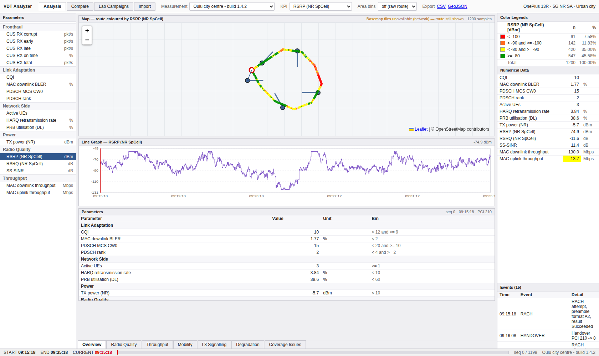

### 3.1 열기

툴바의 **Measurement**에서 주행을 고릅니다. 세션에 메모가 있으면 툴바 바로 아래
회색 줄에 표시됩니다(예: "프론트홀 타이밍 결함 09:30 부근 포함") — 무엇을 보러 온
데이터인지 알려주는 자리입니다.

**KPI**를 바꾸면 지도 색상과 범례가 함께 바뀝니다. 왼쪽 **Parameters** 트리에서
분류별로 골라도 같습니다.

### 3.2 범례부터 읽는다

오른쪽 **Color Legends**는 색상 키가 아니라 **분포 요약**입니다.

```
RSRP (NR SpCell) (dBm) [Sample]      n        %
■ < -100                            91     7.58%
■ < -90 and >= -100                142    11.83%
■ < -80 and >= -90                 420    35.00%
■ >= -80                           547    45.58%
  Total                           1200   100.00%
```

"주행의 45.6%가 -80 dBm 이상"을 한눈에 읽는 것이 이 패널의 목적입니다.

Total은 **선택한 KPI가 실제로 기록된 표본 수**입니다. 모든 표본에 그 KPI가 있으면 세션의
전체 표본 수와 같고, 일부 구간에만 있으면 그보다 적습니다. 범위 필터(§3.6)가 걸려 있으면
그 구간의 수입니다.

### 3.3 문제 구간을 찾는다

**Degradation** 워크북으로 갑니다. 선택한 KPI가 경고·심각 구간에 **연속으로 머문
구간**이 자동으로 나열됩니다 — 범위, 지속 시간, 최악값, 평균, 심각도, 표본 수.

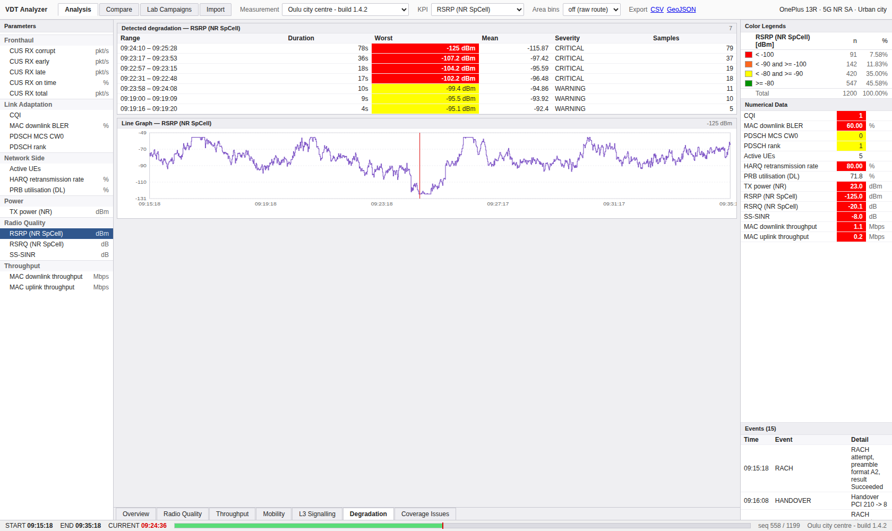

행을 클릭하면 **커서가 그 구간으로 이동**합니다. 그 자리에서 바로 보이는 것은:

- 오른쪽 **Numerical Data**가 그 시점의 전 KPI 값으로 (임계 초과 셀은 배경이 칠해짐)
- 아래 차트의 커서선이 그 위치로

커서는 워크북을 옮겨도 유지되므로, **Overview**나 **Mobility**로 가면 지도 마커가,
**L3 Signalling**으로 가면 메시지 목록이 같은 시각을 가리킵니다.
(Degradation 워크북 자체에는 지도가 없습니다.)

### 3.3a 무엇이 이 주행을 망쳤나 — Problem Survey

**Degradation**은 *고른 KPI 하나*가 나쁜 구간을 셉니다. **Problem Survey** 워크북은
질문을 뒤집습니다 — *이 주행에서 어느 원인이 가장 많았나*.

원인별 파이가 먼저 나옵니다. 조각을 클릭하면 **그 원인의 사례만** 아래 표에 남고,
사례를 클릭하면 **Around this problem** 창이 열립니다 — 사건 전후 30표본의 RSRP 궤적에
그 구간의 이벤트가 함께 찍힙니다. 원인 → 사례 → 순간 → **맥락**까지가 한 화면입니다.

| 원인 | 무엇이 이걸 세웠나 |
|---|---|
| Weak coverage · Interference · Overshoot | 커버리지 검출기 (§6) |
| Radio link failure · High BLER | 네트워크가 **보고한** 이벤트 |
| Fronthaul timing · Throughput degradation | 열화 검출기 |

> 무선 KPI의 열화는 **일부러 빠져 있습니다.** 커버리지 검출기가 이미 같은 구간을 분류하고
> 있어서, 둘 다 세면 한 구간이 두 원인으로 중복 집계됩니다.
>
> 재현할 수 없는 원인은 **아예 나오지 않습니다.** 참조 도구는 호 상태를 디코딩하므로
> 끊긴 통화를 보고할 수 있지만 이 도구는 못 합니다. 근거 없이 원인을 적는 조사는
> 조사가 없는 것보다 나쁩니다.

### 3.4 원인을 좁힌다

문제 시점에서 다른 축을 확인합니다.

| 워크북 | 보는 것 |
|---|---|
| **Radio Quality** | RSRP · RSRQ · SS-SINR 세 차트를 함께 |
| **Throughput** | MAC 상·하향 처리량과 BLER |
| **Mobility** | 지도 + **Cells 테이블**(PCI·타입·밴드·ARFCN·GSCN·방위각, 서빙 셀 강조) + 이벤트. 지도에는 커서 시점에 **단말이 볼 수 있던 셀 전부**로 점선이 그어집니다 — 굵은 주황은 최강 셀과 6 dB 이내로 경합 중인 셀, 흐린 회색은 잡히기만 한 셀 |
| **Monitored Set** | 커서 시점 모니터드 셋 막대 + 드라이브 전체 셀 검출 표 + 파일럿 오염 구간 — §3.4a |
| **L3 Signalling** | 세션의 RRC 메시지 **전체 목록**. 커서 시각 직전 메시지가 강조되고 그 위치로 자동 스크롤됩니다. 행을 클릭하면 본문이 펼쳐집니다 |
| **Fronthaul** | 랩 세션 한정 — §5.3 |

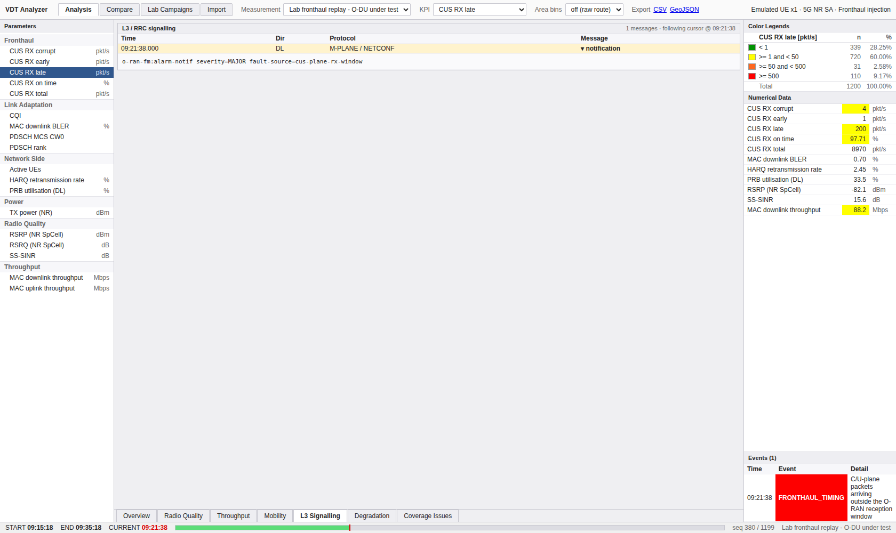

### 3.4a 단말이 무엇을 볼 수 있었나 — Monitored Set

우측 도크의 **Monitored Set** 표는 커서 시점에 단말이 **측정할 수 있던 셀 전부**를
Ch · PCI · RSRP · RSRQ · Δ로 보여줍니다. 맨 위 굵은 행이 실제로 쓰고 있던 셀이고,
Δ는 최강 셀 대비 몇 dB 아래인지입니다.

**Δ를 먼저 보십시오.** −1 dB짜리 이웃이 여럿이면 단말에 확실한 선택지가 없다는 뜻이고,
−15 dB뿐이면 깨끗한 상황입니다.

행이 **하나뿐**이면 고장이 아닙니다. 나머지가 보고 문턱 아래로 떨어졌다는 뜻이고,
표 아래에 그렇게 적힙니다. 깊은 페이드 구간에서 정상적으로 일어납니다.

`Monitored Set` 워크북 탭은 같은 내용을 넓게 폅니다.

| 영역 | 읽는 법 |
|---|---|
| **RSRP monitored set** 막대 | 커서 시점 — 시간 커서를 옮기면 함께 움직입니다. 초록이 서빙 셀, 주황이 잡히기만 한 셀 |
| **Across the whole drive** | 셀별 검출 횟수·검출률·**서빙 횟수**·p95·평균. 검출률은 높은데 서빙 횟수가 낮은 셀이 **오버슈팅** 후보입니다 |
| **Pilot pollution** | 3개 이상의 **쓸 만한** 셀이 6 dB 안에 몰린 구간. 행을 누르면 그 시각으로 이동 |

> 파일럿 오염은 **최강 셀이 −110 dBm 이상**일 때만 보고합니다. 페이드 안에서는 모든 셀이
> 약해서 서로 가까워지므로 조건만 보면 걸리지만, 그것은 커버리지 홀이지 오염이 아닙니다.
> 오염으로 잘못 부르면 "안테나를 조정하라"는 결론이 나오는데 실제 문제는 신호가 아예
> 닿지 않는 것입니다.

### 3.4b 내 화면을 직접 짠다 — 워크북 구성

내장 탭은 목적이 정해진 화면입니다. 그 옆의 **`+`** 로 **자기 탭**을 만들 수 있습니다.

1. 워크북 탭 줄 맨 끝의 **`+`**
2. **`+ Chart pane`** (또는 `+ Map pane`)
3. 페인 오른쪽 **Layers** 도크에서 `+ add layer…` 로 보고 싶은 파라미터를 고릅니다
4. **Save**

한 페인에 **여러 KPI를 겹칠 수 있습니다.** 프론트홀 결함을 조사한다면 CUS RX late와
MAC 하향 처리량과 PRB 이용률을 한 페인에 올려놓고 같은 시간축에서 보는 식입니다 — 지금까지는
탭을 옮겨 다니며 눈으로 맞춰야 했던 일입니다.

**체크박스는 숨기기이지 삭제가 아닙니다.** 체크를 풀면 트레이스만 사라지고 레이어는
목록에 남으므로, 비교 계열을 켰다 껐다 하는 데 다시 추가할 필요가 없습니다. 지우려면
레이어 오른쪽의 `×` 입니다.

축에 대해: 페인에 **한 계열만** 있으면 그 단위의 실제 눈금이 붙습니다. **여럿이면 눈금이
없습니다** — RSRP(dBm)와 백분율에 정직하게 공유할 수 있는 축이 없기 때문입니다. 각 계열은
자기 범위로 정규화되고, 실제 범위는 아래 범례에 숫자로 적힙니다. 두 번째 축을 다는 대안은
더 나쁩니다: 교차점이 의미 있는 것처럼 읽히지만 사실은 두 축을 따로 고른 결과일 뿐입니다.

워크북은 **서버에 저장됩니다.** 브라우저를 지워도 남고, 같은 서버를 보는 동료에게도
보입니다.

### 3.5 시간을 훑는다

- 상태바의 진행 바를 클릭하거나 누른 채 좌우로 끌기
- 차트 위를 클릭·드래그
- **◀| |▶** 버튼 — 한 표본씩. 키보드는 **← →**
- **▶** 버튼(또는 **Space**) — 커서가 주행을 자동으로 훑습니다. 다시 누르면 정지
- **↺** 로 역방향, 옆의 **n/s** 로 속도

> **재생은 표본을 건너뛰지 않습니다.** 속도가 바뀌는 것은 **틱 간격**이고 걸음은 항상
> 한 표본이라, 8시간 주행에서도 커서가 닿지 못하는 표본은 없습니다. 예전에는 주행 길이와
> 무관하게 240스텝으로 나눠서, 긴 주행에서는 30개 중 29개를 영원히 건너뛰었습니다.
>
> 커서가 초당 64표본으로 움직여도 **서버 요청은 초당 8건을 넘지 않습니다** — 지도·차트·
> 상태바는 이미 브라우저에 있는 데이터로 그리고, 왕복이 필요한 두 건만 따로 묶습니다.

### 3.5a 키보드

상태바 오른쪽 **?** 버튼, 또는 **?** 키를 누르면 전체 목록이 나옵니다.
목록은 실제 바인딩 테이블에서 **생성**되므로, 적혀 있는 키는 동작하는 키입니다.

| | |
|---|---|
| **← →** | 한 표본씩 |
| **PgUp PgDn** | 열 표본씩 |
| **Home End** | 처음 / 끝 |
| **Space** | 재생·정지 |
| **R** | 역방향 |
| **+ −** | 재생 속도 |
| **[ ]** | 커서 기준 구간 필터 시작 / 끝 |
| **\\** | 구간 필터 해제 |
| **F** | 지도를 주행 전체로 다시 맞춤 |
| **↑ ↓** | 지도에 포커스가 있을 때 지도 이동 |
| **Esc** | 열린 것을 닫음 |

> 입력란에 타이핑하는 동안에는 단축키가 동작하지 않고, 전송 키는 **Analysis 화면에서만**
> 듣습니다 — Import 화면에서 Space가 보이지도 않는 커서를 훑게 두면 사용자가 알 수도,
> 되돌릴 수도 없는 일이 벌어집니다.
- **Events** 목록(오른쪽 하단)의 행 클릭 — 그 이벤트 시각으로 점프
- **지도의 이벤트 심볼** 클릭, 또는 **차트의 이벤트 눈금** 클릭 — 같은 곳으로 갑니다

> 이벤트는 목록·지도·차트 **세 곳에 같은 글리프와 같은 색**으로 나타납니다
> (`⇄` 핸드오버, `✕` 무선 링크 실패, `▲` 높은 BLER, `●` RACH, `◆` 프론트홀 타이밍).
> 색만으로는 흑백 출력이나 색각 이상 사용자에게 전달되지 않으므로 **글리프가 정체성을
> 지고 색이 보강**합니다. *"RLF가 처리량 붕괴보다 먼저였나 나중이었나"* 는 차트 눈금을
> 보면 바로 답이 나옵니다 — 목록만으로는 시각을 외워서 대조해야 했습니다.

### 3.5b 지금 보는 것을 남에게 넘긴다

**주소창을 그대로 복사해서 보내면 됩니다.** 세션·파라미터·탭·모드·커서 위치·구간 필터·
빈 크기가 전부 주소에 들어 있고, 받는 사람은 **같은 주행의 같은 순간**에서 시작합니다.
새로고침해도 그대로 돌아옵니다.

> 재생 상태는 **일부러 넣지 않았습니다.** 링크는 증거이지 공연이 아니라, 남의 링크를
> 열었는데 커서가 이미 달아나고 있으면 멈춰 있는 것만 못합니다.
>
> **지도 확대도 넣지 않았습니다.** 화면에서 가장 공유하고 싶은 값처럼 보이지만, 앱도
> 스스로 쓰는 유일한 값입니다 — 자동 맞춤이 사용자가 움직인 것과 구별되지 않아서,
> 아무것도 안 해도 "아무도 고르지 않은 프레임"이 링크에 실립니다. 프레임은 **F** 한 번이면
> 되돌아옵니다.

**받은 링크가 이 서버에 안 맞으면 고치고 알려 줍니다.** 조용히 고치지 않는 것이 핵심입니다 —
말없이 고치면 받는 사람은 **완벽히 자기모순 없는, 보낸 것이 아닌** 화면을 보게 되고,
내일 같은 링크를 또 보냅니다.

| 상황 | 어떻게 되나 |
|---|---|
| 지워진 측정을 가리킴 | 다른 주행을 열되 **seq와 range는 버립니다** — 표본 번호는 자기 주행 안에서만 뜻이 있습니다 |
| seq가 주행 끝을 넘음 | 마지막 표본으로 |
| range가 뒤집힘 | 끕니다 (좁은 창이 아니라 **빈 창**입니다) |
| 이 주행에 값이 없는 파라미터 | RSRP로 |

바뀐 항목은 노란 띠에 **파라미터·받은 값·바뀐 값·이유**가 한 줄씩 나옵니다.

### 3.5c 한 구간만 지도에서 본다

오른쪽 **Color Legends**에서 구간 행을 클릭하면 지도가 **그 구간만** 진하게 그립니다.
다시 누르거나 **Show all** 로 되돌아옵니다.

> 나머지 구간은 **숨기지 않고 회색으로 남깁니다.** 나쁜 표본만 남기면 끊긴 조각들이 되어
> 주행 어디쯤인지도, 차가 어느 방향이었는지도 알 수 없습니다. 회색 경로가 그 자리를 알려 줍니다.
>
> 예전 우회로는 *색상 편집기를 열어 나머지를 회색으로 칠하고, 보고, 되돌리기* 였습니다 —
> 사적인 질문을 하려고 **모두가 보는 색상 스케일을 변형**하는 셈이었습니다.

### 3.5d 어느 셀이 서빙했는지 색으로 본다

툴바 **Colour by** 를 **Serving cell (PCI)** 로 바꾸면 경로가 **셀별 색**으로 칠해집니다.
색이 바뀌는 지점이 곧 **핸드오버 경계**입니다.

> 이 색은 **판정이 아니라 이름**입니다. KPI 램프에서 빨강은 "나쁨"이지만, 여기서 빨강 계열은
> 그냥 "저 셀"입니다. 그리고 **첫 등장 순서**로 배정하므로 같은 PCI라도 **다른 주행에서는
> 다른 색**입니다 — 범례가 그렇게 적어 둡니다.
>
> 팔레트(7색)보다 셀이 많으면 남는 셀은 **회색**이고 몇 개인지 적습니다. 색을 돌려쓰지
> 않는 이유는 **두 셀이 같은 색이면 한 셀로 읽히기** 때문입니다 — 답이 없는 것보다 나쁩니다.

### 3.5e 장소를 묻는다 — 지도에 영역 그리기

민원은 시간이 아니라 **장소**로 옵니다. 툴바 **Ask an area** 를 누르고 지도를 클릭해
도형의 꼭짓점을 찍은 뒤 **Finish**. 세 점 이상이어야 영역이 됩니다.

그 안에 들어온 표본의 통계와 함께 **통과 목록**이 나옵니다.

> **통과를 따로 보여 주는 이유**: 같은 도로를 세 번 지났다면 그건 **하나의 장소, 세 번의
> 통과**입니다. *"이 거리가 나쁘다"* 와 *"세 번 중 한 번이 나빴다"* 는 **같은 평균**을 내지만
> 원인도 대책도 다릅니다. 통과 행을 클릭하면 커서가 그 통과로 갑니다.
>
> 도형은 저장되지 않습니다. 필요한 건 답이었고, 도형을 남기면 **다른 주행에 적용될 때**
> 엉뚱한 땅을 고르게 됩니다.

### 3.5f 두 주행이 **어디서** 다른지 본다

**Compare on the Ground** 워크북. 비교할 측정과 타일 크기를 고르면 격자 타일마다
**두 주행의 차이**가 칠해집니다.

> A/B 비교는 *"B가 2.1 dB 나쁨"* 까지 답합니다. 그 문장으로는 **모든 거리가 조금씩 나빠진
> 것**과 **한 거리만 무너지고 나머지는 그대로인 것**을 구별할 수 없습니다 — 원인도 대책도
> 다른데 평균은 같습니다.
>
> **한쪽 주행만 지나간 타일은 속을 채우지 않고 점선**으로 그립니다. 회색으로 칠하면
> "둘 다 재고 차이가 없었다"로 읽히는데, 그건 정반대의 사실입니다.
>
> 색은 **KPI의 방향**을 따릅니다 — BLER이 내려간 타일은 초록입니다. 카탈로그가
> **NEUTRAL**로 표시한 KPI는 판정 없이 **변화 크기만** 보라색 농담으로 표시합니다.

### 3.6 일부 구간만 본다

관심 구간의 시작에 커서를 놓고 상태바의 **From here**, 끝에 놓고 **To here**를 누릅니다.
툴바에 노란 칩(`Filter: seq 300–900`)이 뜨고 그동안:

- **통계**와 **범례**가 그 구간만으로 다시 계산됩니다
- **열화 목록**도 그 구간만
- **지도와 차트는 주행 전체를 유지**합니다 — 고른 구간이 전체 중 어디인지 보여야 하므로

칩의 ✕로 해제합니다.

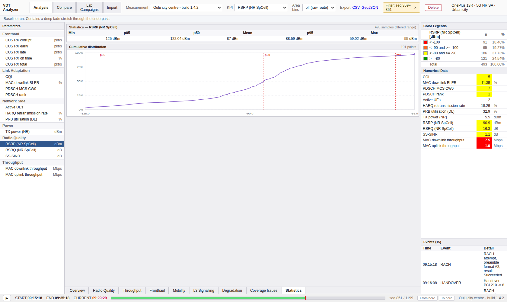

### 3.6a 도로 단위로 본다 — 거리 비닝

툴바 **Distance bins**. 영역 비닝이 "여기 신호가 어떤가"라면, 이쪽은 **"도로 단위로
무엇을 봤나"**입니다.

차이가 중요합니다. 신호등에 서 있으면 한 자리에서 표본이 계속 쌓이므로, 시간 기준 평균은
**오래 서 있던 곳으로 끌려갑니다.** 거리 기준으로 묶으면 그 정차는 아무리 길어도 막대
하나입니다. 드라이브 테스트가 오래전부터 거리 기준 샘플링을 써 온 이유입니다.

막대를 클릭하면 그 지점으로 커서가 이동합니다.

### 3.6b 셀이 실제로 어디를 먹었나 — 푸트프린트

툴바 **Footprints** 를 켜면 지도에 셀별 폴리곤이 깔립니다.

이것은 셀의 **설계상** 커버리지가 아닙니다 — 우리는 빔폭도 반경도 기록하지 않습니다.
그 셀이 **실제로 서빙한 표본들의 외곽**입니다. 어떤 면에서 더 나은 주장입니다: 누가
의도한 범위가 아니라 이번 주행에서 실제로 닿은 범위니까요.

> **볼록 껍질입니다.** 건물 양옆으로 두 갈래를 서빙한 셀은 그 사이 한 번도 서빙하지 않은
> 땅까지 포함한 하나의 폴리곤이 됩니다. 오목 껍질은 "얼마나 조일지"라는 추측값이 하나
> 더 필요해서 쓰지 않았습니다. 커버리지 경계로 읽지 마시고, **어느 셀이 어느 동네를
> 잡았는지**의 그림으로 읽으십시오.

`Cells` 탭의 검출률 대비 서빙률과 함께 보면 오버슈팅 셀이 드러납니다.

### 3.7 분포를 본다

**Statistics** 워크북 — 최소·p05·p50·평균·p95·최대와 **CDF 곡선**(p05/p50/p95 표시).
"최악 5%가 어느 정도인지"는 평균이 답하지 못하는 질문입니다.

### 3.8 내보낸다

툴바 **Export** — **CSV**(전 KPI 피벗, 한 행이 한 표본) 또는 **GeoJSON**(선택 KPI의
지리 데이터, 플래닝 도구용).

---

## 4. 두 빌드를 비교한다

**Compare** 모드. A와 B에 세션을 고르면 KPI별로 평균·p05·p95, 평균 차이, 판정이 나옵니다.

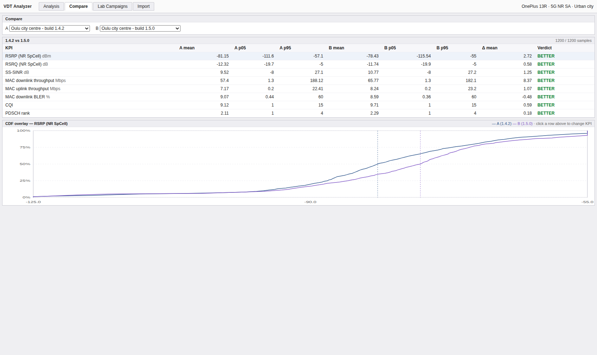

판정은 다섯 가지입니다.

| 판정 | 뜻 |
|---|---|
| **BETTER** | KPI의 방향 기준으로 개선 |
| **WORSE** | 같은 기준으로 악화 |
| **SAME** | 차이가 무시할 수준 |
| **NO DATA** | 한쪽이 그 KPI를 측정하지 않음 — *같은 것이 아니라 없는 것* |
| **NO VERDICT** | 좋고 나쁨이 정의되지 않는 KPI(카운터·부하 지표). 값은 달라졌으나 판단하지 않음. **현재 Compare 화면은 방향이 정의된 8개 KPI만 비교하므로 화면에서는 볼 수 없고, `/api/compare`를 직접 호출할 때 나타납니다** |

아래 **CDF 오버레이**는 두 분포를 한 축에 겹칩니다. 행을 클릭하면 그 KPI로 바뀝니다.
평균만 보면 놓치는 것 — 중앙값은 좋아졌는데 꼬리는 나빠진 경우 — 은 여기서 **곡선이
교차하는 모습**으로 드러납니다.

---

## 5. 랩 캠페인을 확인한다

**Lab Campaigns** 모드. 가상 채널과 가상 UE를 **실물 DU**에 물린 런의 기록입니다.

### 5.1 무엇이 가상이고 무엇이 실물인가

런을 고르면 네 장의 구성 카드가 나옵니다.

| 카드 | 내용 |
|---|---|
| Channel model (emulated) | 종류·프로파일·지연확산·도플러·MIMO 상관. `FIELD_REPLAY`면 원본 세션 표시 |
| Cell configuration (DU) | 밴드·대역폭·SCS·듀플렉스·MIMO·안테나 |
| UE profile (emulated) | 릴리즈·대수·트래픽·목표 속도·이동성 |
| DU under test (real) | 벤더·접속 방식·스플릿·주소 |

재현에 필요한 네 가지를 런과 함께 보존합니다. 하나라도 빠지면 그 런은 재현 불가입니다.

### 5.2 합불 판정

**Evaluate**를 누르면 각 기준(KPI · 집계 · 조건 · 임계)에 대해 **실측값**과
PASS/FAIL이 채워지고, 런 전체 판정이 나옵니다.

`session N` 옆의 **Open session N in Analysis**로 그 런의 측정 데이터로 바로 넘어갑니다 —
실패한 기준의 원인을 찾을 때 쓰는 경로입니다.

### 5.3 프론트홀 결함: 처리량은 떨어지는데 무선은 멀쩡할 때

시드에 포함된 `Lab fronthaul replay` 세션이 이 상황입니다.

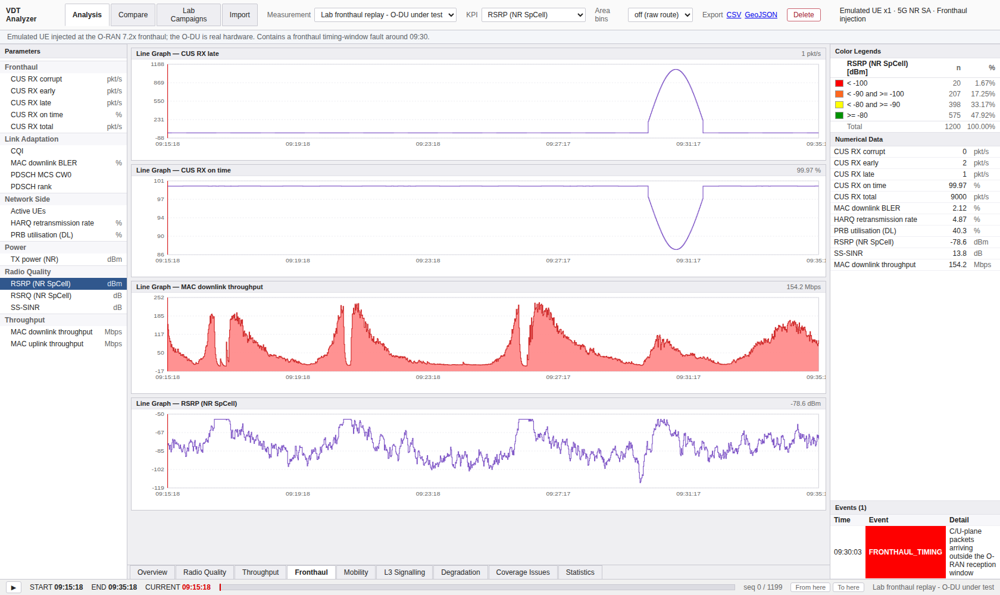

증상부터 시작합니다 — 처리량이 09:30 부근에서 떨어집니다. 그런데 **Radio Quality**를
보면 RSRP·SINR·BLER이 모두 정상입니다. 무선에 원인이 없습니다.

**Fronthaul** 워크북으로 가면 답이 있습니다. `CUS RX late`가 치솟고 `CUS RX on time`이
떨어집니다 — C/U-plane 패킷이 O-RAN 수신창을 벗어나 도착하고 있고, O-DU가 그것을
폐기하므로 전송할 데이터가 없어 처리량이 함께 내려간 것입니다. 원인은 전파가 아니라
**전송로**입니다.

같은 판단이 합불에도 반영됩니다: `Fronthaul timing acceptance` 런은 **무선 기준은 PASS,
프론트홀 기준은 FAIL**입니다. RF만 보는 도구로는 낼 수 없는 판정입니다.

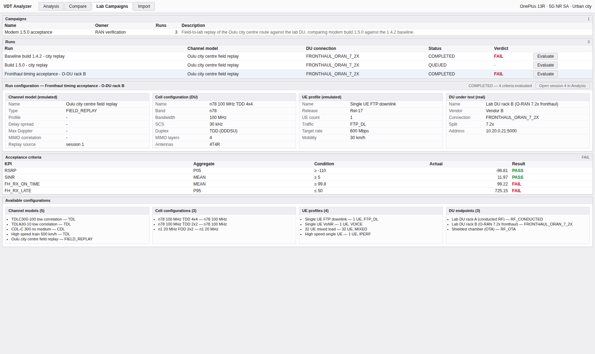

> 프론트홀 카운터는 프론트홀에 주입한 랩 런에만 존재합니다. 필드 세션에서 이 워크북을
> 열면 그 이유를 설명하는 안내가 나옵니다.

---

## 6. 커버리지를 개선한다

**Coverage Issues** 워크북. 원인별로 분류된 문제 구간이 나옵니다.

| 유형 | 뜻 |
|---|---|
| **WEAK COVERAGE** | 간섭과 무관하게 수신 전력 자체가 낮음 |
| **INTERFERENCE** | 전력은 충분한데 SINR이 나쁨 |
| **OVERSHOOT** | 멀리 있는 셀이 과도하게 서빙 |

행을 클릭하면 그 위치로 커서가 이동합니다.

주행이 조밀해 경로가 읽히지 않으면 툴바 **Area bins**에서 50/150/500 m를 고릅니다.
경로가 격자 타일로 집계되어 공간 패턴이 드러납니다.

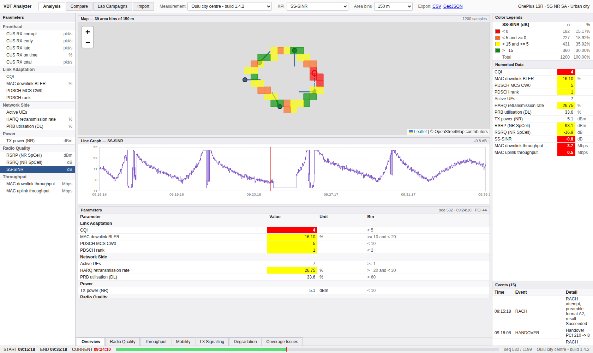

플래닝 도구로 넘길 때는 **Export → GeoJSON**을 씁니다.

> **지도 확대는 파라미터를 바꿔도 유지됩니다.** 한 교차로를 확대해 놓고 KPI를 바꿔 가며
> 비교할 수 있습니다 — 예전에는 KPI를 고를 때마다 지도가 주행 전체로 되돌아갔습니다.
> 프레임이 새로 잡히는 것은 **주행이 바뀔 때**뿐이고, 전체로 돌아가고 싶으면 **F** 입니다.

---

## 7. 데이터를 넣고 뺀다

### 7.1 CSV 가져오기

**Import** 모드. 파일을 고르고 세션 이름·장비·사업자·기술을 채운 뒤 **Import**.

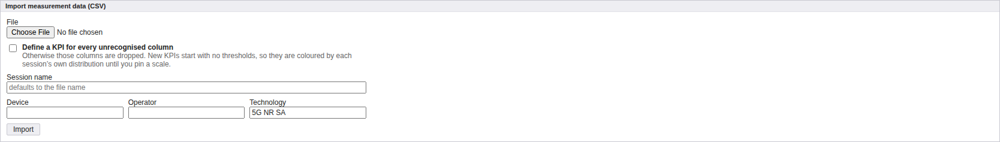

형식:

- 헤더 한 줄, 그 뒤로 표본당 한 행
- 위치·시각 컬럼은 이름으로 인식: `latitude/lat`, `longitude/lon`, `timestamp/time/ts`,
  `speed_kmh`, `serving_pci`
- 시각은 ISO-8601, epoch 초, epoch 밀리초 모두 가능
- 위치가 없는 행은 건너뜁니다
- KPI 컬럼은 **내부 이름**(`RSRP`)뿐 아니라 **표시명**(`RSRP (NR SpCell)`)으로도 인식합니다
  — 대소문자와 문장부호는 무시하므로 타 도구 내보내기가 그대로 들어갑니다

결과 패널에 읽은 행 수, 적재된 표본·KPI 값 수, **매핑된 컬럼**과 **무시된 컬럼**이
표시됩니다. 무시된 컬럼이 있다면 §9를 보십시오.

**Import history**에 성공과 실패가 모두 남습니다. 실패한 행에는 사유가 함께 표시되므로,
어떤 파일이 왜 들어가지 않았는지 나중에도 확인할 수 있습니다.

### 7.1a KPI를 직접 만든다

같은 **Import** 화면에 KPI를 만드는 두 가지 방법이 있습니다. **필요한 만큼만 쓰십시오** —
산술식으로 되는 것을 그래프로 그릴 이유는 없습니다.

**Derived KPIs** — 한 줄 수식. `MAC_DL_THROUGHPUT / DU_PRB_UTILISATION` 처럼
`+ - * / ( )`와 KPI 이름만. 표본별 산술이면 이것으로 충분합니다.

**KPI Workbench** — 노드를 이어 만드는 그래프. 조건·상태·이웃 셀이 필요하면 이쪽입니다.

| 노드 | 하는 일 |
|---|---|
| **KPI source** | KPI 하나를 열로 읽어옵니다 |
| **Neighbour source** | 모니터드 셋에서 **N번째로 강한 셀**의 RSRP/RSRQ. 서빙 셀 제외 여부를 고를 수 있습니다 |
| **Combine** | 여러 입력을 같은 표본에 맞춰 붙입니다. 일부 입력에만 값이 있는 표본도 남습니다 |
| **Expression** | 들어온 열들의 산술. `AS`로 결과 열 이름을 붙입니다 |
| **Filter** | 조건이 참인 표본만 통과 |
| **State machine** | 조건이 맞는 **첫 상태**로 표본에 이름표를 붙입니다. 상태는 순서대로 1, 2, 3… 값이 됩니다 |
| **Output** | KPI가 될 열 하나 |

조작: 팔레트 버튼으로 노드를 놓고, 노드를 끌어 옮기고, 노드 **아래쪽 점**에서 다른 노드
**위쪽 점**으로 끌어 연결합니다. 연결선을 클릭하면 끊어집니다.

**아래쪽 초록/빨강 띠가 항상 무엇이 잘못됐는지 말해 줍니다.** 그리는 도중에는 그래프가
유효하지 않은 것이 정상이므로, 저장할 때가 아니라 그리는 동안 알려 줍니다.

정렬 노드는 **없습니다.** 우리 행 집합은 표본 순서로 정렬돼 있어 정렬할 것이 없고,
아무 일도 하지 않는 버튼은 없느니만 못합니다.

값은 **저장할 때와 임포트할 때** 계산되며, 읽을 때마다 다시 계산하지는 않습니다.
그래서 만들어진 KPI는 다른 KPI와 완전히 똑같이 동작합니다 — 색상 범례, 지도 색칠,
통계, 내보내기, 리포트 전부 그대로 씁니다.

> 예: 서빙 셀이 최강 이웃보다 얼마나 여유가 있는지(핸드오버 마진)는
> `KPI source(RSRP)` + `Neighbour source(RSRP 1위)` → `Combine` →
> `Expression: SERVING - BEST_NBR` → `Output` 입니다.

### 7.2 내보내기

§3.8과 같습니다. 내보낸 CSV는 **그대로 다시 가져올 수 있습니다** — 표본 수까지
일치하는 왕복이 검증되어 있습니다.

### 7.3 지우기

툴바 **Delete**. 세션과 그에 딸린 모든 데이터(표본·KPI 값·이벤트·메시지·셀)가
지워집니다. 그 세션을 참조하던 랩 런은 구성을 유지한 채 연결만 끊깁니다.

---

## 8. 색상 스케일을 바꾼다

사업자마다 기준이 다릅니다. 범례 위 **Edit scale**로 KPI별 구간을 직접 정합니다.

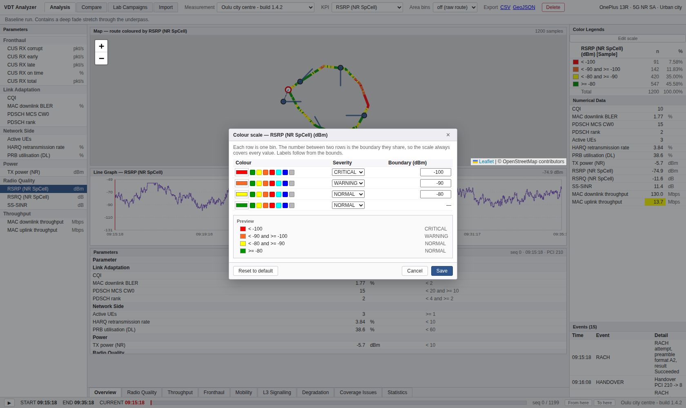

편집하는 것은 **구간이 아니라 경계**입니다. 각 행이 한 구간이고, 두 행 사이의 숫자가
그들이 공유하는 경계입니다. 그래서 빈틈이나 중첩이 생길 수 없고, 어떤 값도 색을
잃지 않습니다. 양 끝은 항상 -∞와 +∞로 열려 있습니다.

- **색상** — 프리셋 7종(참조 도구의 4색 상태 램프 + 시안·파랑·회색) 또는 색상 선택기로 자유 선택
- **심각도** — NORMAL / WARNING / CRITICAL. 값 그리드의 셀 강조와 열화 탐지가 이것을 씁니다
- **라벨** — 편집하지 않습니다. 경계에서 자동 생성됩니다(`>= -80`, `< -80 and >= -90`)
- **Preview** — 저장될 모습을 미리 보여줍니다

경계가 오름차순이 아니면 저장 버튼이 잠깁니다.

**저장하면 다섯 곳이 함께 다시 칠해집니다** — 지도·범례·열화 목록·값 그리드의 셀 강조·
영역 비닝. 스케일은 서버에 저장되므로 이 서버를 쓰는 **모든 사용자에게 적용**됩니다.

- **Reset to default** — 기본 제공 KPI를 시드 기본값으로 되돌립니다
- **Use auto scale** — 고정 구간을 버리고 §9의 자동 스케일로 돌아갑니다

---

## 9. 새로운 KPI를 다룬다

### 9.1 미인식 컬럼을 살린다

임포트할 때 **"Define a KPI for every unrecognised column"**을 체크하면, 모르는 컬럼마다
KPI 정의가 만들어지고 값도 함께 적재됩니다. 체크하지 않으면 그 컬럼은 버려집니다
(그래서 기본값은 꺼짐입니다 — 카탈로그가 저절로 불어나지 않도록).

새로 만들어진 KPI는:

- 방향이 **NEUTRAL**입니다. 그 컬럼이 "높을수록 좋은지" 알 방법이 없고, 추측하면
  판단이 없는 데이터에 녹→적 판단을 씌우게 됩니다. **방향 자체는 아직 화면에서 바꿀 수
  없습니다**(§8은 색상·심각도·경계만 편집합니다) — 원하는 판단은 구간에 **심각도**를
  지정해 표현하십시오
- **소수 자릿수가 실제 값을 따릅니다** — 정수 컬럼이 `13.00`으로 보이지 않습니다
- 헤더가 `Custom margin (dB)` 형태면 **괄호에서 단위를 가져옵니다**

### 9.2 임계값이 없는 KPI는 어떻게 그려지나

새 KPI에는 아직 아무도 기준을 정하지 않았습니다. 그래도 바로 보입니다 — **자동 스케일**이
그 세션의 **사분위수**로 4구간을 만들고 읽기 좋은 숫자로 반올림합니다.

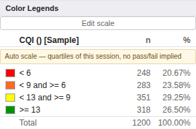

범례가 그렇다고 **명시합니다**: `Auto scale — quartiles of this session, no pass/fail implied`.
이 문구가 중요한 이유가 둘 있습니다.

- 자동 스케일의 색은 **그 주행 안에서의 순위**입니다. 같은 값이 다른 주행에서는 다른
  색일 수 있습니다.
- 어떤 구간도 경고나 심각으로 표시되지 않습니다. 사분위수는 "이 주행 안에서 어디쯤"이지
  "나쁘다"가 아닙니다 — 전 구간이 우수한 주행에도 하위 25%는 있습니다.

기준이 정해지면 **Edit scale**을 여십시오. 자동 스케일이 만든 구간이 **미리 채워져
있으므로**, 조정해서 저장하면 그대로 고정 스케일이 됩니다.

### 9.3 잘못 만든 KPI를 지운다

오타 난 헤더로 KPI가 생겼다면, 그 KPI를 골라 **Edit scale → Delete KPI**. 그 KPI로
기록된 값도 함께 지워지고 건수를 알려줍니다.

기본 제공 KPI 18종은 삭제되지 않습니다 — 화면들이 이름으로 참조하기 때문입니다.
그 자리에는 **Reset to default**가 나옵니다.

---

## 10. 자주 겪는 상황

| 증상 | 원인과 조치 |
|---|---|
| 지도 배경 타일이 안 보이고 회색 격자만 | 이 환경에서 외부 지도 서버로 나가지 못하는 경우입니다. **경로와 색상은 정상 동작**합니다 — 지도 위에 안내가 표시됩니다 |
| 통계·범례 숫자가 세션 전체와 다르다 | 범위 필터가 걸려 있습니다. 툴바의 노란 칩을 확인하고 ✕로 해제하십시오 |
| 임포트했는데 KPI가 하나도 안 들어갔다 | 인식된 KPI 컬럼이 **하나도 없으면 임포트 자체가 실패**하고, 빨간 오류 줄에 인식 가능한 KPI 목록이 나옵니다. **"Define a KPI for every unrecognised column"**을 켜고 다시 시도하십시오(§9.1) |
| 일부 컬럼만 들어갔다 | 결과의 **Ignored columns**를 보십시오. 같은 체크박스로 살릴 수 있습니다 |
| `Fronthaul` 워크북이 비어 있다 | 프론트홀 카운터는 프론트홀에 주입한 랩 런에만 존재합니다. 필드 주행에는 없습니다 |
| 색을 바꿨는데 지도만 그대로 | 저장(Save)을 하지 않았을 수 있습니다. 저장하면 지도·범례·열화·값 그리드가 함께 바뀝니다 |
| 세션 목록이 비어 있다 | 시드 대기 문제는 아닙니다 — 적재가 끝난 뒤에야 API가 열립니다. `SEED_ENABLED=false`로 띄웠거나(§1.1), 이미 세션을 모두 지운 DB입니다. 예시 데이터가 필요하면 `docker compose down -v` 후 다시 올리십시오 |
| 다시 띄웠더니 접속이 안 된다 | 컨테이너: `docker compose ps`로 세 서비스가 healthy인지 보고, 아니면 `docker compose logs backend`. 호스트: `sudo service postgresql start` 후 `./scripts/backend.sh start`, `./scripts/frontend.sh start` |
| 화면은 뜨는데 데이터만 안 나온다 (컨테이너) | nginx는 살아 있고 백엔드가 아닌 경우입니다. `docker compose ps`의 backend 상태와 `curl localhost:8080/api/sessions`를 확인하십시오 |

---

## 관련 문서

| 문서 | 내용 |
|---|---|
| [`architecture.md`](./architecture.md) | 시스템 구조·데이터 모델·API·설계 규칙 |
| [`requirements-analysis.md`](./requirements-analysis.md) | 기능 인벤토리와 화면 명세 |
| [`keysight-vdt-research.md`](./keysight-vdt-research.md) | 참조 도구 리서치 (구간·색상의 근거 포함) |
| [`scenario-verification.md`](./scenario-verification.md) | 이 가이드의 각 절차가 자동 검증되는 방식 |
| [`gap-analysis.md`](./gap-analysis.md) | 아직 없는 기능과 우선순위 |
